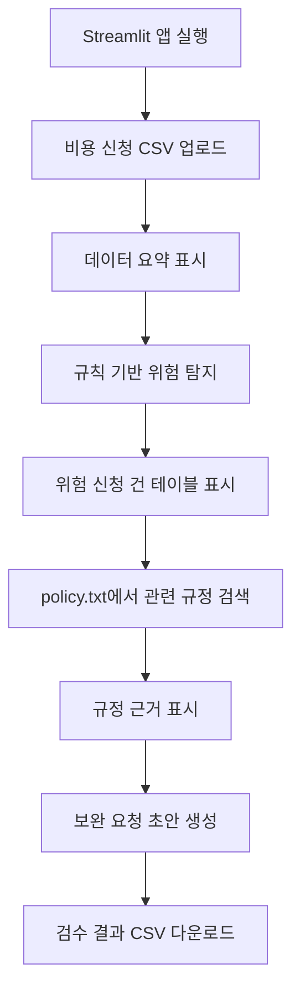
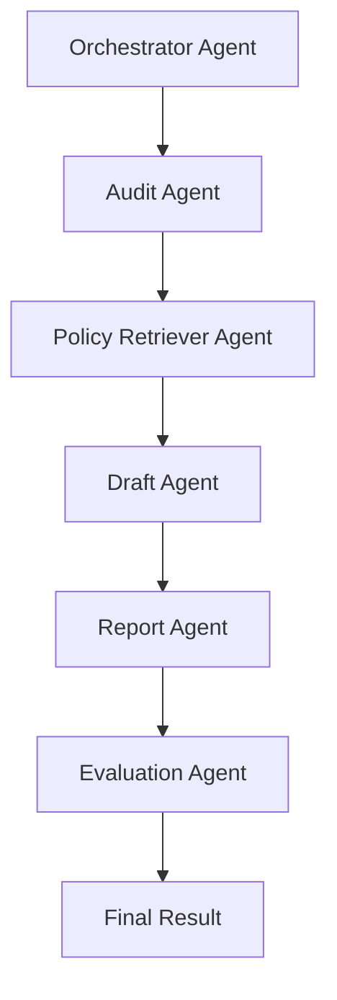

# 5. 유저 플로우 / 워크플로우

## 5.1 핵심 사용자 시나리오

## 시나리오 1. 비용 신청 CSV 1차 검수

재무 담당자가 비용 신청 CSV를 업로드하면 시스템이 데이터 요약과 위험 신청 건을 자동으로 표시한다.

## 시나리오 2. 위험 신청 건의 규정 근거 확인

재무 담당자 또는 팀장/승인자가 위험 건을 확인하고, 관련 비용 규정 근거를 검토한다.

## 시나리오 3. 보완 요청 초안 확인 및 결과 다운로드

재무 담당자가 보완 요청 초안을 확인하고, 검수 결과를 CSV로 다운로드한다.

---

## 5.2 사용자 플로우

## CSV 검수 플로우

1. 진입: Streamlit 앱 실행
2. 입력: 비용 신청 CSV 업로드
3. 처리: Pandas로 데이터 로드 및 요약
4. 결과 확인: 위험 신청 건 테이블 확인
5. 예외: 필수 컬럼 누락 시 오류 메시지 표시
6. 완료: 검수 결과 생성

## 규정 근거 확인 플로우

1. 진입: 위험 신청 건 테이블 확인
2. 입력: 위험 건 선택 또는 자동 처리
3. 처리: `policy.txt`에서 관련 규정 검색
4. 결과 확인: 규정 근거 표시
5. 예외: 관련 규정 없으면 확인 필요 표시
6. 완료: 검수 사유 확인

## 보완 요청 초안 플로우

1. 진입: 위험 신청 건 상세 확인
2. 입력: 위험 유형, 위험 사유, 규정 근거
3. 처리: 템플릿 기반 보완 요청 초안 생성
4. 결과 확인: 초안 문장 확인
5. 예외: 근거 없음 시 일반 보완 문장 생성 제한
6. 완료: 결과 CSV 다운로드

---

## 5.3 화면 흐름

| 화면 ID | 화면명 | 사용자 액션 | 시스템 반응 | 다음 화면 | 예외 메시지 |
|---|---|---|---|---|---|
| S-001 | CSV 업로드 | CSV 파일 선택 | 데이터 로드 | 데이터 요약 | CSV를 업로드해 주세요 |
| S-002 | 데이터 요약 | 요약 확인 | 건수/총액/결측치 표시 | 검수 결과 | 필수 컬럼이 없습니다 |
| S-003 | 검수 결과 | 위험 건 확인 | risk_type 표시 | 규정 근거 | 위험 건이 없습니다 |
| S-004 | 규정 근거 | 근거 확인 | policy_evidence 표시 | 초안 확인 | 관련 규정 확인 필요 |
| S-005 | 결과 다운로드 | 다운로드 클릭 | CSV 저장 | 완료 | 다운로드 실패 |

---

## 5.4 멀티에이전트 워크플로우

MVP에서는 직접 구현하지 않고 v2 확장 구조로 설계한다.

| Agent | 입력 | 처리 | 출력 | 실패 시 분기 |
|---|---|---|---|---|
| Orchestrator Agent | 사용자 요청 | 작업 순서 결정 | 실행 계획 | 사람 검토 |
| Audit Agent | 비용 신청 데이터 | 위험 유형 탐지 | risk_type | 규칙 fallback |
| Retriever Agent | risk_type, category | 규정 검색 | evidence | 확인 필요 |
| Draft Agent | reason, evidence | 초안 생성 | draft_message | 템플릿 fallback |
| Report Agent | 검수 결과 | 요약 생성 | report | 기본 통계 |
| Evaluation Agent | evidence, draft | 품질 평가 | score | 사람 검토 |

---

## 5.5 상태 흐름

| State | 설명 |
|---|---|
| user_query | 사용자의 업로드/검수 요청 |
| intent | 데이터 검수, 규정 검색, 초안 생성 등 의도 |
| uploaded_data | 업로드된 비용 신청 데이터 |
| audit_result | 위험 탐지 결과 |
| retrieved_context | 검색된 비용 규정 근거 |
| draft_message | 보완 요청 초안 |
| confidence_score | 검색/초안 신뢰도 |
| error_state | 검색 실패, 컬럼 누락, LLM 실패 등 |

---

## 5.6 Mermaid 사용자 플로우

---

## 5.7 Mermaid 에이전트 워크플로우

