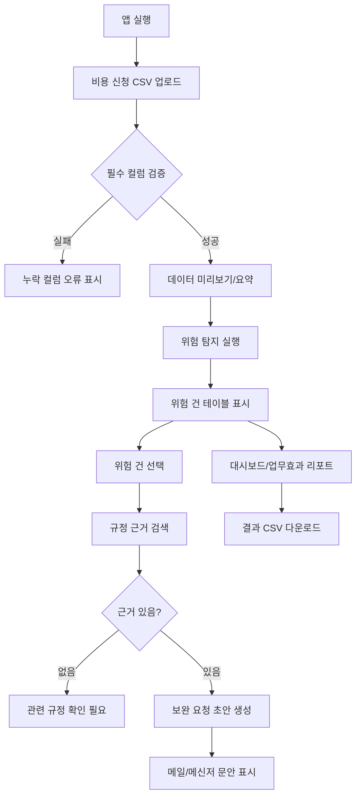
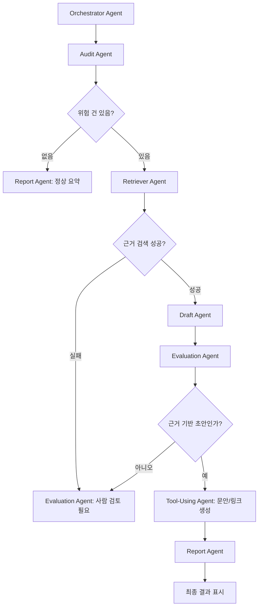
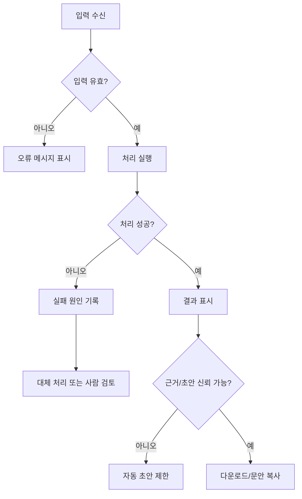

# 5. 유저 플로우 / 워크플로우

## 5.1 핵심 사용자 시나리오 3개

### 시나리오 1. 비용 신청 CSV 기반 1차 검수
- 사용자는 비용 신청 CSV를 업로드한다.
- 시스템은 데이터 미리보기와 요약 정보를 표시한다.
- 시스템은 위험 건을 자동 탐지한다.
- 사용자는 위험 건 목록과 사유를 확인한다.
- 사용자는 결과를 CSV로 다운로드한다.

### 시나리오 2. 규정 근거 기반 보완 요청 초안 생성
- 사용자는 위험 건 하나를 선택한다.
- 시스템은 관련 비용 규정 근거를 검색한다.
- 시스템은 위험 사유와 근거를 바탕으로 보완 요청 초안을 생성한다.
- 사용자는 초안을 복사하거나 메일/메신저 문안으로 활용한다.
- 근거가 없으면 시스템은 초안 생성을 제한한다.

### 시나리오 3. 업무효과 리포트 확인
- 사용자는 대시보드를 연다.
- 시스템은 전체 건수, 위험 건수, 위험률을 표시한다.
- 시스템은 기존 수작업 시간과 자동 검수 후 예상 시간을 비교한다.
- 사용자는 예상 절감 시간과 절감률을 확인한다.
- 사용자는 포트폴리오/발표에서 AX/DX 효과를 설명한다.

---

## 5.2 사용자 플로우

### 플로우 1. CSV 검수 플로우
| 단계 | 설명 |
|---|---|
| 진입 | Streamlit 앱 실행 |
| 입력 | 비용 신청 CSV 업로드 |
| 처리 | Pandas로 로드, 필수 컬럼 검증, 데이터 요약 |
| 결과 확인 | 미리보기, 행/열, 컬럼, 결측치, 총액 확인 |
| 예외 상황 | CSV 없음, 필수 컬럼 누락, amount 오류 |
| 완료 | 위험 탐지 실행 가능 상태 |

### 플로우 2. 위험 탐지 및 근거 확인 플로우
| 단계 | 설명 |
|---|---|
| 진입 | CSV 업로드 완료 후 검수 실행 |
| 입력 | 비용 신청 DataFrame, policy.txt |
| 처리 | 규칙 기반 위험 탐지, risk_type/risk_reason 생성 |
| 처리 | 위험 유형과 카테고리 기반 규정 근거 검색 |
| 결과 확인 | 위험 건 테이블, 규정 근거 컬럼 확인 |
| 예외 상황 | 근거 검색 실패 시 "관련 규정 확인 필요" 표시 |
| 완료 | 상세 검수/초안 생성으로 이동 |

### 플로우 3. 보완 요청 및 리포트 플로우
| 단계 | 설명 |
|---|---|
| 진입 | 위험 건 상세 화면 |
| 입력 | 선택한 expense_id |
| 처리 | 상세 정보, 근거, 초안 표시 |
| 처리 | 업무효과 지표 계산 |
| 결과 확인 | 초안 복사, mailto 링크, 절감 시간/절감률 확인 |
| 예외 상황 | LLM 실패 시 템플릿 초안 또는 제한 문구 표시 |
| 완료 | 결과 CSV 다운로드, 발표/README에 활용 |

---

## 5.3 화면 흐름

| 화면 ID | 화면명 | 사용자 액션 | 시스템 반응 | 다음 화면 | 예외 메시지 |
|---|---|---|---|---|---|
| UI-001 | 메인 | 앱 실행 | 제목과 업로드 영역 표시 | UI-002 | - |
| UI-002 | CSV 업로드 | CSV 선택 | DataFrame 로드 | UI-003 | CSV를 읽을 수 없습니다 |
| UI-003 | 데이터 요약 | 업로드 완료 | 행/열, 컬럼, 결측치, 총액 표시 | UI-004 | 필수 컬럼이 없습니다 |
| UI-004 | 위험 탐지 결과 | 검수 실행 | 위험 건 테이블 표시 | UI-005 | 탐지된 위험 건이 없습니다 |
| UI-005 | 위험 건 상세 | 위험 건 선택 | 사유, 근거, 초안 표시 | UI-006 | 관련 규정 확인 필요 |
| UI-006 | 대시보드 | 대시보드 확인 | 지표/차트 표시 | UI-007 | 표시할 데이터가 없습니다 |
| UI-007 | 다운로드 | 다운로드 클릭 | 결과 CSV 생성 | 완료 | 다운로드할 결과가 없습니다 |

---

## 5.4 멀티에이전트 워크플로우

MVP에서는 멀티에이전트를 구현하지 않는다. 아래는 v2 확장 시 LangGraph 관점의 설계다.

| Agent | 입력 | 처리 | 출력 | 실패 시 분기 |
|---|---|---|---|---|
| Orchestrator Agent | 사용자 요청, 현재 상태 | 어떤 단계가 필요한지 결정 | 다음 노드 | error_state 기록 |
| Audit Agent | 비용 신청 데이터 | 위험 유형 탐지 | risk_results | 필수 컬럼 오류 반환 |
| Retriever Agent | risk_type, category | 규정 문서 검색 | policy_evidence | 관련 규정 확인 필요 |
| SQL/DB Agent | audit_id, filters | DB 조회/저장 | query_result | SQL 실패 메시지 |
| Tool-Using Agent | 외부 도구 요청 | mailto, n8n, 다운로드 호출 | tool_result | 도구 실패 fallback |
| Report Agent | audit_results | 지표/리포트 생성 | summary_report | 기본 지표만 표시 |
| Evaluation Agent | evidence, draft | 근거 기반 여부 평가 | confidence_score, warning | 사람 검토 필요 |
| Memory Agent | 검수 이력 | 반복 패턴 저장 | memory_context | 저장 생략 |

---

## 5.5 상태 흐름

LangGraph State 기준 확장 설계:

| State Key | 설명 | MVP 대응 |
|---|---|---|
| user_query | 사용자의 요청 또는 버튼 액션 | 버튼/선택값 |
| intent | 요청 의도 | 업로드/검수/초안/다운로드 |
| uploaded_data | CSV DataFrame | DataFrame |
| validation_result | 컬럼/타입 검증 결과 | 오류 메시지 |
| audit_results | 위험 탐지 결과 | result DataFrame |
| retrieved_context | 규정 근거 | policy_evidence |
| tool_result | 다운로드/메일 링크 결과 | CSV, mailto |
| agent_decision | 다음 처리 단계 | MVP에서는 if문 |
| final_answer | 화면 출력 결과 | Streamlit 출력 |
| confidence_score | 근거 신뢰도 | v2 |
| error_state | 예외 상태 | 오류 메시지 |

---

## 5.6 예외 상황 처리 흐름

| 예외 상황 | 감지 지점 | 시스템 반응 | 사용자 행동 |
|---|---|---|---|
| CSV 없음 | 업로드 화면 | CSV를 업로드해 주세요 | 파일 선택 |
| 빈 CSV | 로드 단계 | 데이터가 비어 있습니다 | 다른 파일 업로드 |
| 필수 컬럼 누락 | 검증 단계 | 누락 컬럼 목록 표시 | CSV 수정 |
| 금액 타입 오류 | 검증/탐지 단계 | amount 컬럼을 숫자로 변환할 수 없습니다 | 데이터 수정 |
| 규정 근거 없음 | RAG 검색 | 관련 규정 확인 필요 | 규정 문서 확인 |
| 환각 가능성 높음 | LLM 초안 생성 | 자동 초안 생성을 제한합니다 | 수동 작성 |
| LLM 응답 실패 | 초안 생성 | 템플릿 초안으로 대체 | 재시도 또는 복사 |
| 다운로드 실패 | 다운로드 단계 | 다운로드할 결과가 없습니다 | 검수 실행 |

---

## 5.7 Mermaid flowchart 코드

### 사용자 플로우

### 에이전트 워크플로우(v2)

### 예외 처리 플로우

---

## 5.8 MCP server 사용 지점

MVP에서는 MCP server를 구현하지 않는다. v2 이후 아래 도구를 MCP tool로 노출할 수 있다.

| MCP Tool | 역할 | 호출 Agent | Input Schema | Output Schema |
|---|---|---|---|---|
| `load_expense_csv` | 비용 신청 데이터 로드 | Tool Agent | file_path | rows, columns, preview |
| `run_audit_rules` | 위험 탐지 실행 | Audit Agent | expense_rows | audit_results |
| `search_policy` | 규정 근거 검색 | Retriever Agent | risk_type, category | evidence, score |
| `generate_draft` | 보완 요청 초안 생성 | Draft Agent | risk_reason, evidence | draft_message |
| `export_audit_result` | 결과 파일 생성 | Tool Agent | audit_results | file_url/path |
| `send_notification` | Slack/n8n 알림 | Tool Agent | recipient, message | send_status |

### 권한/보안
- 실제 기업 데이터 사용 시 MCP tool 호출 로그 저장
- 문서 접근 권한 검증 후 검색 실행
- 개인정보 포함 데이터는 마스킹 후 전달

---

