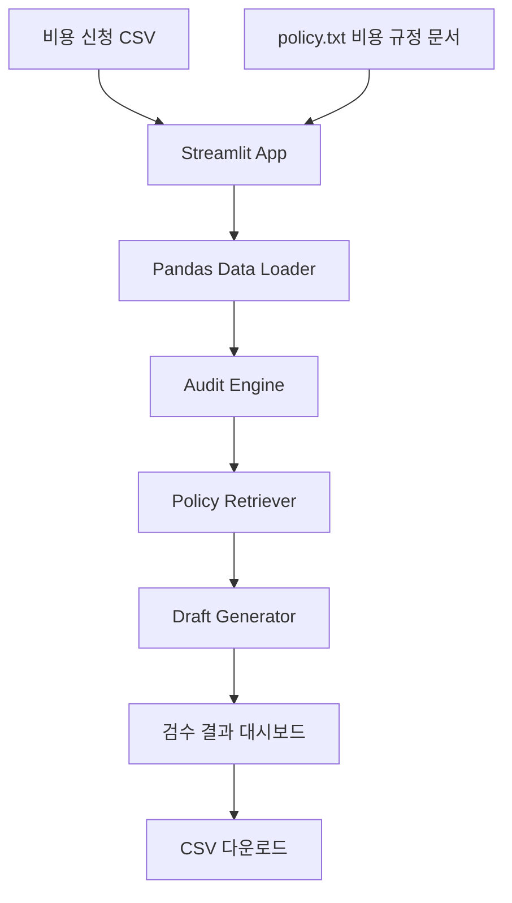
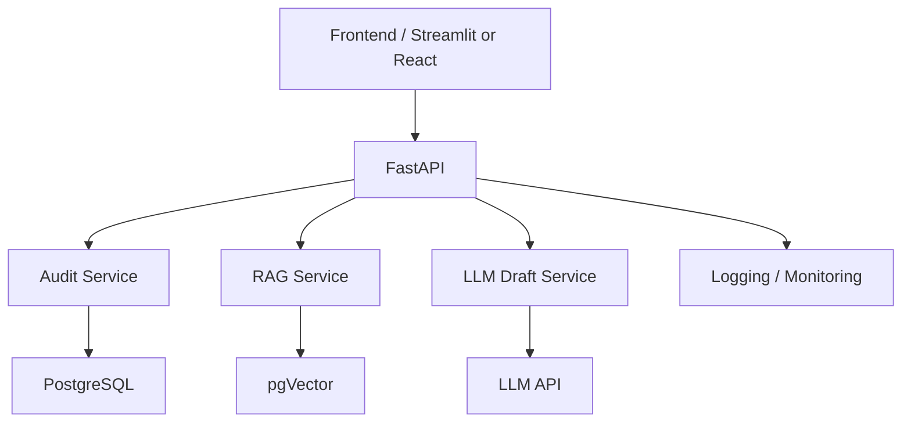

# 6. 아키텍처 설계서

## 6.1 전체 아키텍처 개요

MVP는 Streamlit 단일 앱 구조로 구현한다.
CSV 파일과 `policy.txt`를 입력으로 받아 Pandas 기반 검수 로직과 미니 RAG 검색 로직을 실행하고, 결과를 화면과 CSV 다운로드로 제공한다.

## MVP 구성요소

| 구성요소 | 역할 | 기술 |
|---|---|---|
| Web Dashboard | 사용자 화면 | Streamlit |
| Data Loader | CSV 로드 | Pandas |
| Audit Engine | 규칙 기반 검수 | Python |
| Policy Retriever | 규정 문서 검색 | 미니 RAG |
| Draft Generator | 보완 요청 초안 생성 | Template |
| Exporter | 결과 CSV 다운로드 | Pandas, Streamlit |

---

## 6.2 전체 구성도



---

## 6.3 v2 확장 아키텍처



---

## 6.4 클린 아키텍처 기준 구조

```text
expense-audit-assistant/
├── app.py
├── sample_expenses.csv
├── policy.txt
├── requirements.txt
├── README.md
├── src/
│   ├── data_loader.py
│   ├── audit_rules.py
│   ├── policy_retriever.py
│   ├── draft_generator.py
│   ├── dashboard.py
│   └── exporter.py
└── tests/
    ├── test_audit_rules.py
    └── test_policy_retriever.py
```

| 레이어 | 책임 |
|---|---|
| presentation | Streamlit 화면 |
| application | 검수 흐름 제어 |
| domain | 비용정산 규칙 |
| infrastructure | 파일 입출력 |
| rag | 규정 문서 검색 |
| export | 결과 다운로드 |

---

## 6.5 데이터 모델 설계

## MVP CSV 컬럼

| 컬럼 | 설명 |
|---|---|
| expense_id | 신청 ID |
| employee | 신청자 |
| department | 부서 |
| category | 비용 항목 |
| amount | 금액 |
| date | 사용일 |
| vendor | 사용처 |
| reason | 사용 사유 |
| has_receipt | 영수증 여부 |

## 검수 결과 컬럼

| 컬럼 | 설명 |
|---|---|
| risk_type | 위험 유형 |
| risk_reason | 위험 사유 |
| policy_evidence | 관련 규정 근거 |
| suggested_action | 추천 조치 |
| draft_message | 보완 요청 초안 |
| review_status | 검수 상태 |

---

## 6.6 v2 DB 설계

| 테이블 | 역할 |
|---|---|
| expenses | 비용 신청 원본 |
| audit_results | 검수 결과 |
| policies | 비용 규정 문서 |
| policy_chunks | 규정 청크 |
| draft_messages | AI 초안 |
| review_logs | 담당자 검수 로그 |
| eval_results | RAG/LLM 품질 평가 결과 |

---

## 6.7 벡터 DB 설계

MVP에서는 pgVector를 사용하지 않는다.
v2에서 비용 규정 문서를 chunking하고 embedding을 생성해 pgVector에 저장한다.

| 항목 | 설계 |
|---|---|
| 문서 단위 | 비용 규정 문서 |
| 청크 단위 | 규정 섹션 또는 문단 |
| 메타데이터 | category, policy_type, section_title |
| 검색 전략 | 비용 항목 + 위험 유형 기반 유사도 검색 |
| 실패 처리 | 관련 규정 확인 필요 표시 |

---

## 6.8 보안 설계

MVP에서는 실제 회사 데이터와 개인정보를 사용하지 않는다.
v1 이후에는 다음을 고려한다.

- 사용자 인증
- 역할 기반 권한
- 민감정보 마스킹
- 문서 접근 제어
- 감사 로그
- API 보안

---

## 6.9 미사용 스택 정리

| 기술 | MVP 사용 여부 | 제외 이유 | 추후 확장 |
|---|---|---|---|
| FastAPI | 제외 | 3주 MVP에서는 Streamlit 단일 앱 우선 | v2 |
| PostgreSQL | 제외 | CSV 기반 가치 검증 우선 | v1 |
| pgVector | 제외 | 미니 RAG부터 구현 | v2 |
| OCR | 제외 | 난이도 높음 | v2 |
| Docker | 제외 | 배포보다 기능 완성 우선 | v2 |
| LangGraph | 제외 | 멀티에이전트는 후순위 | v3 |
| MCP server | 제외 | 도구화 단계는 장기 확장 | v3 |
