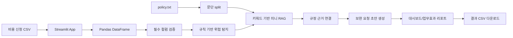
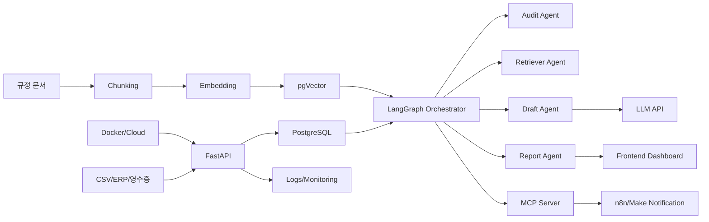
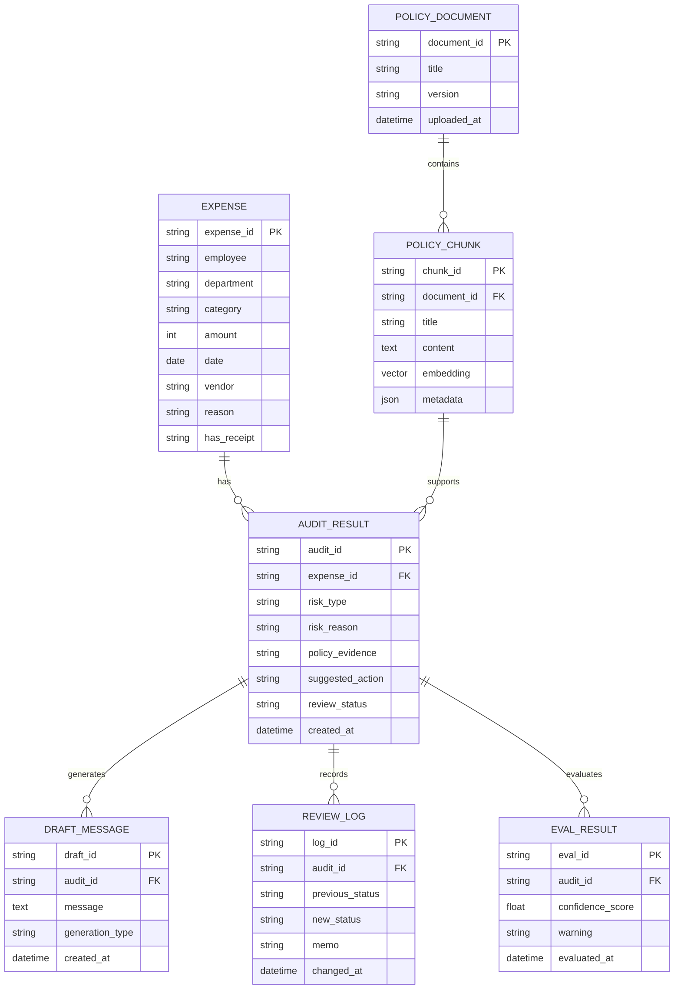
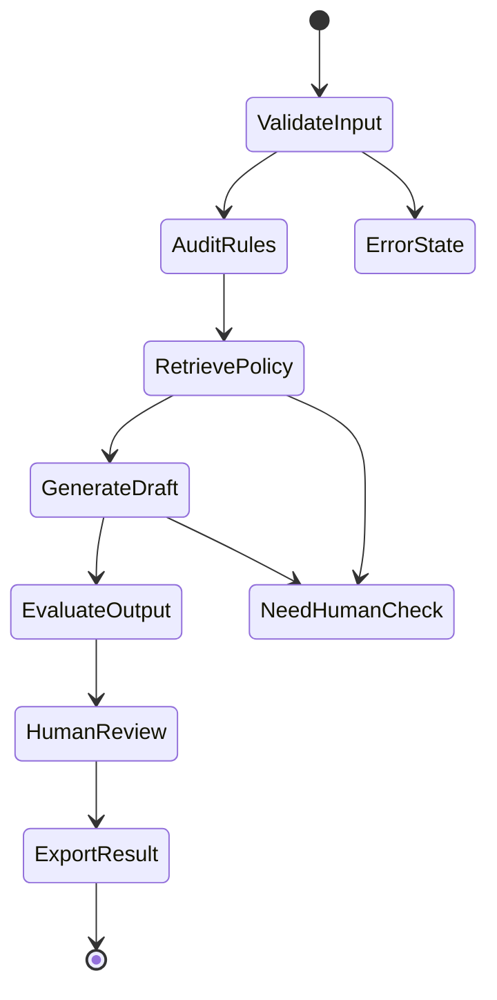

# 6. 아키텍처 설계서

## 6.1 전체 아키텍처 개요

AuditFlow AI의 MVP는 Streamlit 단일 앱 구조다. CSV와 `policy.txt`를 로컬에서 읽고, Pandas로 위험 탐지를 수행하며, 키워드 기반 미니 RAG로 규정 근거를 연결하고, Streamlit 화면에 결과와 대시보드를 표시한다.

### MVP 흐름
```text
비용 신청 CSV
→ Pandas 로드/검증
→ 규칙 기반 위험 탐지
→ policy.txt 문단 분리
→ 키워드 기반 규정 근거 검색
→ 보완 요청 초안 생성
→ 대시보드/업무효과 리포트
→ 결과 CSV 다운로드
```

### v2 확장 흐름
```text
데이터 소스/문서 업로드
→ FastAPI
→ PostgreSQL
→ pgVector RAG
→ LangGraph Agent
→ LLM
→ Streamlit/Frontend
→ n8n/Make 알림
→ Docker/Cloud 배포
→ 로그/모니터링
```

---

## 6.2 전체 구성도

### MVP 구성도



### v2 목표 구성도



---

## 6.3 클린 아키텍처 기준 백엔드 구조

MVP에서는 과한 구조를 피하되, v1/v2로 확장하기 쉽게 모듈을 나눈다.

### 레이어별 책임
| 레이어 | 책임 | MVP 파일 예시 | v2 확장 |
|---|---|---|---|
| Presentation Layer | 화면 표시, 사용자 입력 | `app.py` | frontend/dashboard |
| Application Layer | 흐름 제어 | `app.py` 일부 | use_cases |
| Domain Layer | 검수 규칙, 업무 로직 | `src/audit_rules.py` | domain/services |
| Infrastructure Layer | 파일 로드/다운로드 | `src/data_loader.py`, `src/exporter.py` | DB, storage |
| RAG Layer | 규정 문서 검색 | `src/policy_retriever.py` | pgVector retriever |
| AI Layer | 초안 생성 | `src/draft_generator.py` | LLM, Agent |
| Data Layer | 데이터 구조 | DataFrame | PostgreSQL tables |

### 목표 폴더 구조

```text
Cost_Manager/
├── app.py
├── sample_expenses.csv
├── policy.txt
├── requirements.txt
├── README.md
├── src/
│   ├── data_loader.py
│   ├── audit_rules.py
│   ├── policy_retriever.py
│   ├── draft_generator.py
│   ├── dashboard.py
│   ├── effect_report.py
│   └── exporter.py
└── tests/
    ├── test_audit_rules.py
    └── test_policy_retriever.py
```

---

## 6.4 데이터 모델 설계

### 핵심 엔티티
| 엔티티 | 설명 |
|---|---|
| Expense | 비용 신청 원본 데이터 |
| AuditResult | 위험 탐지 결과 |
| PolicyDocument | 비용 규정 문서 |
| PolicyChunk | 규정 문서 조각 |
| DraftMessage | 보완 요청 초안 |
| ReviewLog | 검수 상태 변경 로그 |
| EvalResult | RAG/LLM 품질 평가 결과 |

### ERD(v1/v2)



### 테이블 정의(v1/v2)
| 테이블 | 주요 컬럼 | 인덱스 |
|---|---|---|
| expenses | expense_id, employee, department, category, amount, date, vendor, reason, has_receipt | expense_id, employee+date+amount+vendor |
| audit_results | audit_id, expense_id, risk_type, risk_reason, policy_evidence, review_status | risk_type, review_status |
| policy_documents | document_id, title, version, uploaded_at | document_id |
| policy_chunks | chunk_id, document_id, content, embedding, metadata | vector index(v2), document_id |
| draft_messages | draft_id, audit_id, message, generation_type | audit_id |
| review_logs | log_id, audit_id, previous_status, new_status, changed_at | audit_id, changed_at |
| eval_results | eval_id, audit_id, confidence_score, warning | audit_id |

---

## 6.5 벡터 DB 설계

MVP에서는 벡터 DB를 사용하지 않는다. v2에서 pgVector를 사용한다.

| 항목 | 설계 |
|---|---|
| 문서 단위 | 비용 규정 문서 버전별 저장 |
| 청크 단위 | 조항/섹션/문단 단위 |
| 임베딩 저장 | `policy_chunks.embedding` |
| 메타데이터 | category, risk_type, section_title, version |
| 인덱싱 전략 | pgVector HNSW 또는 IVFFlat |
| 검색 쿼리 전략 | query embedding + metadata filter |
| 재검색/필터링 | category/risk_type 기반 필터 후 top-k |
| 실패 처리 | confidence 낮으면 "관련 규정 확인 필요" |

---

## 6.6 온톨로지 적용 설계

v2 이후 RAG 검색 품질 개선용으로 사용한다.

| 도메인 개념 | 하위 개념 | 관계 |
|---|---|---|
| 비용 항목 | 식대, 야근식대, 택시비, 사무용품 | Expense.category |
| 검수 리스크 | 영수증 누락, 한도 초과, 중복 신청, 사유 부족 | AuditResult.risk_type |
| 규정 기준 | 한도 금액, 증빙 요건, 승인 요건 | PolicyChunk.metadata |
| 처리 상태 | 미검토, 보완요청, 승인, 반려 | AuditResult.review_status |

### 활용 방식
- 위험 유형과 규정 조항을 메타데이터로 연결
- `택시비` + `사유 부족` 검색 시 관련 조항 우선 검색
- 비슷한 표현도 같은 개념으로 묶어 검색 품질 개선

---

## 6.7 에이전트 아키텍처

MVP에서는 함수 기반으로 구현하고, v2에서 LangGraph 상태 머신으로 확장한다.

### 상태 머신


### Agent별 책임
| Agent | 책임 | 실패/재시도 정책 |
|---|---|---|
| Orchestrator | 전체 흐름 제어 | 실패 원인을 error_state에 저장 |
| Audit Agent | 위험 탐지 | 필수 컬럼 누락 시 중단 |
| Retriever Agent | 규정 근거 검색 | top-k 재검색 후 실패 표시 |
| SQL Agent | 저장/조회 | 쿼리 오류 로그 기록 |
| Tool Agent | 다운로드/알림 | fallback 문안 제공 |
| Report Agent | 대시보드/효과 리포트 | 기본 지표만 표시 |
| Evaluation Agent | 환각/근거 검증 | 사람 검토 필요 표시 |
| Memory Agent | 반복 패턴 저장 | MVP 제외 |

---

## 6.8 MCP server 설계

MVP 제외, v2 확장.

| Tool | Input Schema | Output Schema | 권한 | 실패 처리 |
|---|---|---|---|---|
| load_expense_csv | file_path | rows, columns | 담당자 | invalid_csv |
| run_audit_rules | expense_rows | audit_results | 담당자 | missing_columns |
| search_policy | risk_type, category | evidence, score | 담당자/승인자 | evidence_not_found |
| generate_draft | risk_reason, evidence | draft_message | 담당자 | llm_error |
| export_result | audit_id | file_path | 담당자 | export_failed |
| send_notification | recipient, message | send_status | 담당자 | notification_failed |

---

## 6.9 데이터 파이프라인 설계

MVP에서는 Airflow/BigQuery를 사용하지 않는다.

### MVP
```text
CSV 업로드 → Pandas 로드 → 검증 → 탐지 → 결과 표시
```

### v2
```text
ERP/CSV 수집 → Airflow DAG → 정제 → PostgreSQL 적재 → BigQuery 분석용 복제 → 규정 문서 embedding → pgVector 저장 → API 제공
```

### Airflow DAG 예시(v2)
| 단계 | 설명 |
|---|---|
| extract_expenses | ERP/CSV에서 비용 데이터 수집 |
| validate_schema | 필수 컬럼과 타입 검증 |
| transform_expenses | category, amount, date 정제 |
| load_postgres | PostgreSQL 적재 |
| build_policy_embeddings | 규정 문서 chunk/embedding |
| quality_check | 데이터 품질 검증 |
| notify_result | 실패/성공 알림 |

---

## 6.10 인프라 설계

| 항목 | MVP | v2 |
|---|---|---|
| 실행 환경 | 로컬 Streamlit | Docker Compose |
| 백엔드 | 없음 | FastAPI |
| DB | 없음 | PostgreSQL |
| Vector DB | 없음 | pgVector |
| 배포 | 로컬 실행/Streamlit Cloud 선택 | AWS/GCP/Azure |
| CI/CD | 수동 | GitHub Actions |
| 환경변수 | `.env` 선택 | Secret Manager/GitHub Secrets |
| 모니터링 | 화면 지표 | 로그, 비용, LLM 호출량 |

### docker-compose(v2) 구성
```text
services:
  api: FastAPI
  db: PostgreSQL + pgVector
  frontend: Streamlit
  worker: optional background worker
```

---

## 6.11 운영 설계

| 항목 | 설계 |
|---|---|
| 로깅 | 업로드, 검수 실행, 초안 생성, 다운로드 이벤트 기록(v1) |
| 모니터링 | 처리 시간, 오류 수, LLM 호출 수, 근거 매칭률 |
| 알림 | v2에서 n8n/Make/Slack |
| 비용 추적 | LLM 호출 건수와 평균 토큰 사용량 |
| 캐싱 | policy.txt chunk와 검색 결과 캐싱 |
| 장애 대응 | fallback 문구, 사람 검토 필요 표시 |
| LLM 호출량 관리 | 위험 건 선택 시에만 호출 |

---

## 6.12 보안 설계

| 항목 | 설계 |
|---|---|
| 인증 | MVP 제외, v2에서 담당자/승인자 권한 |
| 권한 | 문서 접근/검수 상태 변경 권한 분리 |
| 문서 접근 제어 | 규정 문서별 접근 권한 |
| 민감정보 마스킹 | 이름/부서/사용처 샘플화 또는 마스킹 |
| 감사 로그 | 검수 상태 변경, 초안 생성, 다운로드 로그 |
| API 보안 | v2에서 JWT/세션, rate limit, input validation |
| AI 보안 | 근거 없는 판단 금지, 승인/반려 자동화 금지 |

---

## 6.13 기술 스택 매핑

| 컴포넌트 | 사용하는 기술 | 사용하는 이유 | 대안 기술 | 면접 설명 포인트 |
|---|---|---|---|---|
| UI/MVP | Streamlit | 빠른 데이터 앱 구현 | React | 핵심 가치 검증을 빠르게 하기 위해 선택 |
| 데이터 처리 | Pandas | CSV 검수/집계에 적합 | Polars | 비용정산 규칙을 DataFrame 조건으로 구현 |
| 규정 검색 | 미니 RAG | 초보자 MVP에 적합 | pgVector | 먼저 키워드 기반으로 근거 연결 검증 |
| 초안 생성 | 템플릿/LLM | 반복 문구 작성 감소 | 룰 기반만 사용 | AI는 판단자가 아니라 초안 보조자 |
| 저장소(v1) | SQLite/PostgreSQL | 검수 결과 이력 관리 | 파일 저장 | 기록과 감사 대응 확장 |
| API(v2) | FastAPI | 서비스 구조 확장 | Flask | Streamlit 단일 앱에서 백엔드 분리 |
| Vector DB(v2) | pgVector | 규정 문서 embedding 검색 | Pinecone | PostgreSQL과 통합 가능 |
| 자동화(v2) | n8n/Make | 알림/외부 시스템 연동 | Zapier | 실제 업무 흐름 자동화 확장 |
| 배포(v2) | Docker | 재현 가능한 실행 환경 | 로컬 실행 | 면접에서 실행 가능성 설명 |

---

## 6.14 미사용 스택 정리

| 제외 기술 | 제외 이유 | 추후 확장 가능성 |
|---|---|---|
| LangGraph | MVP에는 함수 흐름으로 충분 | v2에서 Agent 워크플로우 |
| MCP server | 도구 노출 전 API/함수 안정화 필요 | v2/v3에서 tool server |
| Airflow | MVP 데이터는 수동 CSV 업로드 | ERP 정기 수집 시 사용 |
| BigQuery | 샘플 규모에서는 과함 | 대용량 비용 분석 시 사용 |
| Docker | Day 1~18에서는 학습 부담 큼 | v2 배포 단계 |
| GitHub Actions | 테스트가 안정화된 후 적용 | v2 CI/CD |
| OCR | 영수증 이미지 데이터가 없음 | v2 기능 |
| AI 자동 승인/반려 | 리스크 큼, 내부통제상 부적절 | 계속 제외 또는 강한 통제 필요 |

---

