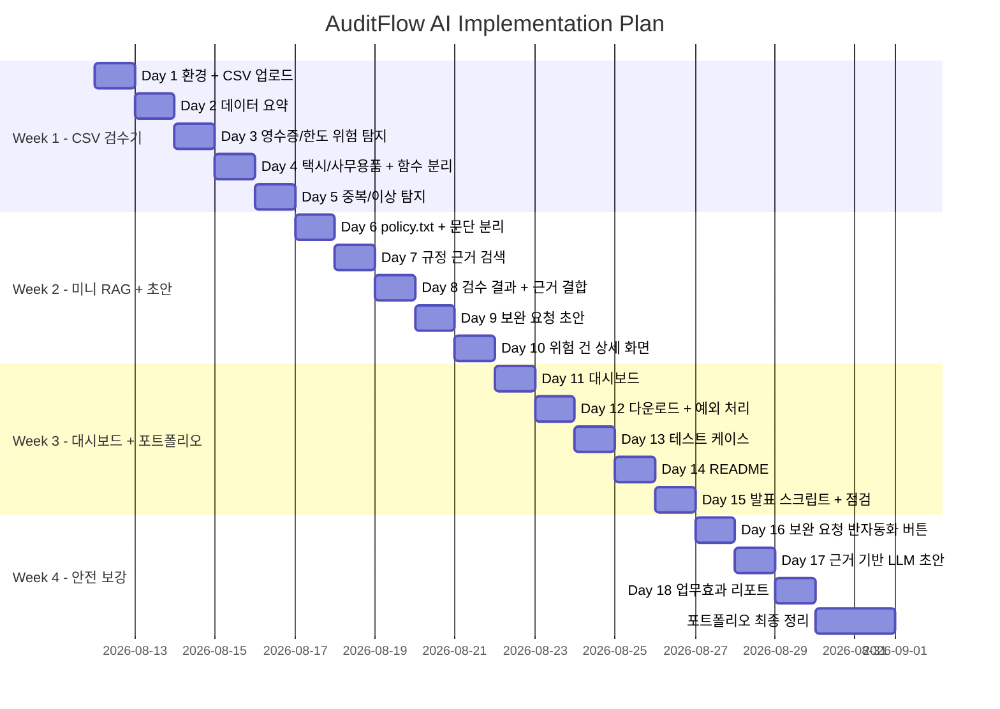

# 7. 구현 계획 / WBS / 간트차트

## 7.1 구현 전략

### MVP 우선 구현 전략
AuditFlow AI는 처음부터 모든 기술을 넣지 않는다. 먼저 비용정산 1차 검수의 핵심 가치인 `CSV 업로드 → 데이터 요약 → 위험 탐지 → 규정 근거 → 초안 → 대시보드 → 다운로드` 흐름을 완성한다.

### 핵심 가치 검증 순서
1. 비용 신청 CSV를 화면에 띄울 수 있는가
2. 데이터 구조와 품질을 요약할 수 있는가
3. 7종 위험 유형을 자동 탐지할 수 있는가
4. 위험 건에 관련 규정 근거를 연결할 수 있는가
5. 보완 요청 초안을 만들 수 있는가
6. 결과를 다운로드하고 업무효과를 숫자로 설명할 수 있는가
7. LLM/DB/API/자동화는 가치 검증 후 확장한다

### 의존성 설명
```text
데이터 적재
→ 데이터 검증
→ 위험 탐지
→ 규정 검색
→ 응답/초안 생성
→ 대시보드/리포트
→ 다운로드/문안 복사
→ DB 저장(v1)
→ API 분리(v2)
→ 에이전트화(v2)
→ 외부 자동화 연동(v2)
```

---

## 7.2 WBS

| WBS ID | 작업명 | 영역 | 상세 설명 | 산출물 | 담당 역할 | 우선순위 | 선행 작업 | 예상 소요 | 관련 기술 스택 |
|---|---|---|---|---|---|---|---|---|---|
| WBS-001 | 프로젝트 폴더 생성 | 기획/문서 | 기본 폴더와 파일 생성 | 폴더 구조 | 개발자 | P0 | 없음 | 30분 | OS |
| WBS-002 | requirements 작성 | Infra/DevOps | streamlit, pandas 등 명시 | requirements.txt | 개발자 | P0 | WBS-001 | 20분 | Python |
| WBS-003 | Streamlit 첫 화면 | Frontend/Dashboard | 제목, 설명, Hello 표시 | app.py | 개발자 | P0 | WBS-002 | 30분 | Streamlit |
| WBS-004 | CSV 업로드 | Frontend/Dashboard | file_uploader 구현 | 업로드 UI | 개발자 | P0 | WBS-003 | 40분 | Streamlit, Pandas |
| WBS-005 | 샘플 데이터 작성 | 데이터 파이프라인 | 12~15행 샘플 CSV 작성 | sample_expenses.csv | 개발자/PM | P0 | WBS-004 | 40분 | CSV |
| WBS-006 | 데이터 요약 | Frontend/Dashboard | 행/열, 컬럼, 결측치, 총액 표시 | 요약 화면 | 개발자 | P0 | WBS-004 | 1일 | Pandas |
| WBS-007 | 필수 컬럼 검증 | QA/Test | 필수 컬럼 누락 처리 | 검증 함수 | 개발자 | P0 | WBS-006 | 0.5일 | Python |
| WBS-008 | 영수증/한도 탐지 | Backend API | 영수증 누락, 식대/야근식대 한도 초과 | 규칙 함수 | 개발자 | P0 | WBS-006 | 1일 | Pandas |
| WBS-009 | 택시/사무용품 탐지 | Backend API | 택시비 사유 부족, 사무용품 승인 필요 | 규칙 함수 | 개발자 | P0 | WBS-008 | 1일 | Pandas |
| WBS-010 | 함수 분리 | Backend API | `src/audit_rules.py`로 분리 | 모듈 | 개발자 | P1 | WBS-009 | 0.5일 | Python |
| WBS-011 | 중복/이상 탐지 | Backend API | duplicated, category 평균 2배 이상 | 규칙 함수 | 개발자 | P0 | WBS-010 | 1일 | Pandas |
| WBS-012 | policy.txt 작성 | RAG | 비용 규정 샘플 작성 | policy.txt | PM/개발자 | P0 | WBS-011 | 0.5일 | Text |
| WBS-013 | 문단 분리 | RAG | policy.txt split | chunks | 개발자 | P0 | WBS-012 | 0.5일 | Python |
| WBS-014 | 키워드 매핑 검색 | RAG | risk_type/category 기반 근거 검색 | policy_retriever.py | 개발자 | P0 | WBS-013 | 1일 | Python |
| WBS-015 | 근거 결합 | RAG | 결과 테이블에 policy_evidence 추가 | result DataFrame | 개발자 | P0 | WBS-014 | 1일 | Pandas |
| WBS-016 | 보완 요청 초안 | LLM/Agent | 템플릿 기반 초안 생성 | draft_generator.py | 개발자 | P1 | WBS-015 | 1일 | Python |
| WBS-017 | 상세 화면 | Frontend/Dashboard | selectbox로 위험 건 상세 표시 | 상세 UI | 개발자 | P1 | WBS-016 | 1일 | Streamlit |
| WBS-018 | 대시보드 | Frontend/Dashboard | metric, bar_chart 표시 | 대시보드 | 개발자 | P1 | WBS-011 | 1일 | Streamlit |
| WBS-019 | 다운로드 | Frontend/Dashboard | 결과 CSV 다운로드 | download_button | 개발자 | P0 | WBS-018 | 0.5일 | Pandas |
| WBS-020 | 테스트 케이스 | QA/Test | 주요 규칙 테스트 | tests | 개발자 | P1 | WBS-011 | 1일 | pytest |
| WBS-021 | README 작성 | README/Demo | 문제정의, 실행법, 데모 | README.md | 개발자/PM | P1 | WBS-019 | 1일 | Markdown |
| WBS-022 | 발표 스크립트 | README/Demo | 3분 발표 문장 작성 | script.md | PM | P1 | WBS-021 | 0.5일 | Markdown |
| WBS-023 | 보완 요청 버튼 | Automation | mailto/복사용 문안 생성 | 반자동화 UI | 개발자 | P1 | WBS-017 | 1일 | Streamlit |
| WBS-024 | LLM 초안 생성 | LLM/Agent | 근거 기반 초안 생성 | LLM draft | 개발자 | P1 | WBS-023 | 1일 | LLM API |
| WBS-025 | 업무효과 리포트 | Frontend/Dashboard | 절감 시간/절감률 계산 | effect_report.py | 개발자 | P1 | WBS-018 | 1일 | Python |
| WBS-026 | 포트폴리오 정리 | README/Demo | 캡처, 한계, 확장 계획 | 최종 README | 개발자 | P1 | WBS-025 | 1일 | Markdown |
| WBS-027 | DB 저장(v1) | DB/모델링 | SQLite/PostgreSQL 저장 | audit_results table | 개발자 | P2 | MVP 완료 | 3일 | SQL |
| WBS-028 | FastAPI(v2) | Backend API | API 서버 분리 | API spec | 개발자 | P2 | v1 | 5일 | FastAPI |
| WBS-029 | pgVector RAG(v2) | RAG | embedding 검색 | vector search | 개발자 | P2 | v1 | 5일 | pgVector |
| WBS-030 | Docker(v2) | Infra/DevOps | 실행 환경 컨테이너화 | docker-compose.yml | 개발자 | P2 | v2 구조 | 2일 | Docker |
| WBS-031 | n8n/Make(v2) | Automation | 알림 자동화 | workflow | 개발자 | P2 | API 분리 | 3일 | n8n/Make |

---

## 7.3 마일스톤

| 단계 | 목표 | 포함 기능 | 제외 기능 | 완료 기준 | 예상 기간 |
|---|---|---|---|---|---|
| MVP | 비용정산 1차 검수 지원 도구 완성 | CSV 업로드, 요약, 위험 탐지, 미니 RAG, 초안, 대시보드, 다운로드 | DB, FastAPI, Docker, OCR | Day 15 데모 가능 | 3주 |
| 안전 보강 | AX/DX 포트폴리오 방어력 강화 | 보완 요청 버튼, LLM 초안, 업무효과 리포트 | 실제 발송, ERP 연동 | Day 18 면접 설명 가능 | 3일 |
| v1 | 기록/상태 관리 강화 | SQLite/PostgreSQL, SQL 집계, 로그, 테스트 확대 | pgVector, OCR | 검수 결과 저장/조회 가능 | 1~2주 |
| v2 | 서비스 구조 확장 | FastAPI, pgVector, Docker, n8n/Make, OCR | AI 자동 승인/반려 | API/RAG/배포 구조 설명 가능 | 2~4주 |
| 포트폴리오 정리 | 제출/면접용 완성 | README, 캡처, 발표, 한계/확장 | 신규 기능 | GitHub 제출 가능 | 2~3일 |

---

## 7.4 주차별 일정표

현실적으로는 **4주 일정**을 추천한다. 이유는 3주만 하면 MVP는 가능하지만 포트폴리오 안전 보강과 README 정리에 시간이 부족하고, 6~8주는 초보 단계에서 늘어질 위험이 있기 때문이다.

| 주차 | 목표 | 주요 작업 | 산출물 | 사용 스택 | 리스크 |
|---|---|---|---|---|---|
| 1주차 | CSV 검수기 완성 | 업로드, 요약, 위험 탐지 7종 | app.py, audit_rules.py | Python, Pandas, Streamlit | 조건 필터에서 막힘 |
| 2주차 | 미니 RAG + 초안 | policy.txt, 근거 검색, 초안, 상세 화면 | policy_retriever.py, draft_generator.py | Python, 미니 RAG | 근거 매칭률 낮음 |
| 3주차 | 대시보드 + 결과물 | 대시보드, 다운로드, 테스트, README, 발표 | dashboard.py, README.md | Streamlit, pytest | 기능 정리 부족 |
| 4주차 | 안전 보강 + 포트폴리오 | 반자동화 버튼, LLM 초안, 업무효과 리포트, 문서 7종 정리 | 최종 포트폴리오 | LLM API, Markdown | LLM/API 설정 부담 |

---

## 7.5 간트차트



---

## 7.6 우선순위 및 의존성

### 반드시 먼저 해야 하는 작업
- app.py 생성
- Streamlit 실행
- CSV 업로드
- 데이터 미리보기
- 필수 컬럼 검증
- 위험 탐지 규칙 구현

### 병렬로 가능한 작업
- 샘플 CSV 작성
- policy.txt 작성
- README 초안 작성
- 발표 문장 초안 작성

### 나중에 해도 되는 작업
- LLM 초안 생성
- DB 저장
- FastAPI 분리
- pgVector RAG
- Docker
- n8n/Make

### MVP에서 제거해도 되는 작업
- 이상 비용 후보 탐지
- LLM API
- 테스트 케이스 전체
- 업무효과 리포트 고도화
- 메일/Slack 실제 발송

---

## 7.7 리스크 및 대응 전략

| 리스크 | 발생 가능성 | 영향도 | 대응 방안 | 조기 감지 신호 |
|---|---|---|---|---|
| 데이터 품질 낮음 | 중 | 높음 | 필수 컬럼 검증, 샘플 데이터 통제 | 컬럼 오류가 자주 발생 |
| RAG 검색 실패 | 중 | 중 | 키워드 매핑 보강, 실패 시 확인 필요 표시 | policy_evidence 빈 값 증가 |
| LLM 환각 | 중 | 높음 | 근거 없으면 초안 제한, 템플릿 fallback | 없는 규정/금액 생성 |
| 비용 폭증 | 낮음 | 중 | 선택 건만 LLM 호출 | 테스트 중 호출량 증가 |
| 일정 지연 | 높음 | 중 | Day 단위 최소선 운영 | 하루 기능 미완료 |
| 기능 과다 | 높음 | 높음 | MVP/v1/v2 분리 | Docker/FastAPI를 초반에 만짐 |
| 배포 실패 | 중 | 낮음 | MVP는 로컬/Streamlit로 제한 | 환경 설정에서 오래 막힘 |
| 면접에서 설명 어려운 스택 포함 | 높음 | 높음 | 구현하지 않은 기술은 확장안으로만 표기 | README에 과장 표현 등장 |

---

## 7.8 MVP 정의

### 가장 빠르게 가치를 검증할 최소 기능
CSV를 업로드하면 비용 신청 데이터를 요약하고, 규정 위반 가능성이 있는 위험 건을 자동 탐지하며, 관련 규정 근거와 보완 요청 초안을 제공하는 Streamlit 앱.

### MVP에 반드시 들어갈 기능
- CSV 업로드
- 데이터 미리보기
- 행/열/결측치/컬럼/총액 요약
- 필수 컬럼 검증
- 7종 위험 탐지
- policy.txt 기반 미니 RAG
- 규정 근거 표시
- 보완 요청 초안 생성
- 위험 유형별 대시보드
- 결과 CSV 다운로드
- README/발표 문장

### MVP에서 제외할 기능
- 실제 메일/Slack 발송
- ERP 연동
- OCR
- DB 저장
- FastAPI
- pgVector
- Docker
- LangGraph
- MCP server
- Airflow/BigQuery
- AI 자동 승인/반려

### MVP 성공 기준
| 기준 | 목표 |
|---|---|
| CSV 업로드 | 정상 작동 |
| 데이터 요약 | 행/열/결측치/총액 표시 |
| 위험 탐지 | 7종 위험 유형 작동 |
| 근거 검색 | 위험 건 80% 이상 근거 연결 |
| 초안 생성 | 위험 건 80% 이상 초안 생성 |
| 다운로드 | 결과 CSV 정상 다운로드 |
| 설명 가능성 | 3분 발표 가능 |

---

## 7.9 테스트 계획

| 테스트 유형 | 테스트 내용 | 성공 기준 |
|---|---|---|
| 단위 테스트 | 영수증 누락, 한도 초과, 중복 신청 함수 | expected risk_type 일치 |
| API 테스트 | MVP 제외, v2에서 FastAPI endpoint 테스트 | status code/response 검증 |
| RAG 검색 테스트 | risk_type별 policy_evidence 매칭 | expected 문단 포함 |
| Agent workflow 테스트 | MVP 제외, v2에서 LangGraph 상태 전이 테스트 | 실패 분기 정상 작동 |
| eval harness 테스트 | 근거 없는 초안 제한 | 제한 문구 출력 |
| 사용자 시나리오 테스트 | 업로드→검수→근거→초안→다운로드 | end-to-end 1회 성공 |
| 예외 테스트 | 필수 컬럼 누락, 빈 CSV, 근거 없음 | 친절한 오류 메시지 |

---

## 7.10 스택 커버리지 표

| 목표 기술 스택 | 사용 여부 | 사용 위치 | 구현 마일스톤 | 면접 설명 포인트 | 제외 시 이유 |
|---|---|---|---|---|---|
| Python | 사용 | 전체 로직 | MVP | 업무 규칙을 코드로 구현 | - |
| Pandas | 사용 | CSV 처리/탐지/집계 | MVP | 비용 데이터 분석과 조건 탐지 | - |
| Streamlit | 사용 | 화면/대시보드 | MVP | 빠른 MVP 검증 | - |
| LLM API | 부분 사용 | 근거 기반 초안 | 안전 보강/v1 | AI는 판단자가 아니라 초안 보조자 | 초기 MVP는 템플릿 |
| 프롬프트 엔지니어링 | 부분 사용 | 초안 생성 | 안전 보강/v1 | 근거 기반, 환각 제한 | 초기에는 단순 |
| RAG | 사용 | policy.txt 검색 | MVP | 규정 근거 기반 판단 지원 | - |
| chunking | 부분 사용 | policy 문단 분리 | MVP | 문서 조각 검색 개념 | embedding은 v2 |
| SQL | 제외/확장 | 검수 결과 저장 | v1 | 기록/감사 대응 | MVP는 CSV 다운로드 |
| PostgreSQL | 제외/확장 | DB 저장 | v1/v2 | 서비스 확장 | 초반 부담 |
| pgVector | 제외/확장 | embedding 검색 | v2 | 고도화된 RAG | MVP는 키워드 충분 |
| FastAPI | 제외/확장 | API 서버 | v2 | 서비스 구조 확장 | Streamlit 단일 앱 우선 |
| Docker | 제외/확장 | 배포 | v2 | 실행 환경 재현성 | 초반 부담 |
| GitHub Actions | 제외/확장 | CI | v2 | 테스트 자동화 | 테스트 안정화 후 |
| n8n/Make | 제외/확장 | 알림 자동화 | v2 | 업무 워크플로우 연동 | 실제 연동은 후순위 |
| LangGraph | 제외/확장 | Agent workflow | v2 | 복잡한 흐름 관리 | MVP 과함 |
| MCP server | 제외/확장 | tool server | v2/v3 | 도구 호출 구조 | 기능 안정화 후 |
| Airflow | 제외 | 정기 파이프라인 | v3 | 대량/정기 처리 | CSV 업로드 MVP에는 과함 |
| BigQuery | 제외 | 분석 DW | v3 | 대규모 분석 | 샘플 규모 과함 |

---

## 7.11 포트폴리오 정리 계획

### README 구성
1. 프로젝트 소개
2. 문제 정의
3. 핵심 기능
4. 데모 화면
5. 사용 데이터
6. 규정 기반 검수 로직
7. 미니 RAG 설계
8. 보완 요청 초안 생성
9. 업무효과 리포트
10. 실행 방법
11. 기술 스택 선택 이유
12. 한계와 리스크
13. v1/v2 확장 계획
14. 면접 어필 포인트

### 아키텍처 다이어그램
- MVP 구성도
- v2 확장 구성도
- 데이터 흐름도

### 데모 시나리오
1. 샘플 비용 신청 CSV 업로드
2. 데이터 요약 확인
3. 위험 건 자동 탐지
4. 위험 건 상세 선택
5. 규정 근거와 초안 확인
6. 업무효과 리포트 확인
7. 결과 CSV 다운로드

### API 명세
MVP에서는 없음. v2 확장안으로 README에 별도 표기.

### 기술 선택 이유
- Streamlit: 빠른 MVP 화면 구현
- Pandas: CSV 기반 데이터 검수에 적합
- 미니 RAG: 초보 단계에서 규정 근거 연결을 검증하기 적합
- LLM: 보완 요청 초안 작성 반복 업무 감소
- DB/FastAPI/Docker: v1/v2 확장으로 분리

### 트러블슈팅 기록
- CSV 인코딩 오류
- 필수 컬럼 누락
- 금액 문자열 변환
- reason 결측 판단
- 중복 탐지 기준
- 규정 근거 검색 실패
- LLM 초안 환각 방지

### 성능/품질 개선 결과
- 위험 탐지율
- 규정 근거 매칭률
- 초안 생성률
- 예상 검수 시간 절감률
- 다운로드 성공률

### 면접에서 강조할 포인트
> “AuditFlow AI는 비용정산 담당자의 1차 검수 업무를 지원하는 AX/DX MVP입니다. CSV 비용 신청 데이터를 규칙 기반으로 분석해 위험 후보를 자동 탐지하고, 관련 비용 규정 근거와 보완 요청 초안을 제공합니다. AI가 승인 여부를 결정하지 않고, 실무자가 근거를 보고 빠르게 판단하는 human-in-the-loop 구조로 설계했습니다.”