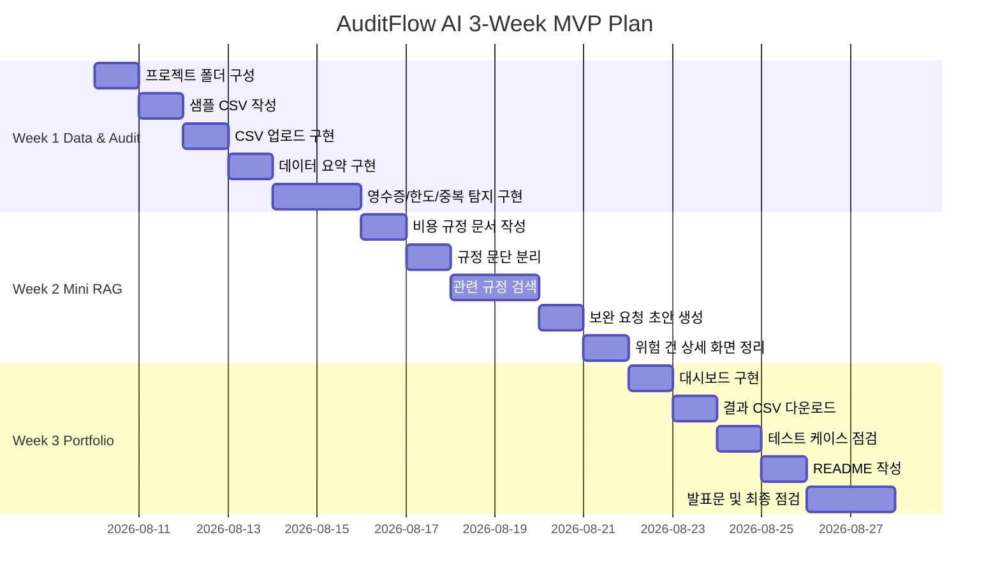

# 7. 구현 계획 / WBS / 간트차트

## 7.1 구현 전략

MVP는 3주 동안 핵심 업무 흐름을 닫는 것을 목표로 한다.

**핵심 흐름**

```text
CSV 업로드
→ 데이터 요약
→ 위험 신청 건 탐지
→ 규정 근거 검색
→ 보완 요청 초안 생성
→ 결과 CSV 다운로드
→ README/발표 정리
```

기술을 많이 넣는 것보다, 비용정산 검수 문제 하나를 끝까지 작동하게 만드는 것을 우선한다.

---

## 7.2 WBS

| WBS ID | 작업명 | 영역 | 산출물 | 우선순위 | 선행 작업 | 예상 소요 | 기술 |
|---|---|---|---|---|---|---|---|
| WBS-001 | 프로젝트 폴더 구성 | 기획/문서 | 폴더, README 초안 | P0 | 없음 | 0.5일 | Git |
| WBS-002 | 샘플 CSV 작성 | 데이터 | sample_expenses.csv | P0 | 없음 | 0.5일 | CSV |
| WBS-003 | 비용 규정 문서 작성 | RAG | policy.txt | P0 | 없음 | 0.5일 | Text |
| WBS-004 | CSV 업로드 구현 | Frontend | 업로드 화면 | P0 | WBS-002 | 1일 | Streamlit |
| WBS-005 | 데이터 요약 구현 | Data | 요약 지표 | P0 | WBS-004 | 1일 | Pandas |
| WBS-006 | 영수증 누락 탐지 | Audit | risk_type | P0 | WBS-005 | 1일 | Python |
| WBS-007 | 한도 초과 탐지 | Audit | risk_reason | P0 | WBS-006 | 1일 | Pandas |
| WBS-008 | 중복 신청 탐지 | Audit | duplicate flag | P0 | WBS-007 | 1일 | Pandas |
| WBS-009 | 이상 비용 후보 탐지 | Audit | anomaly flag | P1 | WBS-008 | 1일 | Pandas |
| WBS-010 | policy.txt 문단 분리 | RAG | policy chunks | P0 | WBS-003 | 1일 | Python |
| WBS-011 | 규정 근거 검색 | RAG | evidence | P0 | WBS-010 | 1일 | Python |
| WBS-012 | 보완 요청 초안 생성 | LLM/Agent | draft_message | P1 | WBS-011 | 1일 | Template |
| WBS-013 | 대시보드 구현 | Dashboard | 위험 유형별 카드 | P1 | WBS-008 | 1일 | Streamlit |
| WBS-014 | CSV 다운로드 | Export | result.csv | P0 | WBS-012 | 0.5일 | Pandas |
| WBS-015 | 테스트 케이스 작성 | QA/Test | 테스트 시나리오 | P1 | 주요 기능 | 1일 | Python |
| WBS-016 | README 작성 | README/Demo | README.md | P0 | 기능 완성 | 1일 | Markdown |
| WBS-017 | 발표문 작성 | README/Demo | 3분 발표문 | P0 | README | 1일 | 문서화 |
| WBS-018 | 최종 점검 | QA/Test | 실행 캡처 | P0 | 전체 | 1일 | GitHub |

---

## 7.3 마일스톤

| 단계 | 목표 | 포함 기능 | 제외 기능 | 완료 기준 | 예상 기간 |
|---|---|---|---|---|---|
| MVP | 핵심 검수 흐름 완성 | CSV, 요약, 위험 탐지, 미니 RAG, 다운로드 | DB, FastAPI, OCR | 로컬에서 전체 흐름 실행 | 3주 |
| v1 | AI/DB 확장 | LLM API, SQL 저장, 검수 로그 | OCR, pgVector | DB 저장 및 AI 초안 생성 | 2~3주 |
| v2 | 서비스 구조 확장 | FastAPI, PostgreSQL, pgVector, OCR | ERP 연동 | API/RAG/OCR 분리 | 4~6주 |
| 포트폴리오 정리 | 채용 제출용 정리 | README, 데모, 발표문 | 신규 기능 | GitHub 제출 가능 | 3일 |

---

## 7.4 주차별 일정표

| 주차 | 목표 | 주요 작업 | 산출물 | 사용 스택 | 리스크 |
|---|---|---|---|---|---|
| 1주차 | CSV 검수기 완성 | CSV 업로드, 요약, 영수증 누락, 한도 초과, 중복 탐지 | 기본 검수 앱 | Python, Pandas, Streamlit | Pandas 이해 부족 |
| 2주차 | 미니 RAG와 초안 생성 | policy.txt 작성, 문단 분리, 근거 검색, 초안 생성 | 근거 기반 검수 결과 | Python, 미니 RAG | 검색 매칭 실패 |
| 3주차 | 대시보드와 포트폴리오화 | 대시보드, 다운로드, README, 발표문, 테스트 | 제출용 MVP | Streamlit, GitHub | 일정 지연 |

---

## 7.5 간트차트



---

## 7.6 우선순위 및 의존성

## 반드시 먼저 해야 하는 작업

1. 샘플 CSV 작성
2. Streamlit 실행
3. CSV 업로드
4. 데이터 요약
5. 위험 탐지 규칙 구현

## 병렬로 가능한 작업

- policy.txt 작성
- README 초안 작성
- 발표 문장 초안 작성
- 테스트 케이스 목록 작성

## 나중에 해도 되는 작업

- LLM API
- SQL 저장
- FastAPI
- pgVector
- OCR
- Docker

## MVP에서 제거해도 되는 작업

- 이상 비용 후보 탐지
- 대시보드 시각화 일부
- LLM API 연결
- 배포

---

## 7.7 리스크 및 대응 전략

| 리스크 | 발생 가능성 | 영향도 | 대응 방안 | 조기 감지 신호 |
|---|---|---|---|---|
| 데이터 품질 낮음 | 중간 | 높음 | 필수 컬럼 검증 추가 | 업로드 후 에러 발생 |
| RAG 검색 실패 | 높음 | 중간 | 키워드 매핑 테이블 사용 | 관련 규정 없음 증가 |
| LLM 환각 | 중간 | 높음 | MVP는 템플릿 기반 초안 사용 | 근거 없는 문장 생성 |
| 비용 폭증 | 낮음 | 중간 | MVP는 외부 API 미사용 | API 호출량 증가 |
| 일정 지연 | 높음 | 높음 | P0 기능 우선 구현 | 1주차에 CSV 업로드 미완성 |
| 기능 과다 | 높음 | 높음 | MVP/v1/v2 분리 | 새 기술 추가 욕심 |
| 배포 실패 | 중간 | 낮음 | 로컬 실행+캡처 우선 | 배포 설정에서 막힘 |
| 설명 어려운 스택 포함 | 높음 | 높음 | 구현한 기술만 강조 | README 설명이 추상적임 |

---

## 7.8 MVP 정의

## 가장 빠르게 가치를 검증할 최소 기능

비용 신청 CSV를 업로드하면 위험 신청 건을 자동 탐지하고, 관련 비용 규정 근거와 보완 요청 초안을 제공한 뒤 결과 CSV로 다운로드할 수 있는 기능

## MVP에 반드시 들어갈 기능

- CSV 업로드
- 데이터 요약
- 위험 탐지
- 규정 근거 검색
- 보완 요청 초안
- 결과 다운로드
- README

## MVP에서 제외할 기능

- OCR
- PostgreSQL
- FastAPI
- pgVector
- LangGraph
- MCP server
- ERP 연동
- 로그인

## MVP 성공 기준

- 샘플 CSV 업로드가 가능하다.
- 위험 신청 건이 자동 탐지된다.
- 위험 건에 관련 규정 근거가 표시된다.
- 보완 요청 초안이 생성된다.
- 결과 CSV 다운로드가 가능하다.
- README에서 문제 정의, 기능, 기술 선택 이유, 확장 계획을 설명한다.

---

## 7.9 테스트 계획

| 테스트 유형 | 테스트 내용 |
|---|---|
| 단위 테스트 | 영수증 누락, 한도 초과, 중복 탐지 함수 테스트 |
| API 테스트 | MVP 제외, v2에서 FastAPI 테스트 |
| RAG 검색 테스트 | 위험 유형별 관련 규정 문단 매칭 확인 |
| Agent workflow 테스트 | MVP 제외, v3에서 LangGraph 테스트 |
| Eval Harness 테스트 | 샘플 케이스 기반 수동 평가 |
| 사용자 시나리오 테스트 | CSV 업로드부터 다운로드까지 전체 흐름 확인 |

---

## 7.10 스택 커버리지 표

| 목표 기술 스택 | 사용 여부 | 사용 위치 | 마일스톤 | 면접 설명 포인트 | 제외 시 이유 |
|---|---|---|---|---|---|
| Python | 사용 | 검수 로직 | MVP | 업무 규칙을 코드로 구현 | - |
| Pandas | 사용 | CSV 처리, 집계 | MVP | 데이터 분석/정제 역량 | - |
| Streamlit | 사용 | 대시보드 | MVP | 빠른 업무 MVP 구현 | - |
| RAG | 일부 사용 | policy.txt 검색 | MVP | 근거 기반 검수 구조 | 벡터DB는 v2 |
| LLM API | 선택 | 초안 생성 | v1 | 근거 기반 문장 생성 | MVP는 템플릿 |
| SQL | 제외 | 검수 로그 저장 | v1 | 데이터 저장/조회 확장 | 3주 MVP 범위 초과 |
| FastAPI | 제외 | 백엔드 분리 | v2 | 서비스 구조 확장 | Streamlit 우선 |
| PostgreSQL | 제외 | DB 저장 | v1/v2 | 운영 데이터 저장 | CSV 검증 우선 |
| pgVector | 제외 | 벡터 검색 | v2 | 고도화 RAG | 미니 RAG 우선 |
| OCR | 제외 | 영수증 인식 | v2 | 증빙 자동 대조 | 난이도 높음 |
| Docker | 제외 | 실행 환경 | v2 | 재현성 | MVP 기능 우선 |
| LangGraph | 제외 | 멀티에이전트 | v3 | 상태 기반 AI workflow | 후순위 |
| MCP server | 제외 | 도구화 | v3 | AI 도구 연동 | 장기 확장 |

---

## 7.11 포트폴리오 정리 계획

## README 구성

1. 프로젝트 소개
2. 문제 정의
3. 핵심 기능
4. 사용 데이터
5. 비용 규정 문서 예시
6. 시스템 흐름
7. RAG 설계
8. 기술 스택
9. 실행 방법
10. 데모 시나리오
11. 결과 예시
12. 한계와 확장 계획
13. 면접 어필 포인트

## 데모 시나리오

1. 비용 신청 CSV 업로드
2. 데이터 요약 확인
3. 위험 신청 건 자동 탐지
4. 규정 근거 확인
5. 보완 요청 초안 확인
6. 결과 CSV 다운로드

## 면접에서 강조할 포인트

- 비용정산 검수 업무를 AX/DX 문제로 정의했다.
- 반복 검수 로직을 Pandas로 자동화했다.
- 규정 문서를 근거로 연결하는 미니 RAG를 구현했다.
- AI가 최종 판단하지 않는 human-in-the-loop 구조로 설계했다.
- SQL, FastAPI, pgVector, OCR로 확장 가능한 로드맵을 제시했다.
