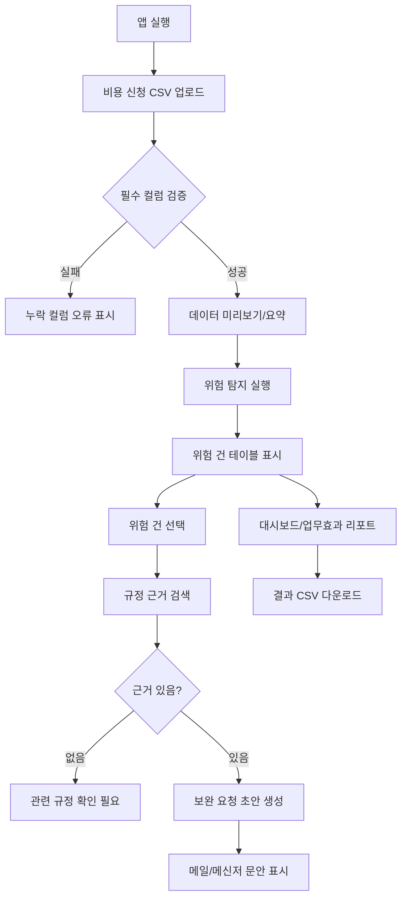
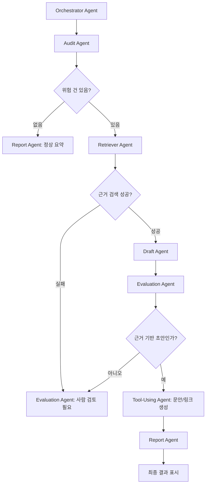
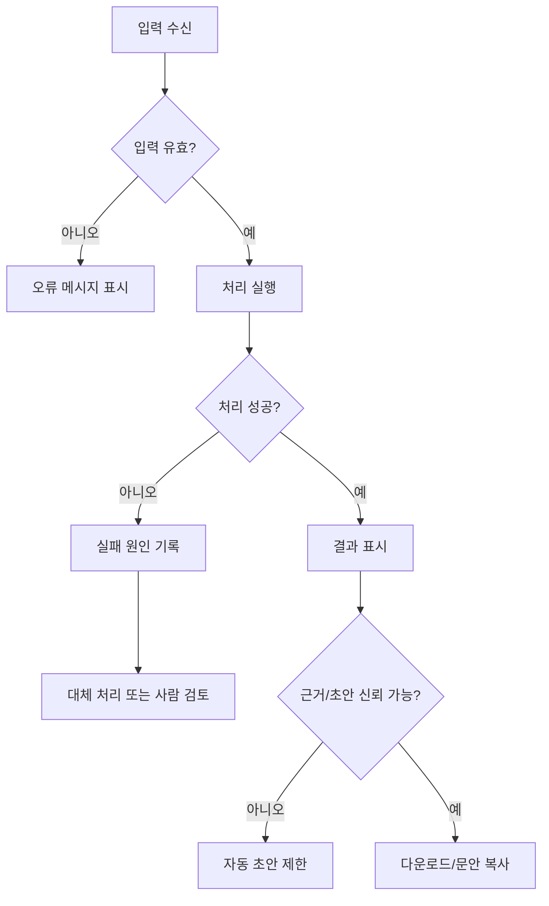
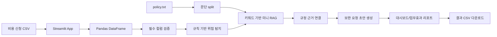
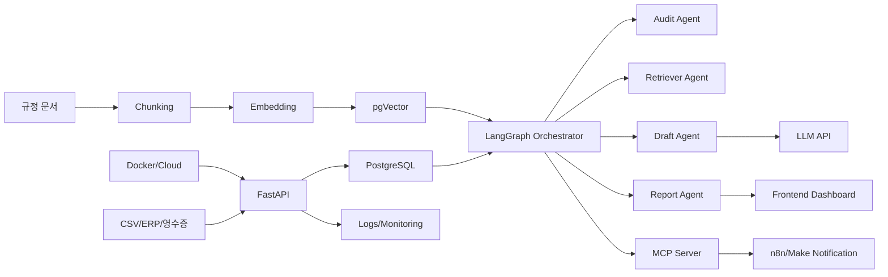
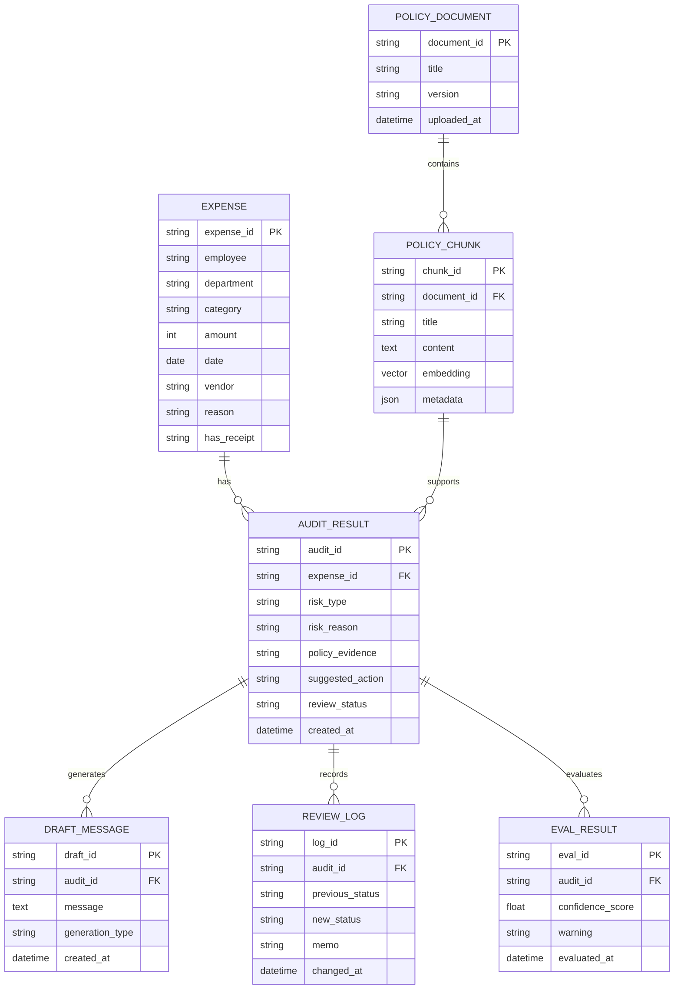
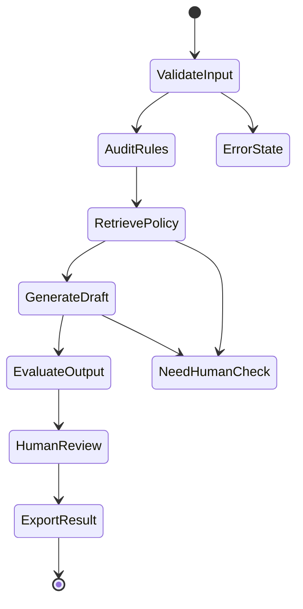
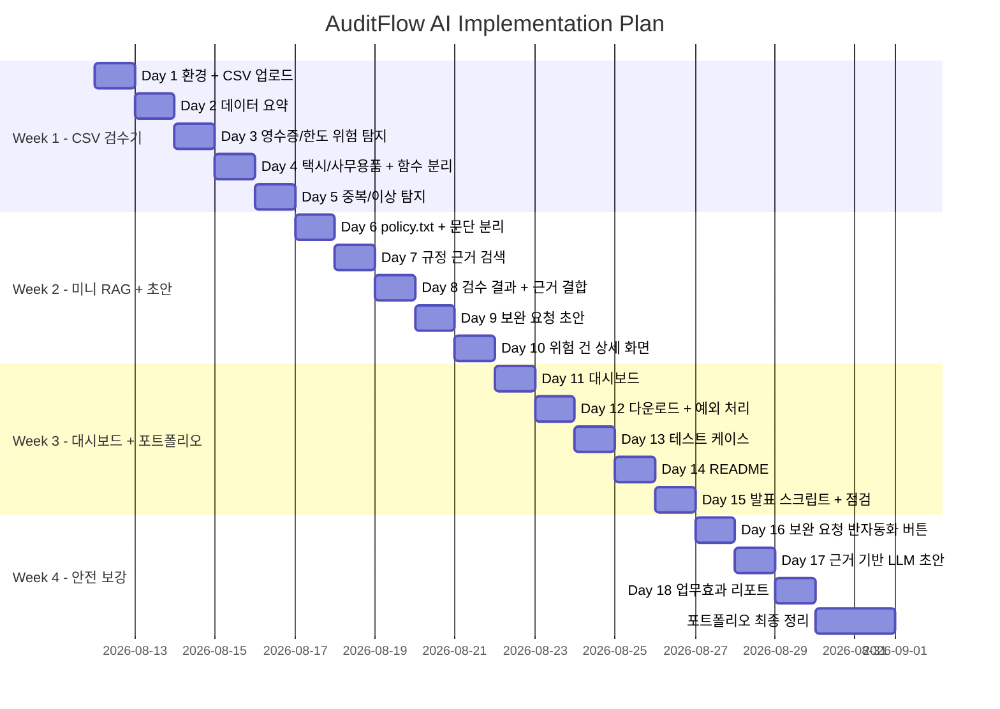

# 1. 기획서

## 1.1 프로젝트 개요

**프로젝트명**  
AuditFlow AI: 규정 근거 기반 비용정산 1차 검수 어시스턴트

**한 줄 설명**  
비용 신청 CSV와 비용 규정 문서를 기반으로 영수증 누락, 한도 초과, 중복 신청, 이상 비용 후보를 자동 탐지하고, 관련 규정 근거와 보완 요청 초안, 메일/메신저 작성 문안, 업무효과 리포트를 제공하는 AX/DX 비용정산 1차 검수 반자동화 MVP

**서비스 유형**

- AX/DX 검수 지원 및 반자동화 서비스
- 재무·총무·회계 담당자용 비용정산 1차 검수 도구
- 규정 근거 기반 미니 RAG 업무지원 시스템
- 보완 요청 커뮤니케이션 지원 도구
- Streamlit 기반 개인 포트폴리오 MVP

**타겟 도메인**  
재무팀, 회계팀, 총무팀, 경영지원팀, 내부통제 및 감사 대응 조직

**핵심 사용자**

1. 재무팀 비용정산 담당자
2. 팀장/승인자
3. 비용 신청 직원은 간접 사용자

**포트폴리오 포지셔닝**  
이 프로젝트는 단순 데이터 분석 앱이 아니라, 비용정산 담당자의 반복 검수 업무를 줄이고 규정 근거 기반으로 판단을 지원하는 AX/DX 업무개선 MVP다.  
단, MVP 단계에서는 실제 ERP 연동, 자동 승인/반려, 실제 메일·메신저 자동 발송까지 수행하지 않는다. 현재 범위는 **1차 검수 지원 + 보완 요청 문안 생성 + 업무효과 수치화**까지이며, 이를 통해 실무자가 검토하고 실행하는 human-in-the-loop 구조를 지향한다.

---

## 1.2 문제 정의

기업의 비용정산 업무는 매월 반복적으로 발생한다. 재무·총무·회계 담당자는 직원들이 제출한 식대, 야근식대, 택시비, 사무용품비 등의 비용 신청 건을 확인하고 회사 규정에 맞는지 검수해야 한다.

현재 업무에서는 다음 문제가 발생한다.

- 영수증 첨부 여부를 사람이 직접 확인해야 한다.
- 항목별 한도 기준을 수작업으로 비교해야 한다.
- 동일 신청자, 동일 날짜, 동일 금액, 동일 사용처 기준의 중복 신청을 육안으로 찾기 어렵다.
- 고액 택시비, 주말 사용, 고액 사무용품 구매처럼 추가 사유가 필요한 건을 놓칠 수 있다.
- 보완 또는 반려 요청 문구를 매번 사람이 작성해야 한다.
- 메일이나 메신저로 보낼 제목과 본문을 반복해서 작성해야 한다.
- 담당자마다 검수 기준이 달라질 수 있다.
- 감사 대응 시 판단 근거를 남기기 어렵다.
- 검수 업무가 실제로 얼마나 줄었는지 수치로 설명하기 어렵다.

기존 방식은 엑셀, 메일, 메신저, 수기 검토에 의존하기 때문에 신청 건수가 늘어날수록 검수 시간과 실수 가능성이 증가한다.

---

## 1.3 타겟 사용자 및 페르소나

## 페르소나 1. 재무팀 비용정산 담당자

**설명**  
직원들이 제출한 비용 신청 CSV를 확인하고 영수증 누락, 한도 초과, 중복 신청, 사유 부족 여부를 검수하는 실무자다.

**목표**

- 검수 필요 건을 빠르게 찾는다.
- 반복적인 확인 업무를 줄인다.
- 비용 규정 근거를 확인한다.
- 보완 요청 문구를 빠르게 작성한다.
- 메일/메신저로 보낼 문안을 빠르게 준비한다.
- 검수 결과를 기록으로 남긴다.

**불편함**

- 엑셀을 보며 조건을 일일이 확인해야 한다.
- 항목별 규정 기준이 달라 실수하기 쉽다.
- 중복 신청을 육안으로 찾기 어렵다.
- 보완 요청 문구를 반복 작성해야 한다.
- 감사 대응 시 근거를 다시 찾아야 한다.
- 업무 개선 효과를 정량적으로 설명하기 어렵다.

**얻는 가치**

- 위험 신청 건을 자동으로 우선 확인할 수 있다.
- 검수 기준이 표준화된다.
- 관련 규정 근거를 바로 확인할 수 있다.
- 보완 요청 초안으로 커뮤니케이션 시간을 줄일 수 있다.
- 메일/메신저 문안을 복사하거나 작성 링크로 활용할 수 있다.
- 검수 결과를 CSV로 다운로드해 기록할 수 있다.
- 예상 절감 시간과 절감률을 확인할 수 있다.

---

## 페르소나 2. 팀장/승인자

**설명**  
1차 검수된 비용 신청 건을 확인하고 최종 승인, 보완 요청, 반려 여부를 판단하는 관리자다.

**목표**

- 위험도가 높은 비용 신청 건을 빠르게 파악한다.
- 승인 또는 보완 요청 판단의 근거를 확인한다.
- 담당자가 어떤 기준으로 검수했는지 확인한다.
- 검수 시간을 줄이면서 리스크를 놓치지 않는다.
- 업무 개선 효과를 숫자로 확인한다.

**불편함**

- 모든 비용 신청 건을 자세히 확인하기 어렵다.
- 위험 건과 정상 건이 섞여 있어 우선순위 판단이 어렵다.
- 반려 사유가 불명확하면 직원 문의가 반복된다.
- 승인 후 문제가 발생하면 판단 근거를 설명해야 한다.
- 자동화 도입 효과를 정량적으로 설명하기 어렵다.

**얻는 가치**

- 위험 신청 건을 우선 검토할 수 있다.
- 규정 근거와 보완 요청 사유를 함께 확인할 수 있다.
- 승인 판단의 일관성과 설명 가능성이 높아진다.
- 비용정산 업무 흐름을 데이터 기반으로 관리할 수 있다.
- 기존 수작업 대비 예상 절감 효과를 확인할 수 있다.

---

## 1.4 솔루션 개요

AuditFlow AI는 비용 신청 CSV와 비용 규정 문서 `policy.txt`를 입력받아 비용정산 담당자의 1차 검수 업무를 지원하고 일부 반복 작업을 반자동화하는 Streamlit 기반 AX/DX MVP다.

시스템은 다음 항목을 자동 탐지한다.

- 영수증 누락
- 식대 한도 초과
- 야근식대 한도 초과
- 고액 택시비의 상세 사유 부족
- 사무용품 고액 구매의 추가 승인 필요
- 동일 신청자의 중복 신청 의심
- 항목별 평균 대비 이상 비용 후보

위험 신청 건이 발견되면 관련 비용 규정 문단을 찾아 근거로 표시하고, 담당자가 직원에게 보낼 보완 요청 초안을 생성한다.  
추가로 위험 건을 선택하면 보완 요청 메일/메신저 제목과 본문을 자동으로 구성해 실무자가 복사하거나 발송 전 검토할 수 있도록 한다.

이 프로젝트는 AI가 최종 승인 또는 반려를 결정하는 시스템이 아니다.  
AI와 규칙 기반 로직은 위험 가능성, 관련 근거, 보완 요청 초안, 업무효과 추정치를 제공하고 최종 판단은 사람이 수행한다.

### 자동화 범위 정의

| 구분 | MVP에서의 처리 방식 |
|---|---|
| 자동 처리 | CSV 요약, 위험 건 탐지, 규정 근거 검색, 보완 요청 초안 생성, 업무효과 리포트 계산 |
| 반자동 처리 | 메일/메신저 보완 요청 문안 생성, 복사용 텍스트 또는 작성 링크 제공 |
| 사람이 판단 | 최종 승인, 반려, 보완 요청 여부 결정 |
| MVP 제외 | 실제 ERP 연동, 실제 메일/Slack 자동 발송, 자동 승인/반려, 로그인/권한 관리 |

---

## 1.5 핵심 가치 제안

| 가치 | 설명 |
|---|---|
| 반복 검수 자동 탐지 | 영수증 누락, 한도 초과, 중복 신청 등 반복 검수 항목을 자동 탐지 |
| 반자동 커뮤니케이션 | 위험 사유와 규정 근거를 바탕으로 보완 요청 문안 생성 |
| 데이터 기반 의사결정 | 위험 유형별 건수, 항목별 비용, 이상 비용 후보를 제공 |
| 사내 지식 활용 | 비용 규정 문서를 검수 근거로 활용 |
| 설명 가능한 검수 | 위험 사유와 규정 근거를 함께 보여 최종 판단을 지원 |
| 업무효과 수치화 | 기존 수작업 대비 예상 절감 시간과 절감률을 리포트로 제공 |

---

## 1.6 성공 지표

| KPI | 설명 | MVP 목표 |
|---|---|---|
| 위험 신청 건 탐지율 | 샘플 데이터 내 위험 건 중 시스템이 탐지한 비율 | 90% 이상 |
| 규정 근거 매칭률 | 위험 신청 건에 관련 규정 문단이 연결된 비율 | 80% 이상 |
| 검수 결과 생성 시간 | CSV 업로드 후 결과 표시까지 걸리는 시간 | 5초 이내 |
| 보완 요청 초안 생성률 | 위험 건 중 보완 요청 문안이 생성된 비율 | 90% 이상 |
| 수동 검수 시간 절감률 | 전체 수작업 검수 대비 예상 절감률 | 50% 이상 |
| 업무효과 리포트 산출률 | 전체 건수, 위험 건수, 절감 시간, 절감률이 정상 표시되는 비율 | 100% |
| 결과 다운로드 성공률 | 검수 결과 CSV 다운로드 정상 작동률 | 100% |

---

## 1.7 프로젝트 범위

## MVP에서 구현할 것

- 비용 신청 CSV 업로드
- 데이터 미리보기
- 전체 신청 건수, 총 신청 금액, 컬럼 목록, 결측치 개수 표시
- 영수증 누락 탐지
- 식대/야근식대 한도 초과 탐지
- 택시비 고액 사용 및 사유 부족 탐지
- 사무용품 고액 사용 탐지
- 중복 신청 의심 탐지
- 이상 비용 후보 탐지
- `policy.txt` 기반 미니 RAG
- 규정 근거 표시
- 보완 요청 초안 생성
- 위험 건 상세 화면
- 검수 상태 표시 또는 선택
- 위험 유형별 대시보드
- 검수 결과 CSV 다운로드
- README 및 발표 문장 작성

## 포트폴리오 안전 버전에서 추가할 것

MVP만으로는 “검수 지원 도구”에 가깝기 때문에, AX/DX 포트폴리오로 더 안전하게 만들기 위해 아래 3가지를 추가한다.

### Day 16 — 보완 요청 반자동화 버튼

- 위험 건을 선택하면 보완 요청 메일/메신저 제목 자동 생성
- 위험 사유, 규정 근거, 요청 사항이 포함된 본문 자동 생성
- 복사용 텍스트 제공
- 선택 구현: `mailto:` 링크 생성
- 실제 메일/Slack 발송은 MVP에서 제외하고, v1 확장으로 둔다.

### Day 17 — 근거 기반 LLM 초안 생성

- `risk_reason`, `policy_evidence`, `employee`, `category`, `amount`를 입력으로 사용
- LLM이 보완 요청 초안을 생성
- 규정 근거가 없으면 자동 초안 생성을 제한하고 “관련 규정 확인 필요” 표시
- AI가 최종 판단하지 않고, 문장 작성 보조 역할만 수행한다.

### Day 18 — 업무효과 리포트

- 전체 신청 건수 표시
- 위험 후보 건수 표시
- 위험 후보 비율 표시
- 기존 수작업 예상 시간 표시
- 자동 검수 후 예상 검토 시간 표시
- 예상 절감 시간 표시
- 예상 절감률 표시

## MVP에서 제외할 것

- 실제 영수증 이미지 OCR
- 실제 ERP/결재 시스템 연동
- 실제 메일/Slack 자동 발송
- 로그인/권한 관리
- PostgreSQL 저장
- FastAPI 백엔드 분리
- pgVector 기반 RAG
- LangGraph 멀티에이전트
- Docker 배포
- GitHub Actions
- AI 자동 승인/반려

## v1 확장

- 실제 이메일 또는 Slack Webhook 연동
- SQLite 또는 PostgreSQL 기반 검수 결과 저장
- SQL 기반 부서별/항목별 비용 집계
- 검수 로그 저장
- 담당자 검수 상태 관리
- 테스트 케이스 작성
- LLM 프롬프트 품질 개선
- 검수 결과 이력 조회

## v2 확장

- FastAPI 백엔드 분리
- PostgreSQL 정식 도입
- pgVector 기반 embedding 검색
- 비용 규정 문서 업로드
- RAG 검색 품질 평가
- OCR 기반 영수증 정보 추출
- Docker 실행 환경 구성

---

## 1.8 핵심 사용자 흐름

1. 담당자가 비용 신청 CSV를 업로드한다.
2. 시스템이 데이터 규모, 컬럼, 결측치, 총액을 요약한다.
3. 시스템이 영수증 누락, 한도 초과, 중복 신청, 이상 비용 후보를 자동 탐지한다.
4. 위험 건마다 위험 유형과 위험 사유를 표시한다.
5. `policy.txt`에서 관련 규정 근거를 찾아 함께 표시한다.
6. 위험 건을 선택하면 보완 요청 초안을 확인한다.
7. 포트폴리오 안전 버전에서는 메일/메신저 작성 문안 또는 `mailto:` 링크를 생성한다.
8. 대시보드에서 위험 유형별 분포와 예상 절감 효과를 확인한다.
9. 담당자가 최종 검토 후 결과 CSV를 다운로드한다.

---

## 1.9 한계와 리스크

| 한계/리스크 | 대응 방식 |
|---|---|
| 샘플 CSV 기반 MVP라 실제 ERP 데이터 구조와 다를 수 있음 | README에 샘플 데이터 기준과 실제 도입 시 필요한 컬럼 매핑을 명시 |
| 키워드 기반 미니 RAG는 의미 기반 검색보다 정확도가 낮을 수 있음 | v2에서 embedding 기반 pgVector 검색으로 확장 |
| LLM 초안은 부정확하거나 과장된 표현을 만들 수 있음 | 규정 근거가 없는 경우 초안 생성을 제한하고, 최종 검토는 사람이 수행 |
| 실제 영수증 파일 내용은 확인하지 않음 | OCR은 MVP 제외, v2 확장으로 명시 |
| 실제 발송 자동화는 없음 | MVP는 복사용 문안/작성 링크까지만 제공하고, v1에서 Slack Webhook 또는 이메일 API로 확장 |
| 자동 승인/반려 시스템이 아님 | human-in-the-loop 구조를 명확히 표시 |

---

## 1.10 포트폴리오 설명 문장

**30초 설명**  
AuditFlow AI는 비용정산 담당자의 반복적인 1차 검수 업무를 줄이기 위한 AX/DX 반자동화 MVP입니다. 비용 신청 CSV를 업로드하면 영수증 누락, 한도 초과, 중복 신청, 이상 비용 후보를 자동 탐지하고, 관련 비용 규정 근거와 보완 요청 초안을 함께 제공합니다. 최종 판단은 사람이 수행하도록 설계했으며, 위험 건 대시보드와 업무효과 리포트를 통해 검수 우선순위와 예상 절감 효과를 설명할 수 있습니다.

**면접용 한 문장**  
“단순히 데이터를 보여주는 앱이 아니라, 비용정산 담당자의 반복 검수·근거 확인·보완 요청 작성 흐름을 줄이는 AX/DX 업무개선 MVP를 만들었습니다.”

**대회/해커톤용 한 문장**  
“AuditFlow AI는 비용정산 업무에서 사람이 반복적으로 확인하던 규정 위반 후보를 자동 탐지하고, 규정 근거와 보완 요청 초안을 제공해 검수 시간을 줄이는 human-in-the-loop AX/DX 솔루션입니다.”

---

# 공통 입력 블록

## [프로젝트 컨텍스트]

- 프로젝트 이름: AuditFlow AI: 규정 근거 기반 비용정산 1차 검수 어시스턴트
- 한 줄 설명: 비용 신청 CSV와 비용 규정 문서를 기반으로 영수증 누락, 한도 초과, 중복 신청, 이상 비용 후보를 자동 탐지하고, 관련 규정 근거와 보완 요청 초안, 메일/메신저 작성 문안, 업무효과 리포트를 제공하는 AX/DX 비용정산 1차 검수 반자동화 MVP
- 풀려는 문제 / 배경: 재무·총무·회계 담당자가 비용 신청 건을 엑셀, 메일, 수기 규정 확인으로 반복 검수하면서 시간 낭비, 누락, 기준 불일치, 감사 근거 부족 문제가 발생한다.
- 타겟 사용자: 재무팀 비용정산 담당자, 회계/총무 담당자, 팀장/승인자, 내부통제 및 감사 대응 담당자
- 핵심 가치: 반복 검수 항목 자동 탐지, 규정 근거 기반 판단 지원, 보완 요청 초안 생성, 위험 유형별 대시보드, 예상 업무효과 수치화
- 형태: Streamlit 기반 AX/DX 포트폴리오 MVP
- 규모/팀: 개인 프로젝트 / 1인 개발 기준
- 예상 기간: MVP 3주 + 안전 보강 3일, 총 18일 기준
- 도메인: 재무, 회계, 총무, 경영지원, 내부통제, 감사 대응
- 제약사항: 실제 ERP/결재 연동, 로그인/권한, OCR, 자동 승인/반려, 실제 메일 발송은 MVP에서 제외한다. AI는 최종 판단자가 아니라 실무자 검토를 돕는 보조자로 둔다.

## [목표 기술 스택]

### MVP에서 실제 사용할 기술
- Python
- Pandas
- Streamlit
- CSV 데이터 처리
- 규칙 기반 위험 탐지
- `policy.txt` 기반 미니 RAG
- 키워드 기반 규정 근거 검색
- 템플릿 기반 보완 요청 초안 생성
- Streamlit 대시보드
- CSV 다운로드
- 기본 테스트 케이스

### 포트폴리오 안전 보강에서 사용할 기술
- LLM API
- 프롬프트 엔지니어링
- 근거 기반 초안 생성
- 업무효과 리포트
- 메일/메신저 발송용 문안 생성
- 간단한 자동화 버튼

### v1 확장 기술
- SQLite 또는 PostgreSQL
- SQL 기반 검수 결과 저장
- 검수 로그 저장
- 담당자 검수 상태 관리
- 테스트 케이스 고도화

### v2 확장 기술
- FastAPI
- PostgreSQL
- pgVector
- embedding 기반 RAG
- 문서 업로드 및 청킹
- Docker
- GitHub Actions
- OCR 기반 영수증 정보 추출
- n8n 또는 Make 연동

### 이번 MVP에서 제외할 기술
- LangGraph 멀티에이전트
- MCP server
- Airflow
- BigQuery
- 클라우드 배포
- 대규모 데이터 파이프라인
- AI 자동 승인/반려


# 2. 요구사항정의서

## 2.1 문서 개요

### 문서 목적
이 문서는 AuditFlow AI의 비즈니스 요구사항, 사용자 요구사항, 시스템 요구사항, 데이터/AI/보안/비기능 요구사항을 정리한다. 개발자가 바로 기능정의서와 구현계획으로 이어갈 수 있도록 각 요구사항에 ID와 성공 기준을 부여한다.

### 프로젝트 범위
- MVP: CSV 업로드, 데이터 요약, 규칙 기반 위험 탐지, `policy.txt` 기반 규정 근거 검색, 보완 요청 초안, 대시보드, CSV 다운로드
- 안전 보강: 보완 요청 반자동화 버튼, 근거 기반 LLM 초안, 업무효과 리포트
- v1: 검수 결과 저장, SQL 집계, 검수 로그, 상태 관리
- v2: FastAPI, pgVector RAG, OCR, Docker, n8n/Make 연동

### 주요 이해관계자
| 이해관계자 | 역할 | 관심사 |
|---|---|---|
| 비용정산 담당자 | 1차 검수 수행 | 위험 건 빠른 탐지, 보완 요청 문안, 근거 확인 |
| 팀장/승인자 | 최종 판단 | 위험 우선순위, 판단 근거, 업무효과 |
| 비용 신청 직원 | 보완 요청 수신 | 명확한 사유, 필요한 보완 항목 |
| 포트폴리오 평가자 | 결과물 평가 | 문제정의, 실무성, AI 활용, 완성도 |

### 용어 정의
| 용어 | 정의 |
|---|---|
| 비용 신청 CSV | 직원이 제출한 비용정산 신청 데이터 |
| 위험 건 | 영수증 누락, 한도 초과, 중복 신청 등 검수가 필요한 신청 건 |
| 미니 RAG | `policy.txt`를 문단 단위로 나누고 키워드로 관련 규정 근거를 찾는 MVP 방식 |
| 규정 근거 | 위험 건 판단에 연결되는 비용 규정 문단 |
| 보완 요청 초안 | 신청 직원에게 추가 자료나 설명을 요청하기 위한 문구 |
| human-in-the-loop | AI가 최종 승인/반려하지 않고 사람이 최종 판단하는 구조 |

---

## 2.2 비즈니스 요구사항

| 요구사항 ID | 요구사항명 | 설명 | 목적 | 우선순위 | 성공 기준 |
|---|---|---|---|---|---|
| BR-001 | 비용정산 1차 검수 시간 감소 | 반복 검수 항목을 자동 탐지해 담당자의 수작업 확인 시간을 줄인다. | 반복 업무 감소 | P0 | 샘플 기준 예상 검수 시간 50% 이상 절감 |
| BR-002 | 검수 기준 표준화 | 영수증 누락, 한도 초과, 중복 신청 등 규칙을 코드로 표준화한다. | 판단 편차 감소 | P0 | 7종 위험 유형 탐지 동작 |
| BR-003 | 규정 근거 기반 판단 지원 | 위험 건마다 관련 비용 규정 문단을 표시한다. | 감사 대응 및 설명 가능성 | P0 | 위험 건의 80% 이상에 근거 연결 |
| BR-004 | 보완 요청 커뮤니케이션 감소 | 위험 사유와 근거를 바탕으로 보완 요청 초안을 제공한다. | 반복 문구 작성 감소 | P1 | 위험 건의 80% 이상에 초안 생성 |
| BR-005 | 업무효과 수치화 | 전체 건수, 위험 건수, 예상 절감 시간/절감률을 표시한다. | AX/DX 가치 설명 | P1 | 리포트 화면에 6개 핵심 지표 표시 |
| BR-006 | 포트폴리오 설명 가능성 확보 | 문제정의, 기능, 아키텍처, 구현계획, 한계와 확장안을 문서화한다. | 채용/면접 대응 | P1 | README와 7종 산출물 완성 |

---

## 2.3 사용자 요구사항

| 사용자 유형 | 사용 상황 | 요구사항 | 기대 결과 | 우선순위 |
|---|---|---|---|---|
| 비용정산 담당자 | 월말 비용정산 CSV를 받음 | CSV를 업로드하면 데이터 미리보기를 보고 싶다. | 데이터 구조 확인 | P0 |
| 비용정산 담당자 | 신청 건을 검수함 | 위험 건을 자동으로 분류해 보고 싶다. | 검수 대상 우선순위 파악 | P0 |
| 비용정산 담당자 | 위험 사유를 확인함 | 왜 위험 건인지 설명을 보고 싶다. | 판단 기준 이해 | P0 |
| 비용정산 담당자 | 규정을 확인함 | 관련 비용 규정 근거를 함께 보고 싶다. | 감사 대응 가능 | P0 |
| 비용정산 담당자 | 직원에게 보완 요청함 | 보완 요청 초안을 자동으로 받고 싶다. | 문구 작성 시간 감소 | P1 |
| 비용정산 담당자 | 결과를 기록함 | 검수 결과를 CSV로 다운로드하고 싶다. | 기록 및 공유 가능 | P0 |
| 팀장/승인자 | 요약 보고를 받음 | 위험 유형별 현황과 절감 효과를 보고 싶다. | 의사결정 지원 | P1 |
| 포트폴리오 평가자 | 프로젝트를 검토함 | MVP와 확장 범위를 명확히 보고 싶다. | 과장 없는 실무형 평가 | P1 |

---

## 2.4 시스템 요구사항

| 요구사항 ID | 시스템 기능/역할 | 설명 | 입력 데이터 | 출력 데이터 | 관련 기술 스택 |
|---|---|---|---|---|---|
| SR-001 | CSV 업로드 | 비용 신청 CSV를 업로드한다. | `.csv` 파일 | DataFrame | Streamlit, Pandas |
| SR-002 | 데이터 요약 | 행/열, 컬럼, 결측치, 총액을 표시한다. | DataFrame | 요약 지표 | Pandas, Streamlit |
| SR-003 | 필수 컬럼 검증 | 필수 컬럼 누락 시 오류를 표시한다. | DataFrame columns | 오류 메시지 | Python |
| SR-004 | 위험 탐지 | 7종 위험 유형을 탐지한다. | 비용 신청 데이터 | risk_type, risk_reason | Pandas |
| SR-005 | 규정 문서 로드 | `policy.txt`를 읽고 문단 단위로 분리한다. | policy.txt | chunks | Python |
| SR-006 | 규정 근거 검색 | 위험 유형/카테고리에 맞는 규정 문단을 찾는다. | risk_type, category | policy_evidence | 미니 RAG |
| SR-007 | 보완 요청 초안 생성 | 위험 사유와 근거를 바탕으로 초안을 생성한다. | risk_reason, evidence | draft_message | 템플릿, LLM API(v1) |
| SR-008 | 위험 건 상세 화면 | 선택한 위험 건의 사유/근거/초안을 보여준다. | selected expense_id | 상세 정보 | Streamlit |
| SR-009 | 대시보드 | 위험 유형별 건수와 금액을 시각화한다. | 검수 결과 | metric, chart | Streamlit |
| SR-010 | 결과 다운로드 | 검수 결과를 CSV로 다운로드한다. | result DataFrame | audit_result.csv | Pandas, Streamlit |
| SR-011 | 업무효과 리포트 | 예상 절감 시간과 절감률을 계산한다. | 전체 건수, 위험 건수 | 효과 지표 | Python |
| SR-012 | 테스트 | 주요 규칙 함수가 의도대로 동작하는지 검증한다. | 테스트 DataFrame | pass/fail | pytest |

---

## 2.5 데이터 요구사항

### 수집 데이터
| 데이터 | 형식 | 필수 여부 | 설명 |
|---|---|---|---|
| 비용 신청 데이터 | CSV | 필수 | 직원별 비용정산 신청 내역 |
| 비용 규정 문서 | TXT | 필수 | 항목별 한도, 영수증, 중복, 사유 기준 |
| 검수 결과 | DataFrame/CSV | 필수 | 위험 유형, 사유, 근거, 초안, 상태 |
| 검수 로그 | DB(v1) | 선택 | 누가 언제 어떤 상태로 처리했는지 기록 |

### 비용 신청 CSV 필수 컬럼
| 컬럼 | 타입 | 설명 |
|---|---|---|
| expense_id | string | 비용 신청 ID |
| employee | string | 신청자 |
| department | string | 부서 |
| category | string | 비용 항목 |
| amount | number | 신청 금액 |
| date | date/string | 사용 일자 |
| vendor | string | 사용처 |
| reason | string | 신청 사유 |
| has_receipt | string | 영수증 여부(Y/N) |

### 정형/비정형 데이터 구분
| 구분 | 데이터 | MVP 처리 방식 | v2 처리 방식 |
|---|---|---|---|
| 정형 데이터 | 비용 신청 CSV | Pandas DataFrame | PostgreSQL 저장 |
| 비정형 데이터 | 비용 규정 문서 | 문단 split + 키워드 검색 | chunking + embedding + pgVector |
| 결과 데이터 | 검수 결과 | CSV 다운로드 | DB 저장 및 로그 추적 |

### RAG 데이터 정의
| 항목 | MVP | v2 |
|---|---|---|
| 문서 | policy.txt | 업로드된 규정 문서 |
| 청크 | 섹션/문단 단위 split | 토큰 길이 기반 chunking |
| 임베딩 | 사용 안 함 | embedding 모델 사용 |
| 저장소 | 메모리 리스트 | pgVector |
| 검색 | 키워드 매핑 | vector similarity + metadata filter |

---

## 2.6 AI 요구사항

| 요구사항 | MVP 기준 | v1/v2 기준 |
|---|---|---|
| RAG 검색 품질 | 위험 건의 80% 이상에 규정 근거 연결 | top-k 검색 정확도 평가 |
| LLM 응답 품질 | v1 이전에는 템플릿 기반 | 근거 기반 보완 요청 초안 생성 |
| 환각 방지 | 근거 없으면 "관련 규정 확인 필요" 표시 | 출처 없는 답변 생성 금지 |
| 멀티에이전트 판단 | MVP 제외 | Audit/Retriever/Draft/Report Agent로 역할 분리 |
| 평가 하네스 | 수동 테스트 케이스 | query, expected_evidence, generated_draft 비교 |
| 실패 케이스 관리 | 매칭 실패 목록 확인 | 실패 로그 저장 및 개선 루프 |

---

## 2.7 보안 및 권한 요구사항

| 항목 | 요구사항 |
|---|---|
| 사용자 권한 | MVP에서는 로그인 없이 로컬 사용. v1 이후 담당자/승인자 권한 분리 |
| 문서 접근 권한 | MVP에서는 로컬 policy.txt만 사용. v2 이후 문서별 접근 권한 필요 |
| 민감 데이터 처리 | 실제 개인정보 대신 샘플 데이터 사용. README에 명시 |
| 로그/감사 추적 | v1 이후 검수 상태 변경 로그 저장 |
| 데이터 보호 | 실제 기업 데이터 사용 시 이름/부서/사용처 마스킹 필요 |
| AI 사용 제한 | AI가 최종 승인/반려 판단을 내리지 않도록 제한 |

---

## 2.8 비기능 요구사항

| 항목 | 요구사항 | 목표 |
|---|---|---|
| 성능 | CSV 업로드 후 결과 표시 | 5초 이내 |
| 응답 시간 | 위험 건 상세 표시 | 1초 이내 |
| 확장성 | 규칙 추가가 쉬운 구조 | audit_rules.py 함수 분리 |
| 유지보수성 | 모듈별 역할 분리 | src 폴더 구조 |
| 비용 | LLM 호출 비용 최소화 | 위험 건 선택 시에만 호출 |
| 모니터링 | MVP에서는 화면 지표 중심 | v2에서 로그/모니터링 추가 |
| 안정성 | 필수 컬럼 누락, 빈 파일 예외 처리 | 친절한 오류 메시지 |
| 설명 가능성 | 위험 사유와 규정 근거 표시 | 모든 위험 건에 reason/evidence 제공 |

---

## 2.9 요구사항 추적 매트릭스

| 요구사항 ID | 연결 기능 ID | 연결 API | 연결 데이터 | 검증 방법 | 우선순위 |
|---|---|---|---|---|---|
| BR-001 | F-004, F-011 | N/A | 비용 신청 CSV | 샘플 시나리오 시간 비교 | P0 |
| BR-002 | F-004 | N/A | expense_id, category, amount, has_receipt | 규칙 테스트 | P0 |
| BR-003 | F-006 | N/A | policy.txt, risk_type | 근거 매칭률 측정 | P0 |
| BR-004 | F-007, F-010 | N/A / v1 API | risk_reason, policy_evidence | 초안 생성률 확인 | P1 |
| BR-005 | F-011 | N/A | result DataFrame | 리포트 지표 표시 확인 | P1 |
| SR-001 | F-001 | N/A | CSV | 업로드 테스트 | P0 |
| SR-003 | F-003 | N/A | columns | 컬럼 누락 테스트 | P0 |
| SR-010 | F-012 | N/A | audit_result | 다운로드 테스트 | P0 |

---

## 2.10 오픈 이슈

- 실제 회사 비용 규정의 항목별 한도는 샘플 기준으로 가정한다.
- 주말/야간 사용 탐지를 MVP에 넣을지 v1로 미룰지 확인 필요.
- LLM API는 Day 17 안전 보강에서 붙일지 v1로 미룰지 결정 필요.
- `mailto:` 링크만 제공할지 Slack/n8n 연동까지 할지 확인 필요.
- SQLite 저장을 v1에서 먼저 붙일지, MVP 직후 바로 붙일지 확인 필요.
- 개인정보 마스킹 기준은 실제 데이터 사용 전 별도 정의 필요.

---

# 공통 입력 블록

## [프로젝트 컨텍스트]

- 프로젝트 이름: AuditFlow AI: 규정 근거 기반 비용정산 1차 검수 어시스턴트
- 한 줄 설명: 비용 신청 CSV와 비용 규정 문서를 기반으로 영수증 누락, 한도 초과, 중복 신청, 이상 비용 후보를 자동 탐지하고, 관련 규정 근거와 보완 요청 초안, 메일/메신저 작성 문안, 업무효과 리포트를 제공하는 AX/DX 비용정산 1차 검수 반자동화 MVP
- 풀려는 문제 / 배경: 재무·총무·회계 담당자가 비용 신청 건을 엑셀, 메일, 수기 규정 확인으로 반복 검수하면서 시간 낭비, 누락, 기준 불일치, 감사 근거 부족 문제가 발생한다.
- 타겟 사용자: 재무팀 비용정산 담당자, 회계/총무 담당자, 팀장/승인자, 내부통제 및 감사 대응 담당자
- 핵심 가치: 반복 검수 항목 자동 탐지, 규정 근거 기반 판단 지원, 보완 요청 초안 생성, 위험 유형별 대시보드, 예상 업무효과 수치화
- 형태: Streamlit 기반 AX/DX 포트폴리오 MVP
- 규모/팀: 개인 프로젝트 / 1인 개발 기준
- 예상 기간: MVP 3주 + 안전 보강 3일, 총 18일 기준
- 도메인: 재무, 회계, 총무, 경영지원, 내부통제, 감사 대응
- 제약사항: 실제 ERP/결재 연동, 로그인/권한, OCR, 자동 승인/반려, 실제 메일 발송은 MVP에서 제외한다. AI는 최종 판단자가 아니라 실무자 검토를 돕는 보조자로 둔다.

## [목표 기술 스택]

### MVP에서 실제 사용할 기술
- Python
- Pandas
- Streamlit
- CSV 데이터 처리
- 규칙 기반 위험 탐지
- `policy.txt` 기반 미니 RAG
- 키워드 기반 규정 근거 검색
- 템플릿 기반 보완 요청 초안 생성
- Streamlit 대시보드
- CSV 다운로드
- 기본 테스트 케이스

### 포트폴리오 안전 보강에서 사용할 기술
- LLM API
- 프롬프트 엔지니어링
- 근거 기반 초안 생성
- 업무효과 리포트
- 메일/메신저 발송용 문안 생성
- 간단한 자동화 버튼

### v1 확장 기술
- SQLite 또는 PostgreSQL
- SQL 기반 검수 결과 저장
- 검수 로그 저장
- 담당자 검수 상태 관리
- 테스트 케이스 고도화

### v2 확장 기술
- FastAPI
- PostgreSQL
- pgVector
- embedding 기반 RAG
- 문서 업로드 및 청킹
- Docker
- GitHub Actions
- OCR 기반 영수증 정보 추출
- n8n 또는 Make 연동

### 이번 MVP에서 제외할 기술
- LangGraph 멀티에이전트
- MCP server
- Airflow
- BigQuery
- 클라우드 배포
- 대규모 데이터 파이프라인
- AI 자동 승인/반려


# 3. 기능정의서

## 3.1 기능 목록 요약

| 기능 ID | 기능명 | 설명 | 사용자 | 우선순위 | 관련 요구사항 ID | 관련 기술 스택 |
|---|---|---|---|---|---|---|
| F-001 | CSV 업로드 | 비용 신청 CSV 파일을 업로드한다. | 비용정산 담당자 | P0 | SR-001 | Streamlit, Pandas |
| F-002 | 데이터 미리보기 | 업로드한 CSV를 표로 보여준다. | 비용정산 담당자 | P0 | SR-001 | Streamlit |
| F-003 | 데이터 요약 | 행/열, 컬럼, 결측치, 총액을 표시한다. | 비용정산 담당자 | P0 | SR-002 | Pandas |
| F-004 | 필수 컬럼 검증 | 필수 컬럼 누락 시 오류를 표시한다. | 비용정산 담당자 | P0 | SR-003 | Python |
| F-005 | 위험 탐지 | 영수증 누락, 한도 초과, 중복, 이상 비용 등을 탐지한다. | 비용정산 담당자 | P0 | BR-002, SR-004 | Pandas |
| F-006 | 규정 문서 분리 | policy.txt를 문단/chunk로 나눈다. | 시스템 | P0 | SR-005 | Python |
| F-007 | 규정 근거 검색 | 위험 유형에 맞는 규정 근거를 찾는다. | 비용정산 담당자 | P0 | BR-003, SR-006 | 미니 RAG |
| F-008 | 보완 요청 초안 생성 | 위험 사유와 근거를 바탕으로 문구를 만든다. | 비용정산 담당자 | P1 | BR-004, SR-007 | 템플릿, LLM(v1) |
| F-009 | 위험 건 상세 화면 | 선택한 위험 건의 상세 정보를 보여준다. | 담당자/승인자 | P1 | SR-008 | Streamlit |
| F-010 | 검수 상태 관리 | 미검토/보완요청/승인/반려 상태를 표시한다. | 담당자/승인자 | P1 | BR-004 | Streamlit |
| F-011 | 대시보드 | 위험 유형별 건수, 금액, 핵심 지표를 보여준다. | 담당자/승인자 | P1 | BR-005 | Streamlit |
| F-012 | 결과 CSV 다운로드 | 검수 결과를 CSV로 다운로드한다. | 비용정산 담당자 | P0 | SR-010 | Pandas, Streamlit |
| F-013 | 보완 요청 반자동화 버튼 | 메일/메신저용 문안 또는 mailto 링크를 제공한다. | 비용정산 담당자 | P1 | BR-004 | Streamlit |
| F-014 | 근거 기반 LLM 초안 | 규정 근거를 기준으로 LLM이 초안을 생성한다. | 비용정산 담당자 | P1 | AI 요구사항 | LLM API |
| F-015 | 업무효과 리포트 | 예상 절감 시간과 절감률을 계산한다. | 담당자/승인자 | P1 | BR-005 | Python |
| F-016 | 테스트 케이스 | 주요 규칙 함수의 테스트를 작성한다. | 개발자 | P1 | SR-012 | pytest |

---

## 3.2 핵심 기능 상세 정의

### F-001. CSV 업로드
- 기능 ID: F-001
- 기능명: CSV 업로드
- 목적: 비용 신청 데이터를 앱에 입력한다.
- 사용자: 비용정산 담당자
- 진입 경로: Streamlit 메인 화면
- 사전 조건: CSV 파일 보유
- 입력값: `.csv` 파일
- 처리 로직: `st.file_uploader`로 파일 수신 후 `pd.read_csv`로 DataFrame 생성
- 출력값: DataFrame
- 예외 상황: 파일 없음, CSV 파싱 실패, 인코딩 오류
- 권한 조건: MVP에서는 없음
- 저장되는 데이터: MVP에서는 저장하지 않음
- 호출 API: 없음
- 관련 DB 테이블: 없음
- 관련 에이전트: 없음
- 관련 기술 스택: Streamlit, Pandas
- 완료 기준: 업로드한 CSV가 표로 출력된다.

### F-003. 데이터 요약
- 기능 ID: F-003
- 기능명: 데이터 요약
- 목적: 데이터 규모와 품질을 빠르게 파악한다.
- 사용자: 비용정산 담당자
- 진입 경로: CSV 업로드 후 자동 표시
- 사전 조건: DataFrame 생성 완료
- 입력값: DataFrame
- 처리 로직: `df.shape`, `df.columns`, `df.isna().sum()`, `df["amount"].sum()` 계산
- 출력값: 행/열 수, 컬럼 목록, 결측치 개수, 총 신청 금액
- 예외 상황: amount 컬럼 없음, 숫자 변환 실패
- 저장되는 데이터: 없음
- 호출 API: 없음
- 관련 DB 테이블: 없음
- 관련 기술 스택: Pandas, Streamlit
- 완료 기준: 화면에 핵심 요약 지표가 표시된다.

### F-005. 위험 탐지
- 기능 ID: F-005
- 기능명: 위험 탐지
- 목적: 검수 필요 건을 자동으로 선별한다.
- 사용자: 비용정산 담당자
- 진입 경로: CSV 업로드 후 "검수 실행" 또는 자동 실행
- 사전 조건: 필수 컬럼 존재
- 입력값: 비용 신청 DataFrame
- 처리 로직:
  - `has_receipt == 'N'`: 영수증 누락
  - `category == '식대' and amount > 20000`: 식대 한도 초과
  - `category == '야근식대' and amount > 15000`: 야근식대 한도 초과
  - `category == '택시비' and amount > 30000 and reason is empty`: 택시비 사유 부족
  - `category == '사무용품' and amount > 100000`: 추가 승인 필요
  - `employee + date + amount + vendor` 중복: 중복 신청 의심
  - 같은 category 평균의 2배 이상: 이상 비용 후보
- 출력값: `risk_type`, `risk_reason`, `suggested_action`
- 예외 상황: 컬럼 누락, 금액 타입 오류, reason 결측 처리 오류
- 권한 조건: 없음
- 저장되는 데이터: result DataFrame
- 호출 API: 없음
- 관련 DB 테이블: audit_results(v1)
- 관련 에이전트: Audit Agent(v2)
- 관련 기술 스택: Pandas
- 완료 기준: 7종 위험 유형이 탐지된다.

### F-007. 규정 근거 검색
- 기능 ID: F-007
- 기능명: 규정 근거 검색
- 목적: 위험 건에 관련 규정 문단을 연결한다.
- 사용자: 비용정산 담당자, 승인자
- 진입 경로: 위험 탐지 후 자동 실행
- 사전 조건: policy.txt 로드 및 문단 분리 완료
- 입력값: `risk_type`, `category`, policy chunks
- 처리 로직:
  - 위험 유형별 키워드 매핑
  - chunk text에 키워드 포함 여부 검색
  - 가장 관련성 높은 문단 반환
- 출력값: `policy_evidence`
- 예외 상황: 근거 없음, policy.txt 없음, 인코딩 오류
- 권한 조건: 없음
- 저장되는 데이터: 결과 DataFrame에 evidence 컬럼 추가
- 호출 API: 없음
- 관련 DB 테이블: policy_chunks(v2)
- 관련 에이전트: Retriever Agent(v2)
- 관련 기술 스택: Python, 미니 RAG
- 완료 기준: 위험 건의 80% 이상에 근거가 연결된다.

### F-008. 보완 요청 초안 생성
- 기능 ID: F-008
- 기능명: 보완 요청 초안 생성
- 목적: 반복적인 보완 요청 문구 작성을 줄인다.
- 사용자: 비용정산 담당자
- 진입 경로: 위험 건 상세 화면
- 사전 조건: 위험 사유와 규정 근거 존재
- 입력값: `employee`, `category`, `amount`, `risk_reason`, `policy_evidence`
- 처리 로직:
  - MVP: f-string 템플릿
  - 안전 보강/v1: 근거 기반 LLM 프롬프트
  - 근거가 없으면 초안 생성을 제한
- 출력값: `draft_message`
- 예외 상황: 근거 없음, LLM API 실패, 빈 사유
- 권한 조건: 없음
- 저장되는 데이터: result DataFrame 또는 audit_results(v1)
- 호출 API: LLM API(v1)
- 관련 DB 테이블: audit_results(v1)
- 관련 에이전트: Draft Agent(v2)
- 관련 기술 스택: Python, LLM API
- 완료 기준: 위험 건별 초안이 생성된다.

### F-015. 업무효과 리포트
- 기능 ID: F-015
- 기능명: 업무효과 리포트
- 목적: AX/DX 개선 효과를 숫자로 보여준다.
- 사용자: 담당자, 승인자, 포트폴리오 평가자
- 진입 경로: 대시보드 영역
- 입력값: 전체 건수, 위험 건수, 기준 수작업 시간
- 처리 로직:
  - 기존 시간 = 전체 건수 × 건당 수작업 검수 시간
  - 자동 검수 후 시간 = 위험 건수 × 집중 검토 시간 + 전체 건수 × 시스템 확인 시간
  - 절감 시간 = 기존 시간 - 자동 검수 후 시간
  - 절감률 = 절감 시간 / 기존 시간
- 출력값: 기존 시간, 자동 검수 후 시간, 절감 시간, 절감률
- 예외 상황: 전체 건수 0, 시간 가정값 미입력
- 관련 기술 스택: Python, Streamlit
- 완료 기준: 대시보드에 효과 지표 6개가 표시된다.

---

## 3.3 화면/페이지 단위 기능 정의

| 화면 ID | 화면명 | 주요 기능 | 입력 요소 | 출력 요소 | 연결 API | 예외 메시지 | 권한 조건 |
|---|---|---|---|---|---|---|---|
| UI-001 | 메인 업로드 화면 | CSV 업로드 | 파일 업로더 | 데이터 미리보기 | 없음 | CSV를 업로드해 주세요 | 없음 |
| UI-002 | 데이터 요약 화면 | 데이터 구조/품질 확인 | 업로드 DataFrame | 행/열, 컬럼, 결측치, 총액 | 없음 | 필수 컬럼이 없습니다 | 없음 |
| UI-003 | 위험 탐지 결과 화면 | 위험 건 목록 표시 | 검수 실행 | 위험 건 테이블 | 없음 | 탐지된 위험 건이 없습니다 | 없음 |
| UI-004 | 위험 건 상세 화면 | 사유/근거/초안 확인 | selectbox | 상세 정보, 초안 | LLM(v1) | 관련 규정 확인 필요 | 없음 |
| UI-005 | 대시보드 화면 | 지표/차트 확인 | result DataFrame | metric, bar_chart | 없음 | 표시할 데이터가 없습니다 | 없음 |
| UI-006 | 다운로드 화면 | 결과 다운로드 | 버튼 | CSV 파일 | 없음 | 다운로드할 결과가 없습니다 | 없음 |
| UI-007 | 업무효과 리포트 | 절감 시간/절감률 표시 | 기준 시간 입력 | 효과 지표 | 없음 | 건수가 0입니다 | 없음 |

---

## 3.4 API 기능 정의

MVP는 Streamlit 단일 앱이므로 실제 API를 만들지 않는다. v1/v2에서 FastAPI로 분리할 경우 아래 API를 설계한다.

| API ID | Method | Endpoint | 설명 | Request Body | Response Body | Error Case | 인증/권한 | 관련 기능 ID |
|---|---|---|---|---|---|---|---|---|
| API-001 | POST | `/api/expenses/upload` | 비용 신청 CSV 업로드 | multipart file | upload_id, preview | invalid_csv | v2 | F-001 |
| API-002 | POST | `/api/audit/run` | 위험 탐지 실행 | upload_id | audit_results | missing_columns | v2 | F-005 |
| API-003 | POST | `/api/policy/search` | 규정 근거 검색 | risk_type, category | evidence | evidence_not_found | v2 | F-007 |
| API-004 | POST | `/api/drafts/generate` | 보완 요청 초안 생성 | risk_reason, evidence | draft_message | llm_error | v2 | F-008 |
| API-005 | GET | `/api/reports/effect` | 업무효과 계산 | audit_id | effect_metrics | not_found | v2 | F-015 |
| API-006 | GET | `/api/audit/download` | 검수 결과 다운로드 | audit_id | csv | not_found | v2 | F-012 |

---

## 3.5 에이전트 기능 정의

MVP에서는 에이전트를 구현하지 않는다. v2 확장 설계로만 둔다.

| Agent ID | Agent명 | 역할 | 입력 | 처리 | 출력 | 사용하는 도구 | 실패 시 동작 | 관련 기능 ID |
|---|---|---|---|---|---|---|---|---|
| A-001 | Audit Agent | 위험 유형 탐지 | 비용 신청 데이터 | 규칙/모델 기반 분류 | 위험 결과 | audit_rules | 오류 메시지 | F-005 |
| A-002 | Retriever Agent | 규정 근거 검색 | risk_type, category | RAG 검색 | evidence | pgVector | 확인 필요 표시 | F-007 |
| A-003 | Draft Agent | 초안 생성 | risk_reason, evidence | LLM 초안 작성 | draft_message | LLM API | 템플릿 초안으로 fallback | F-008 |
| A-004 | Report Agent | 리포트 생성 | audit_results | 지표/요약 생성 | report | Pandas/SQL | 기본 지표만 표시 | F-011, F-015 |
| A-005 | Evaluation Agent | 품질 점검 | evidence, draft | 근거 기반 여부 검증 | confidence, warnings | eval harness | 사람 검토 필요 표시 | F-014 |

---

## 3.6 RAG 기능 정의

| 항목 | MVP | v2 |
|---|---|---|
| 문서 업로드 | `policy.txt` 고정 파일 | 규정 문서 업로드 UI |
| 청킹 | 섹션 구분자로 split | 토큰 기반 chunking |
| 임베딩 | 사용 안 함 | embedding 생성 |
| 저장 | 메모리 리스트 | PostgreSQL + pgVector |
| 검색 | 키워드 매핑 | vector similarity + metadata filter |
| reranking | 없음 | 필요 시 추가 |
| 출처 기반 답변 | evidence 문단 표시 | chunk source, score 표시 |
| 신뢰도 표시 | 근거 있음/없음 | score + confidence |
| 실패 처리 | "관련 규정 확인 필요" | 재검색/사람 검토 요청 |

---

## 3.7 자동화 기능 정의

| 자동화 항목 | MVP | 안전 보강 | v2 |
|---|---|---|---|
| 알림 발송 | 실제 발송 없음 | 메일/메신저용 문안 생성, mailto 링크 | Slack/n8n/Make 연동 |
| 리포트 자동 생성 | 대시보드 수동 확인 | 업무효과 리포트 표시 | 정기 리포트 생성 |
| 반복 업무 처리 | 위험 탐지 자동 실행 | 초안 생성 버튼 | 승인 워크플로우 연동 |
| 외부 시스템 연동 | 제외 | 제외 | ERP/결재 시스템 연동 검토 |

---

## 3.8 기능 우선순위

### MVP 필수 기능
F-001, F-002, F-003, F-004, F-005, F-006, F-007, F-008, F-011, F-012

### 포트폴리오 안전 보강 기능
F-013, F-014, F-015

### v1 확장 기능
검수 결과 DB 저장, SQL 집계, 검수 로그, 상태 관리 고도화, 테스트 케이스 확대

### v2 고도화 기능
FastAPI, PostgreSQL, pgVector, OCR, Docker, n8n/Make, LangGraph, MCP server

### 제외 기능
AI 자동 승인/반려, 실제 ERP 연동, 실제 개인정보 기반 운영, 대규모 데이터 파이프라인

---

## 3.9 기능별 테스트 기준

| 기능 ID | 테스트 시나리오 | 정상 케이스 | 예외 케이스 | 성공 기준 |
|---|---|---|---|---|
| F-001 | CSV 업로드 | 정상 CSV 업로드 | 빈 파일, 깨진 파일 | DataFrame 생성 |
| F-003 | 데이터 요약 | 컬럼/결측치/총액 표시 | amount 없음 | 오류 메시지 |
| F-004 | 필수 컬럼 검증 | 모든 필수 컬럼 존재 | employee 누락 | 누락 컬럼 표시 |
| F-005 | 위험 탐지 | 7종 위험 케이스 포함 | 금액 문자열 | 위험 유형 정확히 표시 |
| F-007 | 규정 근거 검색 | 식대 초과 → 식대 규정 | 근거 없음 | 확인 필요 표시 |
| F-008 | 초안 생성 | 근거 기반 초안 생성 | 근거 없음 | 초안 제한 |
| F-012 | CSV 다운로드 | 결과 다운로드 | 결과 없음 | 버튼 비활성/오류 메시지 |
| F-015 | 업무효과 리포트 | 절감률 계산 | 전체 건수 0 | 안전 처리 |

---

# 공통 입력 블록

## [프로젝트 컨텍스트]

- 프로젝트 이름: AuditFlow AI: 규정 근거 기반 비용정산 1차 검수 어시스턴트
- 한 줄 설명: 비용 신청 CSV와 비용 규정 문서를 기반으로 영수증 누락, 한도 초과, 중복 신청, 이상 비용 후보를 자동 탐지하고, 관련 규정 근거와 보완 요청 초안, 메일/메신저 작성 문안, 업무효과 리포트를 제공하는 AX/DX 비용정산 1차 검수 반자동화 MVP
- 풀려는 문제 / 배경: 재무·총무·회계 담당자가 비용 신청 건을 엑셀, 메일, 수기 규정 확인으로 반복 검수하면서 시간 낭비, 누락, 기준 불일치, 감사 근거 부족 문제가 발생한다.
- 타겟 사용자: 재무팀 비용정산 담당자, 회계/총무 담당자, 팀장/승인자, 내부통제 및 감사 대응 담당자
- 핵심 가치: 반복 검수 항목 자동 탐지, 규정 근거 기반 판단 지원, 보완 요청 초안 생성, 위험 유형별 대시보드, 예상 업무효과 수치화
- 형태: Streamlit 기반 AX/DX 포트폴리오 MVP
- 규모/팀: 개인 프로젝트 / 1인 개발 기준
- 예상 기간: MVP 3주 + 안전 보강 3일, 총 18일 기준
- 도메인: 재무, 회계, 총무, 경영지원, 내부통제, 감사 대응
- 제약사항: 실제 ERP/결재 연동, 로그인/권한, OCR, 자동 승인/반려, 실제 메일 발송은 MVP에서 제외한다. AI는 최종 판단자가 아니라 실무자 검토를 돕는 보조자로 둔다.

## [목표 기술 스택]

### MVP에서 실제 사용할 기술
- Python
- Pandas
- Streamlit
- CSV 데이터 처리
- 규칙 기반 위험 탐지
- `policy.txt` 기반 미니 RAG
- 키워드 기반 규정 근거 검색
- 템플릿 기반 보완 요청 초안 생성
- Streamlit 대시보드
- CSV 다운로드
- 기본 테스트 케이스

### 포트폴리오 안전 보강에서 사용할 기술
- LLM API
- 프롬프트 엔지니어링
- 근거 기반 초안 생성
- 업무효과 리포트
- 메일/메신저 발송용 문안 생성
- 간단한 자동화 버튼

### v1 확장 기술
- SQLite 또는 PostgreSQL
- SQL 기반 검수 결과 저장
- 검수 로그 저장
- 담당자 검수 상태 관리
- 테스트 케이스 고도화

### v2 확장 기술
- FastAPI
- PostgreSQL
- pgVector
- embedding 기반 RAG
- 문서 업로드 및 청킹
- Docker
- GitHub Actions
- OCR 기반 영수증 정보 추출
- n8n 또는 Make 연동

### 이번 MVP에서 제외할 기술
- LangGraph 멀티에이전트
- MCP server
- Airflow
- BigQuery
- 클라우드 배포
- 대규모 데이터 파이프라인
- AI 자동 승인/반려


# 4. PRD

## 4.1 제품 개요

### 제품명
AuditFlow AI: 규정 근거 기반 비용정산 1차 검수 어시스턴트

### 문제 정의
비용정산 담당자는 매월 반복되는 비용 신청 건을 엑셀과 규정 문서, 메일/메신저를 오가며 수작업으로 검수한다. 이 과정에서 영수증 누락, 한도 초과, 중복 신청, 사유 부족 건을 놓칠 수 있고, 보완 요청 문구 작성과 감사 근거 정리에 시간이 든다.

### 핵심 사용자
- 재무팀 비용정산 담당자
- 회계/총무 담당자
- 팀장/승인자
- 내부통제 및 감사 대응 담당자

### 제품 목표
비용정산 1차 검수의 반복 업무를 줄이고, 위험 건을 규정 근거와 함께 빠르게 확인하며, 보완 요청 초안과 업무효과 리포트까지 제공하는 AX/DX 업무개선 MVP를 만든다.

### MVP 목표
- CSV 업로드 후 5초 이내 검수 결과 표시
- 7종 위험 유형 자동 탐지
- 위험 건의 80% 이상에 규정 근거 연결
- 보완 요청 초안 생성
- 결과 CSV 다운로드
- 검수 시간 절감률 50% 이상을 시나리오 기반으로 제시

---

## 4.2 제품 전략

### 왜 지금 필요한가
비용정산은 많은 조직에서 반복적으로 발생하는 내부 업무다. 신청 건수가 늘어날수록 검수자는 전체 데이터를 일일이 확인하기 어렵고, 규정 근거를 확인하고 보완 요청 문구를 작성하는 데 시간이 든다. AX/DX 관점에서는 이런 반복 업무를 먼저 구조화하고, 규칙·문서·AI를 연결해 실무자의 판단 시간을 줄이는 것이 효과적이다.

### 왜 AX/DX 프로젝트인가
이 프로젝트는 단순 개발 실습이 아니라 업무 프로세스를 바꾸는 프로젝트다.

- 업무 병목: 비용 신청 검수와 보완 요청
- 데이터 활용: CSV 기반 비용 신청 내역 분석
- 사내 지식 활용: 비용 규정 문서를 근거로 사용
- AI 활용: 근거 기반 보완 요청 초안 생성
- 사람 검토: 최종 판단은 실무자가 수행
- 효과 측정: 예상 절감 시간과 절감률 제시

### 기존 방식 대비 차별점
| 기존 방식 | AuditFlow AI |
|---|---|
| 엑셀 수작업 필터링 | 규칙 기반 위험 탐지 |
| 규정 문서 수동 검색 | 위험 유형별 규정 근거 자동 연결 |
| 보완 요청 문구 직접 작성 | 초안 자동 생성 |
| 전체 건 검토 | 위험 후보 우선 검토 |
| 효과 설명 어려움 | 업무효과 리포트로 수치화 |

### 채용 포트폴리오에서 보여줄 역량
- 실무 문제를 구조화하는 능력
- 데이터 검수 규칙을 코드로 옮기는 능력
- RAG/LLM을 업무 흐름에 붙이는 능력
- human-in-the-loop 설계 감각
- MVP와 확장 범위를 나누는 판단력
- 기술보다 업무효과를 먼저 설명하는 AX/DX 관점

---

## 4.3 주요 기능 요구사항

| 기능명 | 설명 | 우선순위 | 사용자 가치 | 관련 요구사항 ID | 관련 기술 스택 |
|---|---|---|---|---|---|
| CSV 업로드/미리보기 | 비용 신청 데이터를 업로드하고 표로 확인 | P0 | 데이터 확인 시작 | SR-001 | Streamlit, Pandas |
| 데이터 요약 | 행/열, 컬럼, 결측치, 총액 표시 | P0 | 데이터 품질 확인 | SR-002 | Pandas |
| 필수 컬럼 검증 | 누락 컬럼 오류 표시 | P0 | 안전한 처리 | SR-003 | Python |
| 위험 탐지 | 7종 위험 유형 자동 탐지 | P0 | 검수 대상 선별 | BR-002 | Pandas |
| 규정 근거 검색 | policy.txt에서 관련 근거 표시 | P0 | 설명 가능성 | BR-003 | 미니 RAG |
| 보완 요청 초안 | 위험 사유 기반 문구 생성 | P1 | 반복 작성 감소 | BR-004 | Python, LLM |
| 상세 검수 화면 | 위험 건별 상세 확인 | P1 | 실무자 판단 지원 | SR-008 | Streamlit |
| 대시보드 | 위험 유형별 건수/금액 표시 | P1 | 우선순위 판단 | BR-005 | Streamlit |
| 업무효과 리포트 | 절감 시간/절감률 표시 | P1 | AX/DX 효과 설명 | BR-005 | Python |
| 결과 다운로드 | 검수 결과 CSV 저장 | P0 | 기록/공유 | SR-010 | Pandas |

---

## 4.4 유저 스토리

- 비용정산 담당자로서, CSV를 업로드해 비용 신청 데이터를 바로 표로 확인하고 싶다.
- 비용정산 담당자로서, 영수증 누락과 한도 초과 건을 자동으로 찾고 싶다.
- 비용정산 담당자로서, 중복 신청 의심 건을 빠르게 확인하고 싶다.
- 비용정산 담당자로서, 위험 건마다 관련 비용 규정 근거를 보고 싶다.
- 비용정산 담당자로서, 직원에게 보낼 보완 요청 초안을 빠르게 만들고 싶다.
- 팀장/승인자로서, 위험도가 높은 비용 신청 건을 우선 검토하고 싶다.
- 팀장/승인자로서, 검수 기준과 판단 근거를 확인하고 싶다.
- 포트폴리오 평가자로서, 이 프로젝트가 어떤 업무 문제를 어떻게 줄였는지 보고 싶다.

---

## 4.5 AI 품질 요구사항

### RAG 정확도 기준
- MVP: 위험 건의 80% 이상에 관련 규정 문단이 연결되어야 한다.
- v2: expected evidence가 있는 테스트 쿼리에서 top-3 검색 성공률 85% 이상을 목표로 한다.

### 출처 인용 기준
- 모든 위험 건의 `policy_evidence`에는 실제 `policy.txt`의 문단이 들어가야 한다.
- 규정 근거가 없을 경우 임의 근거를 생성하지 않는다.

### 답변 거절 기준
다음 경우 초안 생성을 제한한다.

```text
관련 규정 확인 필요: 자동 초안 생성을 제한합니다.
```

- policy_evidence가 비어 있음
- 위험 사유가 불명확함
- 필수 입력값이 없음
- LLM 응답이 근거에 없는 내용을 포함함

### 환각 방지 정책
- LLM은 위험 유형, 위험 사유, 규정 근거, 신청 정보만 사용한다.
- 승인/반려 최종 판단을 생성하지 않는다.
- "반려 확정" 대신 "보완 요청 검토가 필요합니다"처럼 실무자 검토 표현을 사용한다.
- 근거 없는 조항 번호나 금액 기준을 생성하지 않는다.

### Eval harness 설계
| 평가 항목 | 입력 | 기대 출력 | 판정 |
|---|---|---|---|
| 근거 매칭 | risk_type, category | 관련 규정 문단 | 포함 여부 |
| 초안 품질 | reason, evidence | 정중한 보완 요청 | 금지 표현 없음 |
| 환각 방지 | evidence 없음 | 초안 제한 | 제한 문구 출력 |
| 형식 안정성 | 다양한 금액/항목 | 일관된 문장 | 템플릿/프롬프트 테스트 |

### Query 실패 케이스 분석 방식
- 매칭 실패 건을 별도 표로 표시
- 어떤 키워드가 없어서 실패했는지 기록
- policy.txt 문구 보강 또는 키워드 매핑 보강
- v2에서는 embedding 검색과 metadata filter로 개선

### 재검색/재질문/사람 검토 흐름
1. 근거 검색 실패
2. "관련 규정 확인 필요" 표시
3. 초안 생성 제한
4. 실무자가 직접 규정 확인
5. 필요 시 policy.txt 또는 매핑 테이블 보강

---

## 4.6 데이터 요구사항

### 데이터 소스
- MVP: 샘플 비용 신청 CSV, `policy.txt`
- v1: audit_results 저장 테이블
- v2: 업로드 규정 문서, 영수증 OCR 결과, PostgreSQL/pgVector

### ETL/ELT 흐름
MVP에서는 별도 ETL 파이프라인을 만들지 않는다.

```text
CSV 업로드 → DataFrame 로드 → 필수 컬럼 검증 → 위험 탐지 → 근거 검색 → 초안 생성 → 결과 다운로드
```

v2에서는 다음 흐름으로 확장한다.

```text
업로드/ERP 데이터 수집 → 정제 → PostgreSQL 저장 → 규정 문서 chunking/embedding → pgVector 저장 → API/RAG/대시보드 제공
```

### DW/DM 구조
MVP에서는 DW/DM을 사용하지 않는다. v2 이후 비용 분석 데이터마트를 설계할 수 있다.

### PostgreSQL/pgVector/BigQuery 역할
| 기술 | MVP | v1/v2 역할 |
|---|---|---|
| PostgreSQL | 제외 | 비용 신청, 검수 결과, 로그 저장 |
| pgVector | 제외 | 규정 문서 embedding 검색 |
| BigQuery | 제외 | 대용량 비용정산 분석/장기 리포트 |
| Airflow | 제외 | 정기 데이터 수집/정제 파이프라인 |

### 데이터 품질 검증 방식
- 필수 컬럼 존재 여부
- amount 숫자 변환 가능 여부
- has_receipt 값이 Y/N인지 확인
- category가 지원 항목인지 확인
- date 형식 검증
- 중복 키 조합 검증

---

## 4.7 비기능 요구사항

| 항목 | 요구사항 |
|---|---|
| 성능 | 샘플 100~300행 기준 5초 이내 결과 표시 |
| 응답 지연 | 위험 건 상세 선택 시 1초 이내 표시 |
| 보안 | 실제 개인정보/기업 데이터 사용 금지, 샘플 데이터 사용 |
| 비용 | LLM 호출은 위험 건 선택 시에만 수행해 비용 제한 |
| 장애 대응 | CSV 오류, 필수 컬럼 누락, 근거 없음, LLM 실패 메시지 제공 |
| 모니터링 | MVP에서는 화면 지표, v2에서는 로그/모니터링 추가 |
| 로그 추적 | v1에서 검수 상태 변경 로그 저장 |
| 유지보수성 | `src` 폴더로 기능 모듈 분리 |

---

## 4.8 성공 지표

### 제품 KPI
| KPI | 목표 |
|---|---|
| 위험 신청 건 탐지율 | 90% 이상 |
| 규정 근거 매칭률 | 80% 이상 |
| 검수 결과 생성 시간 | 5초 이내 |
| 수동 검수 시간 절감률 | 50% 이상 |
| 결과 다운로드 성공률 | 100% |

### AI 품질 KPI
| KPI | 목표 |
|---|---|
| 근거 없는 초안 생성률 | 0% |
| 초안 생성률 | 80% 이상 |
| 근거 기반 문장 비율 | 90% 이상 |
| 사람 검토 필요 표시 정확도 | 실패 케이스 100% 표시 |

### 기술 구현 KPI
| KPI | 목표 |
|---|---|
| 핵심 규칙 함수 테스트 | 3개 이상 |
| 필수 컬럼 예외 처리 | 100% |
| 다운로드 정상 동작 | 100% |
| README 실행 재현성 | 처음 보는 사람이 실행 가능 |

### 포트폴리오 평가 기준
- 문제 정의가 구체적인가
- 업무 흐름이 보이는가
- AI를 과장하지 않고 보조 판단으로 설계했는가
- 효과를 숫자로 설명했는가
- MVP와 v1/v2 범위가 분리되어 있는가

---

## 4.9 출시 범위

| 범위 | 포함 | 제외 |
|---|---|---|
| MVP | CSV 업로드, 요약, 위험 탐지, 미니 RAG, 초안, 대시보드, 다운로드 | DB, FastAPI, OCR, Docker |
| 안전 보강 | 반자동화 버튼, LLM 초안, 업무효과 리포트 | 실제 메일 발송, ERP 연동 |
| v1 | DB 저장, SQL 집계, 로그, 상태 관리, 테스트 강화 | 대규모 인프라 |
| v2 | FastAPI, pgVector, OCR, Docker, n8n/Make | AI 자동 승인/반려 |

---

## 4.10 의존성 및 리스크

| 리스크 | 설명 | 대응 |
|---|---|---|
| 데이터 품질 리스크 | 컬럼 누락, 금액 오류, 날짜 오류 | 필수 컬럼 검증과 오류 메시지 |
| LLM 비용 리스크 | 위험 건이 많으면 호출 비용 증가 | 선택한 건만 호출, 템플릿 fallback |
| 환각 리스크 | AI가 없는 규정을 만들 수 있음 | 근거 없으면 초안 제한 |
| 권한/보안 리스크 | 실제 비용 데이터는 민감할 수 있음 | 샘플 데이터만 사용, 마스킹 설계 |
| 일정 리스크 | 기능을 많이 넣으면 완주 실패 | Day 1~18 단계 분리 |
| 설명 리스크 | 너무 많은 기술을 넣으면 면접에서 방어 어려움 | MVP와 v2 기술 분리 |

---

# 공통 입력 블록

## [프로젝트 컨텍스트]

- 프로젝트 이름: AuditFlow AI: 규정 근거 기반 비용정산 1차 검수 어시스턴트
- 한 줄 설명: 비용 신청 CSV와 비용 규정 문서를 기반으로 영수증 누락, 한도 초과, 중복 신청, 이상 비용 후보를 자동 탐지하고, 관련 규정 근거와 보완 요청 초안, 메일/메신저 작성 문안, 업무효과 리포트를 제공하는 AX/DX 비용정산 1차 검수 반자동화 MVP
- 풀려는 문제 / 배경: 재무·총무·회계 담당자가 비용 신청 건을 엑셀, 메일, 수기 규정 확인으로 반복 검수하면서 시간 낭비, 누락, 기준 불일치, 감사 근거 부족 문제가 발생한다.
- 타겟 사용자: 재무팀 비용정산 담당자, 회계/총무 담당자, 팀장/승인자, 내부통제 및 감사 대응 담당자
- 핵심 가치: 반복 검수 항목 자동 탐지, 규정 근거 기반 판단 지원, 보완 요청 초안 생성, 위험 유형별 대시보드, 예상 업무효과 수치화
- 형태: Streamlit 기반 AX/DX 포트폴리오 MVP
- 규모/팀: 개인 프로젝트 / 1인 개발 기준
- 예상 기간: MVP 3주 + 안전 보강 3일, 총 18일 기준
- 도메인: 재무, 회계, 총무, 경영지원, 내부통제, 감사 대응
- 제약사항: 실제 ERP/결재 연동, 로그인/권한, OCR, 자동 승인/반려, 실제 메일 발송은 MVP에서 제외한다. AI는 최종 판단자가 아니라 실무자 검토를 돕는 보조자로 둔다.

## [목표 기술 스택]

### MVP에서 실제 사용할 기술
- Python
- Pandas
- Streamlit
- CSV 데이터 처리
- 규칙 기반 위험 탐지
- `policy.txt` 기반 미니 RAG
- 키워드 기반 규정 근거 검색
- 템플릿 기반 보완 요청 초안 생성
- Streamlit 대시보드
- CSV 다운로드
- 기본 테스트 케이스

### 포트폴리오 안전 보강에서 사용할 기술
- LLM API
- 프롬프트 엔지니어링
- 근거 기반 초안 생성
- 업무효과 리포트
- 메일/메신저 발송용 문안 생성
- 간단한 자동화 버튼

### v1 확장 기술
- SQLite 또는 PostgreSQL
- SQL 기반 검수 결과 저장
- 검수 로그 저장
- 담당자 검수 상태 관리
- 테스트 케이스 고도화

### v2 확장 기술
- FastAPI
- PostgreSQL
- pgVector
- embedding 기반 RAG
- 문서 업로드 및 청킹
- Docker
- GitHub Actions
- OCR 기반 영수증 정보 추출
- n8n 또는 Make 연동

### 이번 MVP에서 제외할 기술
- LangGraph 멀티에이전트
- MCP server
- Airflow
- BigQuery
- 클라우드 배포
- 대규모 데이터 파이프라인
- AI 자동 승인/반려


# 5. 유저 플로우 / 워크플로우

## 5.1 핵심 사용자 시나리오 3개

### 시나리오 1. 비용 신청 CSV 기반 1차 검수
- 사용자는 비용 신청 CSV를 업로드한다.
- 시스템은 데이터 미리보기와 요약 정보를 표시한다.
- 시스템은 위험 건을 자동 탐지한다.
- 사용자는 위험 건 목록과 사유를 확인한다.
- 사용자는 결과를 CSV로 다운로드한다.

### 시나리오 2. 규정 근거 기반 보완 요청 초안 생성
- 사용자는 위험 건 하나를 선택한다.
- 시스템은 관련 비용 규정 근거를 검색한다.
- 시스템은 위험 사유와 근거를 바탕으로 보완 요청 초안을 생성한다.
- 사용자는 초안을 복사하거나 메일/메신저 문안으로 활용한다.
- 근거가 없으면 시스템은 초안 생성을 제한한다.

### 시나리오 3. 업무효과 리포트 확인
- 사용자는 대시보드를 연다.
- 시스템은 전체 건수, 위험 건수, 위험률을 표시한다.
- 시스템은 기존 수작업 시간과 자동 검수 후 예상 시간을 비교한다.
- 사용자는 예상 절감 시간과 절감률을 확인한다.
- 사용자는 포트폴리오/발표에서 AX/DX 효과를 설명한다.

---

## 5.2 사용자 플로우

### 플로우 1. CSV 검수 플로우
| 단계 | 설명 |
|---|---|
| 진입 | Streamlit 앱 실행 |
| 입력 | 비용 신청 CSV 업로드 |
| 처리 | Pandas로 로드, 필수 컬럼 검증, 데이터 요약 |
| 결과 확인 | 미리보기, 행/열, 컬럼, 결측치, 총액 확인 |
| 예외 상황 | CSV 없음, 필수 컬럼 누락, amount 오류 |
| 완료 | 위험 탐지 실행 가능 상태 |

### 플로우 2. 위험 탐지 및 근거 확인 플로우
| 단계 | 설명 |
|---|---|
| 진입 | CSV 업로드 완료 후 검수 실행 |
| 입력 | 비용 신청 DataFrame, policy.txt |
| 처리 | 규칙 기반 위험 탐지, risk_type/risk_reason 생성 |
| 처리 | 위험 유형과 카테고리 기반 규정 근거 검색 |
| 결과 확인 | 위험 건 테이블, 규정 근거 컬럼 확인 |
| 예외 상황 | 근거 검색 실패 시 "관련 규정 확인 필요" 표시 |
| 완료 | 상세 검수/초안 생성으로 이동 |

### 플로우 3. 보완 요청 및 리포트 플로우
| 단계 | 설명 |
|---|---|
| 진입 | 위험 건 상세 화면 |
| 입력 | 선택한 expense_id |
| 처리 | 상세 정보, 근거, 초안 표시 |
| 처리 | 업무효과 지표 계산 |
| 결과 확인 | 초안 복사, mailto 링크, 절감 시간/절감률 확인 |
| 예외 상황 | LLM 실패 시 템플릿 초안 또는 제한 문구 표시 |
| 완료 | 결과 CSV 다운로드, 발표/README에 활용 |

---

## 5.3 화면 흐름

| 화면 ID | 화면명 | 사용자 액션 | 시스템 반응 | 다음 화면 | 예외 메시지 |
|---|---|---|---|---|---|
| UI-001 | 메인 | 앱 실행 | 제목과 업로드 영역 표시 | UI-002 | - |
| UI-002 | CSV 업로드 | CSV 선택 | DataFrame 로드 | UI-003 | CSV를 읽을 수 없습니다 |
| UI-003 | 데이터 요약 | 업로드 완료 | 행/열, 컬럼, 결측치, 총액 표시 | UI-004 | 필수 컬럼이 없습니다 |
| UI-004 | 위험 탐지 결과 | 검수 실행 | 위험 건 테이블 표시 | UI-005 | 탐지된 위험 건이 없습니다 |
| UI-005 | 위험 건 상세 | 위험 건 선택 | 사유, 근거, 초안 표시 | UI-006 | 관련 규정 확인 필요 |
| UI-006 | 대시보드 | 대시보드 확인 | 지표/차트 표시 | UI-007 | 표시할 데이터가 없습니다 |
| UI-007 | 다운로드 | 다운로드 클릭 | 결과 CSV 생성 | 완료 | 다운로드할 결과가 없습니다 |

---

## 5.4 멀티에이전트 워크플로우

MVP에서는 멀티에이전트를 구현하지 않는다. 아래는 v2 확장 시 LangGraph 관점의 설계다.

| Agent | 입력 | 처리 | 출력 | 실패 시 분기 |
|---|---|---|---|---|
| Orchestrator Agent | 사용자 요청, 현재 상태 | 어떤 단계가 필요한지 결정 | 다음 노드 | error_state 기록 |
| Audit Agent | 비용 신청 데이터 | 위험 유형 탐지 | risk_results | 필수 컬럼 오류 반환 |
| Retriever Agent | risk_type, category | 규정 문서 검색 | policy_evidence | 관련 규정 확인 필요 |
| SQL/DB Agent | audit_id, filters | DB 조회/저장 | query_result | SQL 실패 메시지 |
| Tool-Using Agent | 외부 도구 요청 | mailto, n8n, 다운로드 호출 | tool_result | 도구 실패 fallback |
| Report Agent | audit_results | 지표/리포트 생성 | summary_report | 기본 지표만 표시 |
| Evaluation Agent | evidence, draft | 근거 기반 여부 평가 | confidence_score, warning | 사람 검토 필요 |
| Memory Agent | 검수 이력 | 반복 패턴 저장 | memory_context | 저장 생략 |

---

## 5.5 상태 흐름

LangGraph State 기준 확장 설계:

| State Key | 설명 | MVP 대응 |
|---|---|---|
| user_query | 사용자의 요청 또는 버튼 액션 | 버튼/선택값 |
| intent | 요청 의도 | 업로드/검수/초안/다운로드 |
| uploaded_data | CSV DataFrame | DataFrame |
| validation_result | 컬럼/타입 검증 결과 | 오류 메시지 |
| audit_results | 위험 탐지 결과 | result DataFrame |
| retrieved_context | 규정 근거 | policy_evidence |
| tool_result | 다운로드/메일 링크 결과 | CSV, mailto |
| agent_decision | 다음 처리 단계 | MVP에서는 if문 |
| final_answer | 화면 출력 결과 | Streamlit 출력 |
| confidence_score | 근거 신뢰도 | v2 |
| error_state | 예외 상태 | 오류 메시지 |

---

## 5.6 예외 상황 처리 흐름

| 예외 상황 | 감지 지점 | 시스템 반응 | 사용자 행동 |
|---|---|---|---|
| CSV 없음 | 업로드 화면 | CSV를 업로드해 주세요 | 파일 선택 |
| 빈 CSV | 로드 단계 | 데이터가 비어 있습니다 | 다른 파일 업로드 |
| 필수 컬럼 누락 | 검증 단계 | 누락 컬럼 목록 표시 | CSV 수정 |
| 금액 타입 오류 | 검증/탐지 단계 | amount 컬럼을 숫자로 변환할 수 없습니다 | 데이터 수정 |
| 규정 근거 없음 | RAG 검색 | 관련 규정 확인 필요 | 규정 문서 확인 |
| 환각 가능성 높음 | LLM 초안 생성 | 자동 초안 생성을 제한합니다 | 수동 작성 |
| LLM 응답 실패 | 초안 생성 | 템플릿 초안으로 대체 | 재시도 또는 복사 |
| 다운로드 실패 | 다운로드 단계 | 다운로드할 결과가 없습니다 | 검수 실행 |

---

## 5.7 Mermaid flowchart 코드

### 사용자 플로우



### 에이전트 워크플로우(v2)



### 예외 처리 플로우



---

## 5.8 MCP server 사용 지점

MVP에서는 MCP server를 구현하지 않는다. v2 이후 아래 도구를 MCP tool로 노출할 수 있다.

| MCP Tool | 역할 | 호출 Agent | Input Schema | Output Schema |
|---|---|---|---|---|
| `load_expense_csv` | 비용 신청 데이터 로드 | Tool Agent | file_path | rows, columns, preview |
| `run_audit_rules` | 위험 탐지 실행 | Audit Agent | expense_rows | audit_results |
| `search_policy` | 규정 근거 검색 | Retriever Agent | risk_type, category | evidence, score |
| `generate_draft` | 보완 요청 초안 생성 | Draft Agent | risk_reason, evidence | draft_message |
| `export_audit_result` | 결과 파일 생성 | Tool Agent | audit_results | file_url/path |
| `send_notification` | Slack/n8n 알림 | Tool Agent | recipient, message | send_status |

### 권한/보안
- 실제 기업 데이터 사용 시 MCP tool 호출 로그 저장
- 문서 접근 권한 검증 후 검색 실행
- 개인정보 포함 데이터는 마스킹 후 전달

---

# 공통 입력 블록

## [프로젝트 컨텍스트]

- 프로젝트 이름: AuditFlow AI: 규정 근거 기반 비용정산 1차 검수 어시스턴트
- 한 줄 설명: 비용 신청 CSV와 비용 규정 문서를 기반으로 영수증 누락, 한도 초과, 중복 신청, 이상 비용 후보를 자동 탐지하고, 관련 규정 근거와 보완 요청 초안, 메일/메신저 작성 문안, 업무효과 리포트를 제공하는 AX/DX 비용정산 1차 검수 반자동화 MVP
- 풀려는 문제 / 배경: 재무·총무·회계 담당자가 비용 신청 건을 엑셀, 메일, 수기 규정 확인으로 반복 검수하면서 시간 낭비, 누락, 기준 불일치, 감사 근거 부족 문제가 발생한다.
- 타겟 사용자: 재무팀 비용정산 담당자, 회계/총무 담당자, 팀장/승인자, 내부통제 및 감사 대응 담당자
- 핵심 가치: 반복 검수 항목 자동 탐지, 규정 근거 기반 판단 지원, 보완 요청 초안 생성, 위험 유형별 대시보드, 예상 업무효과 수치화
- 형태: Streamlit 기반 AX/DX 포트폴리오 MVP
- 규모/팀: 개인 프로젝트 / 1인 개발 기준
- 예상 기간: MVP 3주 + 안전 보강 3일, 총 18일 기준
- 도메인: 재무, 회계, 총무, 경영지원, 내부통제, 감사 대응
- 제약사항: 실제 ERP/결재 연동, 로그인/권한, OCR, 자동 승인/반려, 실제 메일 발송은 MVP에서 제외한다. AI는 최종 판단자가 아니라 실무자 검토를 돕는 보조자로 둔다.

## [목표 기술 스택]

### MVP에서 실제 사용할 기술
- Python
- Pandas
- Streamlit
- CSV 데이터 처리
- 규칙 기반 위험 탐지
- `policy.txt` 기반 미니 RAG
- 키워드 기반 규정 근거 검색
- 템플릿 기반 보완 요청 초안 생성
- Streamlit 대시보드
- CSV 다운로드
- 기본 테스트 케이스

### 포트폴리오 안전 보강에서 사용할 기술
- LLM API
- 프롬프트 엔지니어링
- 근거 기반 초안 생성
- 업무효과 리포트
- 메일/메신저 발송용 문안 생성
- 간단한 자동화 버튼

### v1 확장 기술
- SQLite 또는 PostgreSQL
- SQL 기반 검수 결과 저장
- 검수 로그 저장
- 담당자 검수 상태 관리
- 테스트 케이스 고도화

### v2 확장 기술
- FastAPI
- PostgreSQL
- pgVector
- embedding 기반 RAG
- 문서 업로드 및 청킹
- Docker
- GitHub Actions
- OCR 기반 영수증 정보 추출
- n8n 또는 Make 연동

### 이번 MVP에서 제외할 기술
- LangGraph 멀티에이전트
- MCP server
- Airflow
- BigQuery
- 클라우드 배포
- 대규모 데이터 파이프라인
- AI 자동 승인/반려


# 6. 아키텍처 설계서

## 6.1 전체 아키텍처 개요

AuditFlow AI의 MVP는 Streamlit 단일 앱 구조다. CSV와 `policy.txt`를 로컬에서 읽고, Pandas로 위험 탐지를 수행하며, 키워드 기반 미니 RAG로 규정 근거를 연결하고, Streamlit 화면에 결과와 대시보드를 표시한다.

### MVP 흐름
```text
비용 신청 CSV
→ Pandas 로드/검증
→ 규칙 기반 위험 탐지
→ policy.txt 문단 분리
→ 키워드 기반 규정 근거 검색
→ 보완 요청 초안 생성
→ 대시보드/업무효과 리포트
→ 결과 CSV 다운로드
```

### v2 확장 흐름
```text
데이터 소스/문서 업로드
→ FastAPI
→ PostgreSQL
→ pgVector RAG
→ LangGraph Agent
→ LLM
→ Streamlit/Frontend
→ n8n/Make 알림
→ Docker/Cloud 배포
→ 로그/모니터링
```

---

## 6.2 전체 구성도

### MVP 구성도



### v2 목표 구성도



---

## 6.3 클린 아키텍처 기준 백엔드 구조

MVP에서는 과한 구조를 피하되, v1/v2로 확장하기 쉽게 모듈을 나눈다.

### 레이어별 책임
| 레이어 | 책임 | MVP 파일 예시 | v2 확장 |
|---|---|---|---|
| Presentation Layer | 화면 표시, 사용자 입력 | `app.py` | frontend/dashboard |
| Application Layer | 흐름 제어 | `app.py` 일부 | use_cases |
| Domain Layer | 검수 규칙, 업무 로직 | `src/audit_rules.py` | domain/services |
| Infrastructure Layer | 파일 로드/다운로드 | `src/data_loader.py`, `src/exporter.py` | DB, storage |
| RAG Layer | 규정 문서 검색 | `src/policy_retriever.py` | pgVector retriever |
| AI Layer | 초안 생성 | `src/draft_generator.py` | LLM, Agent |
| Data Layer | 데이터 구조 | DataFrame | PostgreSQL tables |

### 목표 폴더 구조

```text
Cost_Manager/
├── app.py
├── sample_expenses.csv
├── policy.txt
├── requirements.txt
├── README.md
├── src/
│   ├── data_loader.py
│   ├── audit_rules.py
│   ├── policy_retriever.py
│   ├── draft_generator.py
│   ├── dashboard.py
│   ├── effect_report.py
│   └── exporter.py
└── tests/
    ├── test_audit_rules.py
    └── test_policy_retriever.py
```

---

## 6.4 데이터 모델 설계

### 핵심 엔티티
| 엔티티 | 설명 |
|---|---|
| Expense | 비용 신청 원본 데이터 |
| AuditResult | 위험 탐지 결과 |
| PolicyDocument | 비용 규정 문서 |
| PolicyChunk | 규정 문서 조각 |
| DraftMessage | 보완 요청 초안 |
| ReviewLog | 검수 상태 변경 로그 |
| EvalResult | RAG/LLM 품질 평가 결과 |

### ERD(v1/v2)



### 테이블 정의(v1/v2)
| 테이블 | 주요 컬럼 | 인덱스 |
|---|---|---|
| expenses | expense_id, employee, department, category, amount, date, vendor, reason, has_receipt | expense_id, employee+date+amount+vendor |
| audit_results | audit_id, expense_id, risk_type, risk_reason, policy_evidence, review_status | risk_type, review_status |
| policy_documents | document_id, title, version, uploaded_at | document_id |
| policy_chunks | chunk_id, document_id, content, embedding, metadata | vector index(v2), document_id |
| draft_messages | draft_id, audit_id, message, generation_type | audit_id |
| review_logs | log_id, audit_id, previous_status, new_status, changed_at | audit_id, changed_at |
| eval_results | eval_id, audit_id, confidence_score, warning | audit_id |

---

## 6.5 벡터 DB 설계

MVP에서는 벡터 DB를 사용하지 않는다. v2에서 pgVector를 사용한다.

| 항목 | 설계 |
|---|---|
| 문서 단위 | 비용 규정 문서 버전별 저장 |
| 청크 단위 | 조항/섹션/문단 단위 |
| 임베딩 저장 | `policy_chunks.embedding` |
| 메타데이터 | category, risk_type, section_title, version |
| 인덱싱 전략 | pgVector HNSW 또는 IVFFlat |
| 검색 쿼리 전략 | query embedding + metadata filter |
| 재검색/필터링 | category/risk_type 기반 필터 후 top-k |
| 실패 처리 | confidence 낮으면 "관련 규정 확인 필요" |

---

## 6.6 온톨로지 적용 설계

v2 이후 RAG 검색 품질 개선용으로 사용한다.

| 도메인 개념 | 하위 개념 | 관계 |
|---|---|---|
| 비용 항목 | 식대, 야근식대, 택시비, 사무용품 | Expense.category |
| 검수 리스크 | 영수증 누락, 한도 초과, 중복 신청, 사유 부족 | AuditResult.risk_type |
| 규정 기준 | 한도 금액, 증빙 요건, 승인 요건 | PolicyChunk.metadata |
| 처리 상태 | 미검토, 보완요청, 승인, 반려 | AuditResult.review_status |

### 활용 방식
- 위험 유형과 규정 조항을 메타데이터로 연결
- `택시비` + `사유 부족` 검색 시 관련 조항 우선 검색
- 비슷한 표현도 같은 개념으로 묶어 검색 품질 개선

---

## 6.7 에이전트 아키텍처

MVP에서는 함수 기반으로 구현하고, v2에서 LangGraph 상태 머신으로 확장한다.

### 상태 머신


### Agent별 책임
| Agent | 책임 | 실패/재시도 정책 |
|---|---|---|
| Orchestrator | 전체 흐름 제어 | 실패 원인을 error_state에 저장 |
| Audit Agent | 위험 탐지 | 필수 컬럼 누락 시 중단 |
| Retriever Agent | 규정 근거 검색 | top-k 재검색 후 실패 표시 |
| SQL Agent | 저장/조회 | 쿼리 오류 로그 기록 |
| Tool Agent | 다운로드/알림 | fallback 문안 제공 |
| Report Agent | 대시보드/효과 리포트 | 기본 지표만 표시 |
| Evaluation Agent | 환각/근거 검증 | 사람 검토 필요 표시 |
| Memory Agent | 반복 패턴 저장 | MVP 제외 |

---

## 6.8 MCP server 설계

MVP 제외, v2 확장.

| Tool | Input Schema | Output Schema | 권한 | 실패 처리 |
|---|---|---|---|---|
| load_expense_csv | file_path | rows, columns | 담당자 | invalid_csv |
| run_audit_rules | expense_rows | audit_results | 담당자 | missing_columns |
| search_policy | risk_type, category | evidence, score | 담당자/승인자 | evidence_not_found |
| generate_draft | risk_reason, evidence | draft_message | 담당자 | llm_error |
| export_result | audit_id | file_path | 담당자 | export_failed |
| send_notification | recipient, message | send_status | 담당자 | notification_failed |

---

## 6.9 데이터 파이프라인 설계

MVP에서는 Airflow/BigQuery를 사용하지 않는다.

### MVP
```text
CSV 업로드 → Pandas 로드 → 검증 → 탐지 → 결과 표시
```

### v2
```text
ERP/CSV 수집 → Airflow DAG → 정제 → PostgreSQL 적재 → BigQuery 분석용 복제 → 규정 문서 embedding → pgVector 저장 → API 제공
```

### Airflow DAG 예시(v2)
| 단계 | 설명 |
|---|---|
| extract_expenses | ERP/CSV에서 비용 데이터 수집 |
| validate_schema | 필수 컬럼과 타입 검증 |
| transform_expenses | category, amount, date 정제 |
| load_postgres | PostgreSQL 적재 |
| build_policy_embeddings | 규정 문서 chunk/embedding |
| quality_check | 데이터 품질 검증 |
| notify_result | 실패/성공 알림 |

---

## 6.10 인프라 설계

| 항목 | MVP | v2 |
|---|---|---|
| 실행 환경 | 로컬 Streamlit | Docker Compose |
| 백엔드 | 없음 | FastAPI |
| DB | 없음 | PostgreSQL |
| Vector DB | 없음 | pgVector |
| 배포 | 로컬 실행/Streamlit Cloud 선택 | AWS/GCP/Azure |
| CI/CD | 수동 | GitHub Actions |
| 환경변수 | `.env` 선택 | Secret Manager/GitHub Secrets |
| 모니터링 | 화면 지표 | 로그, 비용, LLM 호출량 |

### docker-compose(v2) 구성
```text
services:
  api: FastAPI
  db: PostgreSQL + pgVector
  frontend: Streamlit
  worker: optional background worker
```

---

## 6.11 운영 설계

| 항목 | 설계 |
|---|---|
| 로깅 | 업로드, 검수 실행, 초안 생성, 다운로드 이벤트 기록(v1) |
| 모니터링 | 처리 시간, 오류 수, LLM 호출 수, 근거 매칭률 |
| 알림 | v2에서 n8n/Make/Slack |
| 비용 추적 | LLM 호출 건수와 평균 토큰 사용량 |
| 캐싱 | policy.txt chunk와 검색 결과 캐싱 |
| 장애 대응 | fallback 문구, 사람 검토 필요 표시 |
| LLM 호출량 관리 | 위험 건 선택 시에만 호출 |

---

## 6.12 보안 설계

| 항목 | 설계 |
|---|---|
| 인증 | MVP 제외, v2에서 담당자/승인자 권한 |
| 권한 | 문서 접근/검수 상태 변경 권한 분리 |
| 문서 접근 제어 | 규정 문서별 접근 권한 |
| 민감정보 마스킹 | 이름/부서/사용처 샘플화 또는 마스킹 |
| 감사 로그 | 검수 상태 변경, 초안 생성, 다운로드 로그 |
| API 보안 | v2에서 JWT/세션, rate limit, input validation |
| AI 보안 | 근거 없는 판단 금지, 승인/반려 자동화 금지 |

---

## 6.13 기술 스택 매핑

| 컴포넌트 | 사용하는 기술 | 사용하는 이유 | 대안 기술 | 면접 설명 포인트 |
|---|---|---|---|---|
| UI/MVP | Streamlit | 빠른 데이터 앱 구현 | React | 핵심 가치 검증을 빠르게 하기 위해 선택 |
| 데이터 처리 | Pandas | CSV 검수/집계에 적합 | Polars | 비용정산 규칙을 DataFrame 조건으로 구현 |
| 규정 검색 | 미니 RAG | 초보자 MVP에 적합 | pgVector | 먼저 키워드 기반으로 근거 연결 검증 |
| 초안 생성 | 템플릿/LLM | 반복 문구 작성 감소 | 룰 기반만 사용 | AI는 판단자가 아니라 초안 보조자 |
| 저장소(v1) | SQLite/PostgreSQL | 검수 결과 이력 관리 | 파일 저장 | 기록과 감사 대응 확장 |
| API(v2) | FastAPI | 서비스 구조 확장 | Flask | Streamlit 단일 앱에서 백엔드 분리 |
| Vector DB(v2) | pgVector | 규정 문서 embedding 검색 | Pinecone | PostgreSQL과 통합 가능 |
| 자동화(v2) | n8n/Make | 알림/외부 시스템 연동 | Zapier | 실제 업무 흐름 자동화 확장 |
| 배포(v2) | Docker | 재현 가능한 실행 환경 | 로컬 실행 | 면접에서 실행 가능성 설명 |

---

## 6.14 미사용 스택 정리

| 제외 기술 | 제외 이유 | 추후 확장 가능성 |
|---|---|---|
| LangGraph | MVP에는 함수 흐름으로 충분 | v2에서 Agent 워크플로우 |
| MCP server | 도구 노출 전 API/함수 안정화 필요 | v2/v3에서 tool server |
| Airflow | MVP 데이터는 수동 CSV 업로드 | ERP 정기 수집 시 사용 |
| BigQuery | 샘플 규모에서는 과함 | 대용량 비용 분석 시 사용 |
| Docker | Day 1~18에서는 학습 부담 큼 | v2 배포 단계 |
| GitHub Actions | 테스트가 안정화된 후 적용 | v2 CI/CD |
| OCR | 영수증 이미지 데이터가 없음 | v2 기능 |
| AI 자동 승인/반려 | 리스크 큼, 내부통제상 부적절 | 계속 제외 또는 강한 통제 필요 |

---

# 공통 입력 블록

## [프로젝트 컨텍스트]

- 프로젝트 이름: AuditFlow AI: 규정 근거 기반 비용정산 1차 검수 어시스턴트
- 한 줄 설명: 비용 신청 CSV와 비용 규정 문서를 기반으로 영수증 누락, 한도 초과, 중복 신청, 이상 비용 후보를 자동 탐지하고, 관련 규정 근거와 보완 요청 초안, 메일/메신저 작성 문안, 업무효과 리포트를 제공하는 AX/DX 비용정산 1차 검수 반자동화 MVP
- 풀려는 문제 / 배경: 재무·총무·회계 담당자가 비용 신청 건을 엑셀, 메일, 수기 규정 확인으로 반복 검수하면서 시간 낭비, 누락, 기준 불일치, 감사 근거 부족 문제가 발생한다.
- 타겟 사용자: 재무팀 비용정산 담당자, 회계/총무 담당자, 팀장/승인자, 내부통제 및 감사 대응 담당자
- 핵심 가치: 반복 검수 항목 자동 탐지, 규정 근거 기반 판단 지원, 보완 요청 초안 생성, 위험 유형별 대시보드, 예상 업무효과 수치화
- 형태: Streamlit 기반 AX/DX 포트폴리오 MVP
- 규모/팀: 개인 프로젝트 / 1인 개발 기준
- 예상 기간: MVP 3주 + 안전 보강 3일, 총 18일 기준
- 도메인: 재무, 회계, 총무, 경영지원, 내부통제, 감사 대응
- 제약사항: 실제 ERP/결재 연동, 로그인/권한, OCR, 자동 승인/반려, 실제 메일 발송은 MVP에서 제외한다. AI는 최종 판단자가 아니라 실무자 검토를 돕는 보조자로 둔다.

## [목표 기술 스택]

### MVP에서 실제 사용할 기술
- Python
- Pandas
- Streamlit
- CSV 데이터 처리
- 규칙 기반 위험 탐지
- `policy.txt` 기반 미니 RAG
- 키워드 기반 규정 근거 검색
- 템플릿 기반 보완 요청 초안 생성
- Streamlit 대시보드
- CSV 다운로드
- 기본 테스트 케이스

### 포트폴리오 안전 보강에서 사용할 기술
- LLM API
- 프롬프트 엔지니어링
- 근거 기반 초안 생성
- 업무효과 리포트
- 메일/메신저 발송용 문안 생성
- 간단한 자동화 버튼

### v1 확장 기술
- SQLite 또는 PostgreSQL
- SQL 기반 검수 결과 저장
- 검수 로그 저장
- 담당자 검수 상태 관리
- 테스트 케이스 고도화

### v2 확장 기술
- FastAPI
- PostgreSQL
- pgVector
- embedding 기반 RAG
- 문서 업로드 및 청킹
- Docker
- GitHub Actions
- OCR 기반 영수증 정보 추출
- n8n 또는 Make 연동

### 이번 MVP에서 제외할 기술
- LangGraph 멀티에이전트
- MCP server
- Airflow
- BigQuery
- 클라우드 배포
- 대규모 데이터 파이프라인
- AI 자동 승인/반려


# 7. 구현 계획 / WBS / 간트차트

## 7.1 구현 전략

### MVP 우선 구현 전략
AuditFlow AI는 처음부터 모든 기술을 넣지 않는다. 먼저 비용정산 1차 검수의 핵심 가치인 `CSV 업로드 → 데이터 요약 → 위험 탐지 → 규정 근거 → 초안 → 대시보드 → 다운로드` 흐름을 완성한다.

### 핵심 가치 검증 순서
1. 비용 신청 CSV를 화면에 띄울 수 있는가
2. 데이터 구조와 품질을 요약할 수 있는가
3. 7종 위험 유형을 자동 탐지할 수 있는가
4. 위험 건에 관련 규정 근거를 연결할 수 있는가
5. 보완 요청 초안을 만들 수 있는가
6. 결과를 다운로드하고 업무효과를 숫자로 설명할 수 있는가
7. LLM/DB/API/자동화는 가치 검증 후 확장한다

### 의존성 설명
```text
데이터 적재
→ 데이터 검증
→ 위험 탐지
→ 규정 검색
→ 응답/초안 생성
→ 대시보드/리포트
→ 다운로드/문안 복사
→ DB 저장(v1)
→ API 분리(v2)
→ 에이전트화(v2)
→ 외부 자동화 연동(v2)
```

---

## 7.2 WBS

| WBS ID | 작업명 | 영역 | 상세 설명 | 산출물 | 담당 역할 | 우선순위 | 선행 작업 | 예상 소요 | 관련 기술 스택 |
|---|---|---|---|---|---|---|---|---|---|
| WBS-001 | 프로젝트 폴더 생성 | 기획/문서 | 기본 폴더와 파일 생성 | 폴더 구조 | 개발자 | P0 | 없음 | 30분 | OS |
| WBS-002 | requirements 작성 | Infra/DevOps | streamlit, pandas 등 명시 | requirements.txt | 개발자 | P0 | WBS-001 | 20분 | Python |
| WBS-003 | Streamlit 첫 화면 | Frontend/Dashboard | 제목, 설명, Hello 표시 | app.py | 개발자 | P0 | WBS-002 | 30분 | Streamlit |
| WBS-004 | CSV 업로드 | Frontend/Dashboard | file_uploader 구현 | 업로드 UI | 개발자 | P0 | WBS-003 | 40분 | Streamlit, Pandas |
| WBS-005 | 샘플 데이터 작성 | 데이터 파이프라인 | 12~15행 샘플 CSV 작성 | sample_expenses.csv | 개발자/PM | P0 | WBS-004 | 40분 | CSV |
| WBS-006 | 데이터 요약 | Frontend/Dashboard | 행/열, 컬럼, 결측치, 총액 표시 | 요약 화면 | 개발자 | P0 | WBS-004 | 1일 | Pandas |
| WBS-007 | 필수 컬럼 검증 | QA/Test | 필수 컬럼 누락 처리 | 검증 함수 | 개발자 | P0 | WBS-006 | 0.5일 | Python |
| WBS-008 | 영수증/한도 탐지 | Backend API | 영수증 누락, 식대/야근식대 한도 초과 | 규칙 함수 | 개발자 | P0 | WBS-006 | 1일 | Pandas |
| WBS-009 | 택시/사무용품 탐지 | Backend API | 택시비 사유 부족, 사무용품 승인 필요 | 규칙 함수 | 개발자 | P0 | WBS-008 | 1일 | Pandas |
| WBS-010 | 함수 분리 | Backend API | `src/audit_rules.py`로 분리 | 모듈 | 개발자 | P1 | WBS-009 | 0.5일 | Python |
| WBS-011 | 중복/이상 탐지 | Backend API | duplicated, category 평균 2배 이상 | 규칙 함수 | 개발자 | P0 | WBS-010 | 1일 | Pandas |
| WBS-012 | policy.txt 작성 | RAG | 비용 규정 샘플 작성 | policy.txt | PM/개발자 | P0 | WBS-011 | 0.5일 | Text |
| WBS-013 | 문단 분리 | RAG | policy.txt split | chunks | 개발자 | P0 | WBS-012 | 0.5일 | Python |
| WBS-014 | 키워드 매핑 검색 | RAG | risk_type/category 기반 근거 검색 | policy_retriever.py | 개발자 | P0 | WBS-013 | 1일 | Python |
| WBS-015 | 근거 결합 | RAG | 결과 테이블에 policy_evidence 추가 | result DataFrame | 개발자 | P0 | WBS-014 | 1일 | Pandas |
| WBS-016 | 보완 요청 초안 | LLM/Agent | 템플릿 기반 초안 생성 | draft_generator.py | 개발자 | P1 | WBS-015 | 1일 | Python |
| WBS-017 | 상세 화면 | Frontend/Dashboard | selectbox로 위험 건 상세 표시 | 상세 UI | 개발자 | P1 | WBS-016 | 1일 | Streamlit |
| WBS-018 | 대시보드 | Frontend/Dashboard | metric, bar_chart 표시 | 대시보드 | 개발자 | P1 | WBS-011 | 1일 | Streamlit |
| WBS-019 | 다운로드 | Frontend/Dashboard | 결과 CSV 다운로드 | download_button | 개발자 | P0 | WBS-018 | 0.5일 | Pandas |
| WBS-020 | 테스트 케이스 | QA/Test | 주요 규칙 테스트 | tests | 개발자 | P1 | WBS-011 | 1일 | pytest |
| WBS-021 | README 작성 | README/Demo | 문제정의, 실행법, 데모 | README.md | 개발자/PM | P1 | WBS-019 | 1일 | Markdown |
| WBS-022 | 발표 스크립트 | README/Demo | 3분 발표 문장 작성 | script.md | PM | P1 | WBS-021 | 0.5일 | Markdown |
| WBS-023 | 보완 요청 버튼 | Automation | mailto/복사용 문안 생성 | 반자동화 UI | 개발자 | P1 | WBS-017 | 1일 | Streamlit |
| WBS-024 | LLM 초안 생성 | LLM/Agent | 근거 기반 초안 생성 | LLM draft | 개발자 | P1 | WBS-023 | 1일 | LLM API |
| WBS-025 | 업무효과 리포트 | Frontend/Dashboard | 절감 시간/절감률 계산 | effect_report.py | 개발자 | P1 | WBS-018 | 1일 | Python |
| WBS-026 | 포트폴리오 정리 | README/Demo | 캡처, 한계, 확장 계획 | 최종 README | 개발자 | P1 | WBS-025 | 1일 | Markdown |
| WBS-027 | DB 저장(v1) | DB/모델링 | SQLite/PostgreSQL 저장 | audit_results table | 개발자 | P2 | MVP 완료 | 3일 | SQL |
| WBS-028 | FastAPI(v2) | Backend API | API 서버 분리 | API spec | 개발자 | P2 | v1 | 5일 | FastAPI |
| WBS-029 | pgVector RAG(v2) | RAG | embedding 검색 | vector search | 개발자 | P2 | v1 | 5일 | pgVector |
| WBS-030 | Docker(v2) | Infra/DevOps | 실행 환경 컨테이너화 | docker-compose.yml | 개발자 | P2 | v2 구조 | 2일 | Docker |
| WBS-031 | n8n/Make(v2) | Automation | 알림 자동화 | workflow | 개발자 | P2 | API 분리 | 3일 | n8n/Make |

---

## 7.3 마일스톤

| 단계 | 목표 | 포함 기능 | 제외 기능 | 완료 기준 | 예상 기간 |
|---|---|---|---|---|---|
| MVP | 비용정산 1차 검수 지원 도구 완성 | CSV 업로드, 요약, 위험 탐지, 미니 RAG, 초안, 대시보드, 다운로드 | DB, FastAPI, Docker, OCR | Day 15 데모 가능 | 3주 |
| 안전 보강 | AX/DX 포트폴리오 방어력 강화 | 보완 요청 버튼, LLM 초안, 업무효과 리포트 | 실제 발송, ERP 연동 | Day 18 면접 설명 가능 | 3일 |
| v1 | 기록/상태 관리 강화 | SQLite/PostgreSQL, SQL 집계, 로그, 테스트 확대 | pgVector, OCR | 검수 결과 저장/조회 가능 | 1~2주 |
| v2 | 서비스 구조 확장 | FastAPI, pgVector, Docker, n8n/Make, OCR | AI 자동 승인/반려 | API/RAG/배포 구조 설명 가능 | 2~4주 |
| 포트폴리오 정리 | 제출/면접용 완성 | README, 캡처, 발표, 한계/확장 | 신규 기능 | GitHub 제출 가능 | 2~3일 |

---

## 7.4 주차별 일정표

현실적으로는 **4주 일정**을 추천한다. 이유는 3주만 하면 MVP는 가능하지만 포트폴리오 안전 보강과 README 정리에 시간이 부족하고, 6~8주는 초보 단계에서 늘어질 위험이 있기 때문이다.

| 주차 | 목표 | 주요 작업 | 산출물 | 사용 스택 | 리스크 |
|---|---|---|---|---|---|
| 1주차 | CSV 검수기 완성 | 업로드, 요약, 위험 탐지 7종 | app.py, audit_rules.py | Python, Pandas, Streamlit | 조건 필터에서 막힘 |
| 2주차 | 미니 RAG + 초안 | policy.txt, 근거 검색, 초안, 상세 화면 | policy_retriever.py, draft_generator.py | Python, 미니 RAG | 근거 매칭률 낮음 |
| 3주차 | 대시보드 + 결과물 | 대시보드, 다운로드, 테스트, README, 발표 | dashboard.py, README.md | Streamlit, pytest | 기능 정리 부족 |
| 4주차 | 안전 보강 + 포트폴리오 | 반자동화 버튼, LLM 초안, 업무효과 리포트, 문서 7종 정리 | 최종 포트폴리오 | LLM API, Markdown | LLM/API 설정 부담 |

---

## 7.5 간트차트



---

## 7.6 우선순위 및 의존성

### 반드시 먼저 해야 하는 작업
- app.py 생성
- Streamlit 실행
- CSV 업로드
- 데이터 미리보기
- 필수 컬럼 검증
- 위험 탐지 규칙 구현

### 병렬로 가능한 작업
- 샘플 CSV 작성
- policy.txt 작성
- README 초안 작성
- 발표 문장 초안 작성

### 나중에 해도 되는 작업
- LLM 초안 생성
- DB 저장
- FastAPI 분리
- pgVector RAG
- Docker
- n8n/Make

### MVP에서 제거해도 되는 작업
- 이상 비용 후보 탐지
- LLM API
- 테스트 케이스 전체
- 업무효과 리포트 고도화
- 메일/Slack 실제 발송

---

## 7.7 리스크 및 대응 전략

| 리스크 | 발생 가능성 | 영향도 | 대응 방안 | 조기 감지 신호 |
|---|---|---|---|---|
| 데이터 품질 낮음 | 중 | 높음 | 필수 컬럼 검증, 샘플 데이터 통제 | 컬럼 오류가 자주 발생 |
| RAG 검색 실패 | 중 | 중 | 키워드 매핑 보강, 실패 시 확인 필요 표시 | policy_evidence 빈 값 증가 |
| LLM 환각 | 중 | 높음 | 근거 없으면 초안 제한, 템플릿 fallback | 없는 규정/금액 생성 |
| 비용 폭증 | 낮음 | 중 | 선택 건만 LLM 호출 | 테스트 중 호출량 증가 |
| 일정 지연 | 높음 | 중 | Day 단위 최소선 운영 | 하루 기능 미완료 |
| 기능 과다 | 높음 | 높음 | MVP/v1/v2 분리 | Docker/FastAPI를 초반에 만짐 |
| 배포 실패 | 중 | 낮음 | MVP는 로컬/Streamlit로 제한 | 환경 설정에서 오래 막힘 |
| 면접에서 설명 어려운 스택 포함 | 높음 | 높음 | 구현하지 않은 기술은 확장안으로만 표기 | README에 과장 표현 등장 |

---

## 7.8 MVP 정의

### 가장 빠르게 가치를 검증할 최소 기능
CSV를 업로드하면 비용 신청 데이터를 요약하고, 규정 위반 가능성이 있는 위험 건을 자동 탐지하며, 관련 규정 근거와 보완 요청 초안을 제공하는 Streamlit 앱.

### MVP에 반드시 들어갈 기능
- CSV 업로드
- 데이터 미리보기
- 행/열/결측치/컬럼/총액 요약
- 필수 컬럼 검증
- 7종 위험 탐지
- policy.txt 기반 미니 RAG
- 규정 근거 표시
- 보완 요청 초안 생성
- 위험 유형별 대시보드
- 결과 CSV 다운로드
- README/발표 문장

### MVP에서 제외할 기능
- 실제 메일/Slack 발송
- ERP 연동
- OCR
- DB 저장
- FastAPI
- pgVector
- Docker
- LangGraph
- MCP server
- Airflow/BigQuery
- AI 자동 승인/반려

### MVP 성공 기준
| 기준 | 목표 |
|---|---|
| CSV 업로드 | 정상 작동 |
| 데이터 요약 | 행/열/결측치/총액 표시 |
| 위험 탐지 | 7종 위험 유형 작동 |
| 근거 검색 | 위험 건 80% 이상 근거 연결 |
| 초안 생성 | 위험 건 80% 이상 초안 생성 |
| 다운로드 | 결과 CSV 정상 다운로드 |
| 설명 가능성 | 3분 발표 가능 |

---

## 7.9 테스트 계획

| 테스트 유형 | 테스트 내용 | 성공 기준 |
|---|---|---|
| 단위 테스트 | 영수증 누락, 한도 초과, 중복 신청 함수 | expected risk_type 일치 |
| API 테스트 | MVP 제외, v2에서 FastAPI endpoint 테스트 | status code/response 검증 |
| RAG 검색 테스트 | risk_type별 policy_evidence 매칭 | expected 문단 포함 |
| Agent workflow 테스트 | MVP 제외, v2에서 LangGraph 상태 전이 테스트 | 실패 분기 정상 작동 |
| eval harness 테스트 | 근거 없는 초안 제한 | 제한 문구 출력 |
| 사용자 시나리오 테스트 | 업로드→검수→근거→초안→다운로드 | end-to-end 1회 성공 |
| 예외 테스트 | 필수 컬럼 누락, 빈 CSV, 근거 없음 | 친절한 오류 메시지 |

---

## 7.10 스택 커버리지 표

| 목표 기술 스택 | 사용 여부 | 사용 위치 | 구현 마일스톤 | 면접 설명 포인트 | 제외 시 이유 |
|---|---|---|---|---|---|
| Python | 사용 | 전체 로직 | MVP | 업무 규칙을 코드로 구현 | - |
| Pandas | 사용 | CSV 처리/탐지/집계 | MVP | 비용 데이터 분석과 조건 탐지 | - |
| Streamlit | 사용 | 화면/대시보드 | MVP | 빠른 MVP 검증 | - |
| LLM API | 부분 사용 | 근거 기반 초안 | 안전 보강/v1 | AI는 판단자가 아니라 초안 보조자 | 초기 MVP는 템플릿 |
| 프롬프트 엔지니어링 | 부분 사용 | 초안 생성 | 안전 보강/v1 | 근거 기반, 환각 제한 | 초기에는 단순 |
| RAG | 사용 | policy.txt 검색 | MVP | 규정 근거 기반 판단 지원 | - |
| chunking | 부분 사용 | policy 문단 분리 | MVP | 문서 조각 검색 개념 | embedding은 v2 |
| SQL | 제외/확장 | 검수 결과 저장 | v1 | 기록/감사 대응 | MVP는 CSV 다운로드 |
| PostgreSQL | 제외/확장 | DB 저장 | v1/v2 | 서비스 확장 | 초반 부담 |
| pgVector | 제외/확장 | embedding 검색 | v2 | 고도화된 RAG | MVP는 키워드 충분 |
| FastAPI | 제외/확장 | API 서버 | v2 | 서비스 구조 확장 | Streamlit 단일 앱 우선 |
| Docker | 제외/확장 | 배포 | v2 | 실행 환경 재현성 | 초반 부담 |
| GitHub Actions | 제외/확장 | CI | v2 | 테스트 자동화 | 테스트 안정화 후 |
| n8n/Make | 제외/확장 | 알림 자동화 | v2 | 업무 워크플로우 연동 | 실제 연동은 후순위 |
| LangGraph | 제외/확장 | Agent workflow | v2 | 복잡한 흐름 관리 | MVP 과함 |
| MCP server | 제외/확장 | tool server | v2/v3 | 도구 호출 구조 | 기능 안정화 후 |
| Airflow | 제외 | 정기 파이프라인 | v3 | 대량/정기 처리 | CSV 업로드 MVP에는 과함 |
| BigQuery | 제외 | 분석 DW | v3 | 대규모 분석 | 샘플 규모 과함 |

---

## 7.11 포트폴리오 정리 계획

### README 구성
1. 프로젝트 소개
2. 문제 정의
3. 핵심 기능
4. 데모 화면
5. 사용 데이터
6. 규정 기반 검수 로직
7. 미니 RAG 설계
8. 보완 요청 초안 생성
9. 업무효과 리포트
10. 실행 방법
11. 기술 스택 선택 이유
12. 한계와 리스크
13. v1/v2 확장 계획
14. 면접 어필 포인트

### 아키텍처 다이어그램
- MVP 구성도
- v2 확장 구성도
- 데이터 흐름도

### 데모 시나리오
1. 샘플 비용 신청 CSV 업로드
2. 데이터 요약 확인
3. 위험 건 자동 탐지
4. 위험 건 상세 선택
5. 규정 근거와 초안 확인
6. 업무효과 리포트 확인
7. 결과 CSV 다운로드

### API 명세
MVP에서는 없음. v2 확장안으로 README에 별도 표기.

### 기술 선택 이유
- Streamlit: 빠른 MVP 화면 구현
- Pandas: CSV 기반 데이터 검수에 적합
- 미니 RAG: 초보 단계에서 규정 근거 연결을 검증하기 적합
- LLM: 보완 요청 초안 작성 반복 업무 감소
- DB/FastAPI/Docker: v1/v2 확장으로 분리

### 트러블슈팅 기록
- CSV 인코딩 오류
- 필수 컬럼 누락
- 금액 문자열 변환
- reason 결측 판단
- 중복 탐지 기준
- 규정 근거 검색 실패
- LLM 초안 환각 방지

### 성능/품질 개선 결과
- 위험 탐지율
- 규정 근거 매칭률
- 초안 생성률
- 예상 검수 시간 절감률
- 다운로드 성공률

### 면접에서 강조할 포인트
> “AuditFlow AI는 비용정산 담당자의 1차 검수 업무를 지원하는 AX/DX MVP입니다. CSV 비용 신청 데이터를 규칙 기반으로 분석해 위험 후보를 자동 탐지하고, 관련 비용 규정 근거와 보완 요청 초안을 제공합니다. AI가 승인 여부를 결정하지 않고, 실무자가 근거를 보고 빠르게 판단하는 human-in-the-loop 구조로 설계했습니다.”