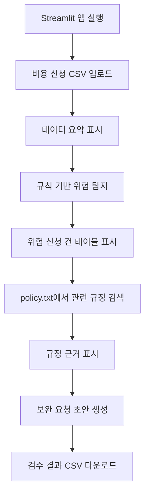
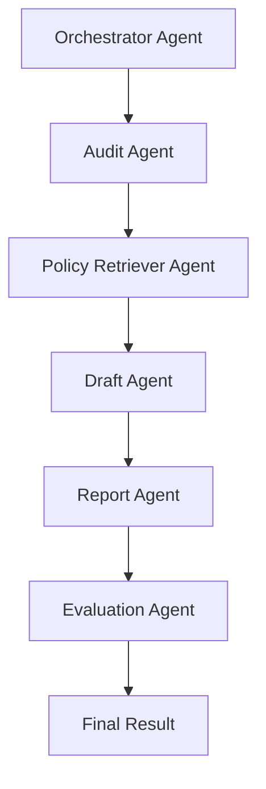
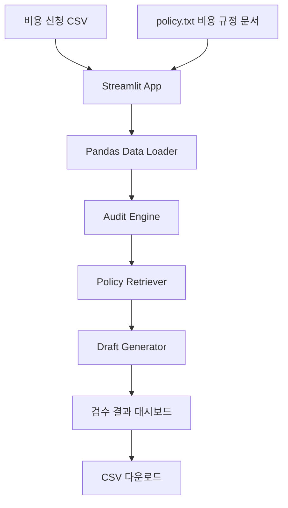
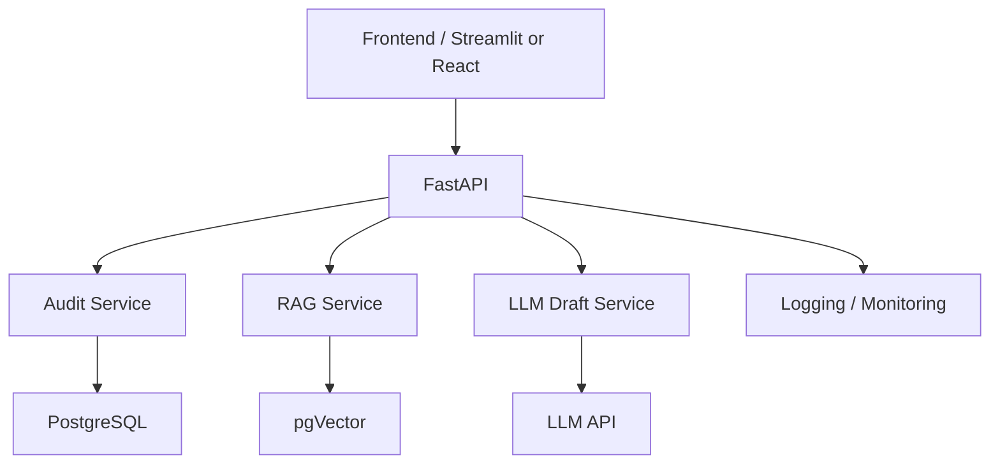
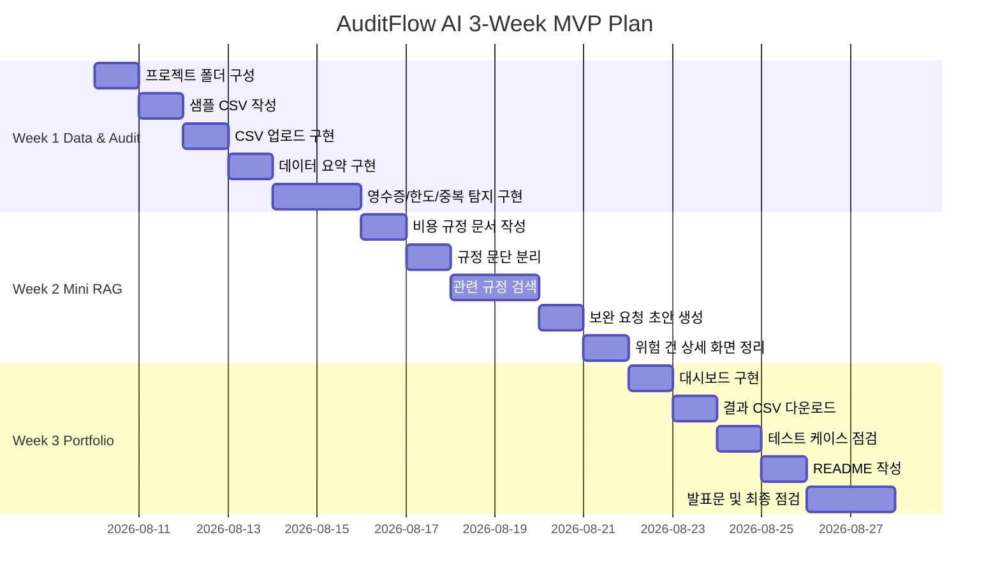

# AuditFlow AI 프로젝트 기획 세트 v1  
## 규정 근거 기반 비용정산 검수 어시스턴트

---

# 1. 기획서

## 1.1 프로젝트 개요

**프로젝트명**  
AuditFlow AI: 규정 근거 기반 비용정산 검수 어시스턴트

**한 줄 설명**  
비용 신청 CSV와 비용 규정 문서를 기반으로 영수증 누락, 한도 초과, 중복 신청, 이상 비용 후보를 자동 탐지하고, 관련 규정 근거와 보완 요청 사유 초안을 제공하는 AX/DX 비용정산 검수 MVP

**서비스 유형**

- AX/DX 업무 자동화 서비스
- 재무·총무·회계 담당자용 비용정산 1차 검수 도구
- 규정 근거 기반 미니 RAG 업무지원 시스템
- Streamlit 기반 개인 포트폴리오 MVP

**타겟 도메인**  
재무팀, 회계팀, 총무팀, 경영지원팀, 내부통제 및 감사 대응 조직

**핵심 사용자**

1. 재무팀 비용정산 담당자  
2. 팀장/승인자  
3. 비용 신청 직원은 간접 사용자

---

## 1.2 문제 정의

기업의 비용정산 업무는 매월 반복적으로 발생한다. 재무·총무·회계 담당자는 직원들이 제출한 식대, 야근식대, 택시비, 사무용품비 등의 비용 신청 건을 확인하고 회사 규정에 맞는지 검수해야 한다.

현재 업무에서는 다음 문제가 발생한다.

- 영수증 첨부 여부를 사람이 직접 확인해야 한다.
- 항목별 한도 기준을 수작업으로 비교해야 한다.
- 동일 신청자, 동일 날짜, 동일 금액, 동일 사용처 기준의 중복 신청을 육안으로 찾기 어렵다.
- 고액 택시비, 주말 사용, 고액 사무용품 구매처럼 추가 사유가 필요한 건을 놓칠 수 있다.
- 보완 또는 반려 요청 문구를 매번 사람이 작성해야 한다.
- 담당자마다 검수 기준이 달라질 수 있다.
- 감사 대응 시 판단 근거를 남기기 어렵다.

기존 방식은 엑셀, 메일, 메신저, 수기 검토에 의존하기 때문에 신청 건수가 늘어날수록 검수 시간과 실수 가능성이 증가한다.

---

## 1.3 타겟 사용자 및 페르소나

## 페르소나 1. 재무팀 비용정산 담당자

**설명**  
직원들이 제출한 비용 신청 CSV를 확인하고 영수증 누락, 한도 초과, 중복 신청, 사유 부족 여부를 검수하는 실무자다.

**목표**

- 검수 필요 건을 빠르게 찾는다.
- 반복적인 확인 업무를 줄인다.
- 비용 규정 근거를 확인한다.
- 보완 요청 문구를 빠르게 작성한다.
- 검수 결과를 기록으로 남긴다.

**불편함**

- 엑셀을 보며 조건을 일일이 확인해야 한다.
- 항목별 규정 기준이 달라 실수하기 쉽다.
- 중복 신청을 육안으로 찾기 어렵다.
- 보완 요청 문구를 반복 작성해야 한다.
- 감사 대응 시 근거를 다시 찾아야 한다.

**얻는 가치**

- 위험 신청 건을 자동으로 우선 확인할 수 있다.
- 검수 기준이 표준화된다.
- 관련 규정 근거를 바로 확인할 수 있다.
- 보완 요청 초안으로 커뮤니케이션 시간을 줄일 수 있다.
- 검수 결과를 CSV로 다운로드해 기록할 수 있다.

---

## 페르소나 2. 팀장/승인자

**설명**  
1차 검수된 비용 신청 건을 확인하고 최종 승인, 보완 요청, 반려 여부를 판단하는 관리자다.

**목표**

- 위험도가 높은 비용 신청 건을 빠르게 파악한다.
- 승인 또는 보완 요청 판단의 근거를 확인한다.
- 담당자가 어떤 기준으로 검수했는지 확인한다.
- 검수 시간을 줄이면서 리스크를 놓치지 않는다.

**불편함**

- 모든 비용 신청 건을 자세히 확인하기 어렵다.
- 위험 건과 정상 건이 섞여 있어 우선순위 판단이 어렵다.
- 반려 사유가 불명확하면 직원 문의가 반복된다.
- 승인 후 문제가 발생하면 판단 근거를 설명해야 한다.

**얻는 가치**

- 위험 신청 건을 우선 검토할 수 있다.
- 규정 근거와 보완 요청 사유를 함께 확인할 수 있다.
- 승인 판단의 일관성과 설명 가능성이 높아진다.
- 비용정산 업무 흐름을 데이터 기반으로 관리할 수 있다.

---

## 1.4 솔루션 개요

AuditFlow AI는 비용 신청 CSV와 비용 규정 문서 `policy.txt`를 입력받아 비용정산 담당자의 1차 검수 업무를 자동화하는 Streamlit 기반 AX/DX MVP다.

시스템은 다음 항목을 자동 탐지한다.

- 영수증 누락
- 식대 한도 초과
- 야근식대 한도 초과
- 고액 택시비의 상세 사유 부족
- 사무용품 고액 구매의 추가 승인 필요
- 동일 신청자의 중복 신청 의심
- 항목별 평균 대비 이상 비용 후보

위험 신청 건이 발견되면 관련 비용 규정 문단을 찾아 근거로 표시하고, 담당자가 직원에게 보낼 보완 요청 사유 초안을 생성한다.

이 프로젝트는 AI가 최종 승인 또는 반려를 결정하는 시스템이 아니다.  
AI와 규칙 기반 로직은 위험 가능성, 관련 근거, 보완 요청 초안을 제공하고 최종 판단은 사람이 수행한다.

---

## 1.5 핵심 가치 제안

| 가치 | 설명 |
|---|---|
| 업무 자동화 | 영수증 누락, 한도 초과, 중복 신청 등 반복 검수 항목을 자동 탐지 |
| 데이터 기반 의사결정 | 위험 유형별 건수, 항목별 비용, 이상 비용 후보를 제공 |
| 사내 지식 활용 | 비용 규정 문서를 검수 근거로 활용 |
| 반복 업무 감소 | 보완 요청 사유 초안 생성으로 커뮤니케이션 시간 절감 |
| 응답 품질 개선 | 규정 근거와 문제 사유를 함께 설명 |

---

## 1.6 성공 지표

| KPI | 설명 | MVP 목표 |
|---|---|---|
| 위험 신청 건 탐지율 | 샘플 데이터 내 위험 건 중 시스템이 탐지한 비율 | 90% 이상 |
| 규정 근거 매칭률 | 위험 신청 건에 관련 규정 문단이 연결된 비율 | 80% 이상 |
| 검수 결과 생성 시간 | CSV 업로드 후 결과 표시까지 걸리는 시간 | 5초 이내 |
| 수동 검수 시간 절감률 | 전체 수작업 검수 대비 예상 절감률 | 50% 이상 |
| 결과 다운로드 성공률 | 검수 결과 CSV 다운로드 정상 작동률 | 100% |

---

## 1.7 프로젝트 범위

## MVP에서 구현할 것

- 비용 신청 CSV 업로드
- 데이터 미리보기
- 전체 신청 건수, 총 신청 금액, 컬럼 목록, 결측치 개수 표시
- 영수증 누락 탐지
- 식대/야근식대 한도 초과 탐지
- 택시비 고액 사용 및 사유 부족 탐지
- 사무용품 고액 사용 탐지
- 중복 신청 의심 탐지
- 이상 비용 후보 탐지
- `policy.txt` 기반 미니 RAG
- 규정 근거 표시
- 보완 요청 초안 생성
- 위험 유형별 대시보드
- 검수 결과 CSV 다운로드
- README 및 발표 문장 작성

## MVP에서 제외할 것

- 실제 영수증 이미지 OCR
- 실제 ERP/결재 시스템 연동
- 로그인/권한 관리
- PostgreSQL 저장
- FastAPI 백엔드 분리
- pgVector 기반 RAG
- LangGraph 멀티에이전트
- Docker 배포
- GitHub Actions
- AI 자동 승인/반려

## v1 확장

- LLM API 기반 보완/반려 사유 초안 생성
- SQLite 또는 PostgreSQL 기반 검수 결과 저장
- SQL 기반 부서별/항목별 비용 집계
- 검수 로그 저장
- 담당자 검수 상태 관리
- 테스트 케이스 작성

## v2 확장

- FastAPI 백엔드 분리
- PostgreSQL 정식 도입
- pgVector 기반 embedding 검색
- 비용 규정 문서 업로드
- RAG 검색 품질 평가
- OCR 기반 영수증 정보 추출
- Docker 실행 환경 구성

---


---

# 2. 요구사항정의서

## 2.1 문서 개요

**문서 목적**  
AuditFlow AI의 비즈니스 요구사항, 사용자 요구사항, 시스템 요구사항, 데이터 요구사항, AI 요구사항을 정의한다.

**프로젝트 범위**  
3주 MVP 기준으로 Streamlit 단일 앱에서 비용 신청 CSV를 업로드하고, 규칙 기반 검수와 미니 RAG 기반 규정 근거 표시를 구현한다.

**주요 이해관계자**

| 이해관계자 | 역할 |
|---|---|
| 재무팀 비용정산 담당자 | 비용 신청 건 1차 검수 |
| 팀장/승인자 | 최종 승인, 보완 요청, 반려 판단 |
| 비용 신청 직원 | 보완 요청을 받는 간접 사용자 |
| 개발자 | 시스템 구현 및 포트폴리오 정리 |

**용어 정의**

| 용어 | 정의 |
|---|---|
| 비용 신청 건 | 직원이 제출한 식대, 교통비, 사무용품비 등 비용 정산 요청 |
| 검수 | 비용 신청이 규정에 맞는지 확인하는 과정 |
| 위험 신청 건 | 영수증 누락, 한도 초과, 중복 신청 등 추가 확인이 필요한 신청 건 |
| 미니 RAG | `policy.txt` 문서를 문단 단위로 나누고 관련 규정을 검색해 근거로 표시하는 방식 |
| human-in-the-loop | AI가 최종 판단하지 않고 사람이 최종 검수하는 구조 |

---

## 2.2 비즈니스 요구사항

| 요구사항 ID | 요구사항명 | 설명 | 목적 | 우선순위 | 성공 기준 |
|---|---|---|---|---|---|
| BR-001 | 비용정산 1차 검수 자동화 | 비용 신청 CSV에서 위험 신청 건을 자동 탐지 | 반복 검수 시간 절감 | High | 주요 위험 유형 탐지 가능 |
| BR-002 | 검수 기준 표준화 | 항목별 규정을 기준으로 위험 유형 판단 | 담당자별 판단 차이 감소 | High | 동일 데이터에 동일 결과 출력 |
| BR-003 | 규정 근거 제공 | 위험 신청 건에 관련 규정 문단 표시 | 설명 가능성 확보 | High | 위험 건의 80% 이상에 근거 연결 |
| BR-004 | 보완 요청 초안 생성 | 위험 사유에 따라 직원에게 보낼 문장 생성 | 반복 커뮤니케이션 감소 | Medium | 위험 건별 초안 생성 |
| BR-005 | 검수 결과 기록 | 검수 결과 CSV 다운로드 | 감사 대응 및 기록 보존 | High | 다운로드 파일 생성 |

---

## 2.3 사용자 요구사항

| 사용자 유형 | 사용 상황 | 요구사항 | 기대 결과 | 우선순위 |
|---|---|---|---|---|
| 재무팀 담당자 | 월별 비용 신청 CSV 검수 | CSV 업로드 후 위험 건 자동 탐지 | 검수 필요 건을 빠르게 확인 | High |
| 재무팀 담당자 | 보완 요청 작성 | 위험 사유별 문장 초안 확인 | 반복 문장 작성 감소 | Medium |
| 재무팀 담당자 | 감사 대응 | 규정 근거와 검수 사유 확인 | 판단 근거 확보 | High |
| 팀장/승인자 | 최종 승인 판단 | 위험 건과 근거 확인 | 승인 판단 시간 절감 | High |
| 비용 신청 직원 | 보완 요청 수신 | 보완 사유 이해 | 재문의 감소 | Medium |

---

## 2.4 시스템 요구사항

| 요구사항 ID | 시스템 기능/역할 | 설명 | 입력 데이터 | 출력 데이터 | 관련 기술 |
|---|---|---|---|---|---|
| SR-001 | CSV 업로드 | 비용 신청 CSV 파일을 업로드 | sample_expenses.csv | DataFrame | Streamlit, Pandas |
| SR-002 | 데이터 요약 | 건수, 총액, 컬럼, 결측치 표시 | DataFrame | 요약 지표 | Pandas, Streamlit |
| SR-003 | 위험 탐지 | 규칙 기반으로 위험 유형 탐지 | 비용 신청 데이터 | risk_type, risk_reason | Python, Pandas |
| SR-004 | 규정 검색 | 위험 유형에 맞는 규정 문단 검색 | policy.txt, risk_type | policy_evidence | 미니 RAG |
| SR-005 | 보완 초안 생성 | 위험 사유와 규정 근거 기반 문장 생성 | risk_reason, evidence | draft_message | Template, LLM 확장 |
| SR-006 | 결과 다운로드 | 검수 결과 CSV 다운로드 | 검수 결과 DataFrame | result.csv | Streamlit, Pandas |

---

## 2.5 데이터 요구사항

## 수집 데이터

- 비용 신청 CSV
- 비용 규정 문서 `policy.txt`

## 정형 데이터

비용 신청 CSV 컬럼 예시:

| 컬럼 | 설명 |
|---|---|
| expense_id | 비용 신청 ID |
| employee | 신청자 |
| department | 부서 |
| category | 비용 항목 |
| amount | 금액 |
| date | 사용일 |
| vendor | 사용처 |
| reason | 사용 사유 |
| has_receipt | 영수증 첨부 여부 |

## 비정형 데이터

- 비용 규정 문서 `policy.txt`
- 보완 요청 초안 문장

## RAG 데이터 정의

| 데이터 | MVP | v2 |
|---|---|---|
| 문서 | policy.txt | 업로드된 비용 규정 문서 |
| 청크 | 문단 단위 분리 | 자동 chunking |
| 임베딩 | 사용하지 않음 | embedding 생성 |
| 저장소 | 메모리 또는 파일 | pgVector |
| 검색 | 키워드/규칙 기반 | 벡터 유사도 검색 |

---

## 2.6 AI 요구사항

| 항목 | 요구사항 |
|---|---|
| RAG 검색 품질 | 위험 신청 건의 비용 항목과 위험 유형에 맞는 규정 문단을 검색해야 한다. |
| LLM 응답 품질 | 보완 요청 초안은 규정 근거와 위험 사유를 반영해야 한다. |
| 환각 방지 | 근거 문단이 없으면 임의 답변을 생성하지 않고 “관련 규정 확인 필요”라고 표시한다. |
| 평가 하네스 | MVP에서는 수동 테스트 케이스로 검색 결과와 초안 품질을 검증한다. |
| 실패 케이스 관리 | 검색 실패, 빈 규정, 잘못된 CSV 컬럼 입력을 예외 케이스로 관리한다. |

---

## 2.7 보안 및 권한 요구사항

MVP에서는 실제 개인정보와 회사 내부 데이터를 사용하지 않는다.  
샘플 데이터는 가상 이름과 가상 비용 신청 건으로 구성한다.

v1 이후에는 다음 요구사항을 고려한다.

- 사용자별 권한 관리
- 문서 접근 권한
- 민감 데이터 마스킹
- 검수 로그 저장
- 감사 추적 기록

---

## 2.8 비기능 요구사항

| 항목 | 요구사항 |
|---|---|
| 성능 | 100건 이하 샘플 CSV 기준 5초 이내 결과 표시 |
| 사용성 | 비개발자도 CSV 업로드 후 결과를 확인할 수 있어야 함 |
| 확장성 | SQL, FastAPI, pgVector로 확장 가능한 구조 |
| 비용 | MVP에서는 외부 API 비용 없이 구현 가능해야 함 |
| 유지보수성 | 검수 규칙과 규정 검색 로직을 함수 단위로 분리 |
| 모니터링 | MVP에서는 수동 로그 또는 화면 출력 중심 |

---

## 2.9 요구사항 추적 매트릭스

| 요구사항 ID | 연결 기능 ID | 연결 API | 연결 데이터 | 검증 방법 | 우선순위 |
|---|---|---|---|---|---|
| BR-001 | F-001, F-003 | 없음 | sample_expenses.csv | 위험 건 탐지 테스트 | High |
| BR-002 | F-003 | 없음 | category, amount | 동일 입력 반복 테스트 | High |
| BR-003 | F-004 | 없음 | policy.txt | 규정 매칭 테스트 | High |
| BR-004 | F-005 | 없음 | risk_reason | 초안 문장 확인 | Medium |
| BR-005 | F-006 | 없음 | result.csv | 다운로드 테스트 | High |

---

## 2.10 오픈 이슈

1. LLM API를 MVP에 포함할지 여부
2. 미니 RAG를 키워드 기반으로만 할지 embedding까지 시도할지
3. 샘플 데이터 건수
4. 결과 CSV 최종 컬럼
5. README 작성 언어
6. 배포 여부

---

# 3. 기능정의서

## 3.1 기능 목록 요약

| 기능 ID | 기능명 | 설명 | 사용자 | 우선순위 | 관련 요구사항 | 기술 |
|---|---|---|---|---|---|---|
| F-001 | CSV 업로드 | 비용 신청 CSV 업로드 | 재무 담당자 | P0 | SR-001 | Streamlit, Pandas |
| F-002 | 데이터 요약 | 건수, 총액, 결측치 표시 | 재무 담당자 | P0 | SR-002 | Pandas |
| F-003 | 위험 신청 건 탐지 | 규칙 기반 위험 유형 탐지 | 재무 담당자 | P0 | SR-003 | Python, Pandas |
| F-004 | 규정 근거 검색 | policy.txt에서 관련 근거 검색 | 재무 담당자, 승인자 | P0 | SR-004 | 미니 RAG |
| F-005 | 보완 요청 초안 생성 | 위험 사유 기반 문장 생성 | 재무 담당자 | P1 | SR-005 | Template, LLM 확장 |
| F-006 | 검수 결과 다운로드 | 결과 CSV 다운로드 | 재무 담당자 | P0 | SR-006 | Streamlit |
| F-007 | 위험 대시보드 | 위험 유형별 건수 표시 | 승인자 | P1 | BR-001 | Streamlit |

---

## 3.2 핵심 기능 상세 정의

## F-001. CSV 업로드

- 목적: 비용 신청 데이터를 시스템에 입력한다.
- 사용자: 재무팀 비용정산 담당자
- 진입 경로: 메인 화면 파일 업로드 영역
- 입력값: `sample_expenses.csv`
- 처리 로직: `pd.read_csv()`로 CSV를 DataFrame으로 변환
- 출력값: 데이터 미리보기 테이블
- 예외 상황: CSV 파일 없음, 필수 컬럼 없음, 인코딩 오류
- 관련 기술: Streamlit, Pandas
- 완료 기준: CSV 업로드 후 표가 화면에 출력된다.

## F-002. 데이터 요약

- 목적: 비용 신청 데이터의 기본 구조를 파악한다.
- 입력값: DataFrame
- 처리 로직: `shape`, `columns`, `isna().sum()`, `amount.sum()`
- 출력값: 전체 건수, 총액, 컬럼 목록, 결측치 개수
- 완료 기준: 업로드된 데이터의 기본 요약이 화면에 표시된다.

## F-003. 위험 신청 건 탐지

- 목적: 비용 신청 건 중 검수 필요 항목을 자동 탐지한다.
- 입력값: 비용 신청 DataFrame
- 처리 로직:
  - `has_receipt == N`이면 영수증 누락
  - 식대 금액 20,000원 초과 시 한도 초과
  - 야근식대 금액 15,000원 초과 시 한도 초과
  - 택시비 30,000원 초과이고 사유가 없으면 사유 부족
  - 사무용품 100,000원 초과 시 추가 승인 필요
  - 동일 신청자/날짜/금액/사용처 기준 중복 신청 탐지
  - 항목별 평균 대비 2배 이상이면 이상 비용 후보
- 출력값: `risk_type`, `risk_reason`, `suggested_action`
- 완료 기준: 위험 신청 건에 위험 유형과 사유가 생성된다.

## F-004. 규정 근거 검색

- 목적: 위험 신청 건과 관련된 비용 규정 근거를 제공한다.
- 입력값: `risk_type`, `category`, `policy.txt`
- 처리 로직:
  - policy.txt를 규정 섹션 단위로 분리
  - 위험 유형과 비용 항목에 맞는 키워드 검색
  - 관련 문단 반환
- 출력값: `policy_evidence`
- 예외 상황: 관련 규정 없음
- 완료 기준: 위험 신청 건 옆에 관련 규정 근거가 표시된다.

## F-005. 보완 요청 초안 생성

- 목적: 담당자가 직원에게 보낼 보완 요청 문장을 자동 생성한다.
- 입력값: `risk_reason`, `policy_evidence`
- 처리 로직:
  - MVP: 템플릿 기반 문장 생성
  - v1: LLM API 기반 문장 생성
- 출력값: `draft_message`
- 완료 기준: 위험 신청 건별 보완 요청 초안이 생성된다.

## F-006. 검수 결과 다운로드

- 목적: 검수 결과를 기록으로 남긴다.
- 입력값: 검수 결과 DataFrame
- 출력값: `audit_result.csv`
- 완료 기준: 다운로드 버튼으로 CSV 파일 저장 가능

---

## 3.3 화면 단위 기능 정의

| 화면 ID | 화면명 | 주요 기능 | 입력 요소 | 출력 요소 | 예외 메시지 |
|---|---|---|---|---|---|
| S-001 | 메인 업로드 화면 | CSV 업로드 | 파일 업로더 | 데이터 미리보기 | CSV를 업로드해 주세요 |
| S-002 | 데이터 요약 화면 | 기본 지표 표시 | 업로드 데이터 | 건수, 총액, 결측치 | 필수 컬럼이 없습니다 |
| S-003 | 검수 결과 화면 | 위험 건 테이블 표시 | 검수 결과 | risk_type, reason | 위험 건이 없습니다 |
| S-004 | 규정 근거 화면 | 관련 규정 표시 | 위험 건 선택 | policy_evidence | 관련 규정 확인 필요 |
| S-005 | 다운로드 화면 | 결과 CSV 저장 | 검수 결과 | 다운로드 버튼 | 다운로드 실패 |

---

## 3.4 API 기능 정의

MVP에서는 FastAPI를 구현하지 않는다. Streamlit 단일 앱으로 구현한다.

v2 확장 API 예시는 다음과 같다.

| API ID | Method | Endpoint | 설명 | 관련 기능 |
|---|---|---|---|---|
| API-001 | POST | `/audit` | 비용 신청 데이터 검수 | F-003 |
| API-002 | POST | `/retrieve-policy` | 관련 규정 검색 | F-004 |
| API-003 | POST | `/draft-message` | 보완 요청 초안 생성 | F-005 |
| API-004 | GET | `/audit-results` | 검수 결과 조회 | F-006 |

---

## 3.5 에이전트 기능 정의

MVP에서는 에이전트를 구현하지 않는다.  
v2 이후 확장 구조는 다음과 같다.

| Agent ID | Agent명 | 역할 | 입력 | 출력 | 실패 시 동작 |
|---|---|---|---|---|---|
| AG-001 | Audit Agent | 위험 유형 탐지 | 비용 신청 데이터 | risk_type | 규칙 기반 fallback |
| AG-002 | Policy Retriever Agent | 규정 근거 검색 | risk_type, category | evidence | 관련 규정 확인 필요 |
| AG-003 | Draft Agent | 보완 요청 문장 생성 | reason, evidence | draft_message | 템플릿 문장 반환 |
| AG-004 | Report Agent | 검수 리포트 생성 | 검수 결과 | summary | 기본 통계 반환 |
| AG-005 | Evaluation Agent | 결과 품질 평가 | evidence, draft | score | 사람 검토 표시 |

---

## 3.6 RAG 기능 정의

| 항목 | MVP | v2 |
|---|---|---|
| 문서 업로드 | policy.txt 고정 사용 | 사용자가 규정 문서 업로드 |
| 청킹 | 문단 단위 수동 분리 | 자동 chunking |
| 임베딩 | 사용하지 않음 | embedding 생성 |
| 저장 | 메모리 또는 텍스트 파일 | pgVector |
| 검색 | 키워드/규칙 기반 | 벡터 유사도 검색 |
| reranking | 없음 | 필요 시 도입 |
| 출처 표시 | 규정 섹션명 표시 | chunk metadata 표시 |
| 실패 처리 | 관련 규정 확인 필요 | 재검색 또는 사람 검토 |

---

## 3.7 기능 우선순위

## MVP 필수 기능

- CSV 업로드
- 데이터 요약
- 위험 신청 건 탐지
- 규정 근거 검색
- 보완 요청 초안 생성
- 결과 CSV 다운로드

## v1 확장 기능

- LLM API
- SQL 저장
- 검수 상태 관리
- 테스트 케이스

## v2 고도화 기능

- FastAPI
- PostgreSQL
- pgVector
- OCR
- Docker
- LangGraph

## 제외 기능

- 실서비스 로그인
- ERP 연동
- 실제 회사 데이터 사용
- AI 자동 승인/반려

---

# 4. PRD

## 4.1 제품 개요

**제품명**  
AuditFlow AI

**문제 정의**  
비용정산 검수 업무는 반복적이고 규정 기반 판단이 필요하지만, 기존 방식은 수작업에 의존해 시간이 오래 걸리고 판단 근거가 남기 어렵다.

**핵심 사용자**

- 재무팀 비용정산 담당자
- 팀장/승인자

**제품 목표**  
비용 신청 데이터에서 위험 신청 건을 자동 탐지하고, 관련 규정 근거와 보완 요청 초안을 제공해 1차 검수 시간을 줄인다.

**MVP 목표**  
CSV 업로드 → 위험 탐지 → 규정 근거 검색 → 보완 요청 초안 → 결과 다운로드 흐름을 완성한다.

---

## 4.2 제품 전략

## 왜 지금 필요한가

기업은 반복적인 백오피스 업무를 줄이고, 내부 규정 기반 판단을 더 일관되게 관리해야 한다. 비용정산 검수는 데이터, 규정, 승인 판단이 결합된 업무이기 때문에 AX/DX 포트폴리오 주제로 적합하다.

## 왜 AX/DX 프로젝트인가

이 프로젝트는 단순 화면 구현이 아니라 비용정산이라는 업무 흐름을 데이터 처리, 규칙 기반 자동화, 문서 근거 검색, AI 초안 생성으로 개선한다.

## 기존 방식 대비 차별점

| 기존 방식 | AuditFlow AI |
|---|---|
| 엑셀 수기 검수 | 위험 건 자동 탐지 |
| 규정 수동 확인 | 관련 규정 자동 검색 |
| 보완 요청 직접 작성 | 보완 요청 초안 생성 |
| 판단 근거 부족 | 규정 근거 표시 |
| 전체 건 동일 검수 | 위험 건 우선 검수 |


---

## 4.3 주요 기능 요구사항

| 기능명 | 설명 | 우선순위 | 사용자 가치 | 관련 요구사항 | 기술 |
|---|---|---|---|---|---|
| CSV 업로드 | 비용 신청 데이터 입력 | P0 | 데이터 입력 가능 | SR-001 | Streamlit |
| 데이터 요약 | 건수, 총액, 결측치 확인 | P0 | 데이터 품질 확인 | SR-002 | Pandas |
| 위험 탐지 | 규칙 기반 검수 | P0 | 검수 시간 절감 | SR-003 | Python |
| 규정 검색 | policy.txt 근거 검색 | P0 | 설명 가능성 확보 | SR-004 | 미니 RAG |
| 초안 생성 | 보완 요청 문장 생성 | P1 | 커뮤니케이션 감소 | SR-005 | Template |
| 다운로드 | 결과 CSV 저장 | P0 | 기록 보관 | SR-006 | Streamlit |

---

## 4.4 유저 스토리

- 재무팀 담당자로서, 비용 신청 CSV를 업로드해 검수 필요 건을 빠르게 찾고 싶다.
- 재무팀 담당자로서, 영수증 누락과 한도 초과 건을 자동으로 확인하고 싶다.
- 재무팀 담당자로서, 위험 신청 건이 어떤 규정에 걸리는지 확인하고 싶다.
- 재무팀 담당자로서, 직원에게 보낼 보완 요청 초안을 빠르게 만들고 싶다.
- 팀장/승인자로서, 위험 건과 판단 근거를 보고 승인 여부를 결정하고 싶다.

---

## 4.5 AI 품질 요구사항

| 항목 | 기준 |
|---|---|
| RAG 정확도 | 위험 신청 건의 항목과 위험 유형에 맞는 규정 문단이 연결되어야 함 |
| 출처 인용 | 관련 규정 섹션명을 함께 표시해야 함 |
| 답변 거절 | 근거가 없으면 임의 문장을 만들지 않고 확인 필요 표시 |
| 환각 방지 | 근거 문단 기반으로만 보완 요청 초안 생성 |
| 평가 방식 | 샘플 테스트 케이스로 수동 검증 |
| 실패 처리 | 검색 실패 시 사람 검토 상태로 표시 |

---

## 4.6 데이터 요구사항

| 항목 | MVP | v2 |
|---|---|---|
| 데이터 소스 | sample_expenses.csv | DB/ERP 연동 |
| 문서 소스 | policy.txt | 업로드된 규정 문서 |
| ETL | CSV 로드 및 정제 | Airflow/배치 |
| 저장소 | 파일 기반 | PostgreSQL |
| RAG 저장소 | 메모리 | pgVector |
| 데이터 품질 검증 | 필수 컬럼, 결측치 확인 | 자동 검증 파이프라인 |

---

## 4.7 비기능 요구사항

- 100건 이하 CSV 기준 5초 이내 결과 표시
- 비개발자도 사용할 수 있는 단순 UI
- 검수 규칙과 RAG 로직을 함수 단위로 분리
- 실제 개인정보를 사용하지 않음
- 외부 API 없이도 MVP 실행 가능
- v1/v2 확장 가능성을 README에 명시

---

## 4.8 성공 지표

| 구분 | KPI |
|---|---|
| 제품 KPI | 검수 시간 절감률, 위험 신청 건 탐지율 |
| AI 품질 KPI | 규정 근거 매칭률, 근거 없는 초안 생성 방지 |
| 기술 KPI | CSV 업로드, 위험 탐지, 근거 검색, 다운로드 정상 작동 |
| 포트폴리오 KPI | 문제 정의, 기술 선택 이유, 확장 계획 설명 가능 |

---

## 4.9 출시 범위

| 단계 | 포함 | 제외 |
|---|---|---|
| MVP | CSV, 규칙 검수, 미니 RAG, 초안, 다운로드 | DB, FastAPI, OCR |
| v1 | LLM API, SQL 저장, 검수 로그 | ERP 연동 |
| v2 | FastAPI, PostgreSQL, pgVector, OCR | 대규모 운영 |
| 제외 | AI 자동 승인, 실제 회사 데이터 | 보안상 제외 |

---

## 4.10 의존성 및 리스크

| 리스크 | 설명 | 대응 |
|---|---|---|
| 데이터 품질 | 필수 컬럼 누락 가능 | 컬럼 검증 추가 |
| RAG 검색 실패 | 관련 규정이 안 나올 수 있음 | 확인 필요 표시 |
| LLM 환각 | 근거 없는 문장 생성 가능 | 근거 기반 초안만 허용 |
| 일정 지연 | 기능 범위 과다 | MVP 우선순위 고정 |
| 설명 어려움 | 기술을 억지로 넣을 위험 | MVP/v1/v2 분리 |

---

# 5. 유저 플로우 / 워크플로우

## 5.1 핵심 사용자 시나리오

## 시나리오 1. 비용 신청 CSV 1차 검수

재무 담당자가 비용 신청 CSV를 업로드하면 시스템이 데이터 요약과 위험 신청 건을 자동으로 표시한다.

## 시나리오 2. 위험 신청 건의 규정 근거 확인

재무 담당자 또는 팀장/승인자가 위험 건을 확인하고, 관련 비용 규정 근거를 검토한다.

## 시나리오 3. 보완 요청 초안 확인 및 결과 다운로드

재무 담당자가 보완 요청 초안을 확인하고, 검수 결과를 CSV로 다운로드한다.

---

## 5.2 사용자 플로우

## CSV 검수 플로우

1. 진입: Streamlit 앱 실행
2. 입력: 비용 신청 CSV 업로드
3. 처리: Pandas로 데이터 로드 및 요약
4. 결과 확인: 위험 신청 건 테이블 확인
5. 예외: 필수 컬럼 누락 시 오류 메시지 표시
6. 완료: 검수 결과 생성

## 규정 근거 확인 플로우

1. 진입: 위험 신청 건 테이블 확인
2. 입력: 위험 건 선택 또는 자동 처리
3. 처리: `policy.txt`에서 관련 규정 검색
4. 결과 확인: 규정 근거 표시
5. 예외: 관련 규정 없으면 확인 필요 표시
6. 완료: 검수 사유 확인

## 보완 요청 초안 플로우

1. 진입: 위험 신청 건 상세 확인
2. 입력: 위험 유형, 위험 사유, 규정 근거
3. 처리: 템플릿 기반 보완 요청 초안 생성
4. 결과 확인: 초안 문장 확인
5. 예외: 근거 없음 시 일반 보완 문장 생성 제한
6. 완료: 결과 CSV 다운로드

---

## 5.3 화면 흐름

| 화면 ID | 화면명 | 사용자 액션 | 시스템 반응 | 다음 화면 | 예외 메시지 |
|---|---|---|---|---|---|
| S-001 | CSV 업로드 | CSV 파일 선택 | 데이터 로드 | 데이터 요약 | CSV를 업로드해 주세요 |
| S-002 | 데이터 요약 | 요약 확인 | 건수/총액/결측치 표시 | 검수 결과 | 필수 컬럼이 없습니다 |
| S-003 | 검수 결과 | 위험 건 확인 | risk_type 표시 | 규정 근거 | 위험 건이 없습니다 |
| S-004 | 규정 근거 | 근거 확인 | policy_evidence 표시 | 초안 확인 | 관련 규정 확인 필요 |
| S-005 | 결과 다운로드 | 다운로드 클릭 | CSV 저장 | 완료 | 다운로드 실패 |

---

## 5.4 멀티에이전트 워크플로우

MVP에서는 직접 구현하지 않고 v2 확장 구조로 설계한다.

| Agent | 입력 | 처리 | 출력 | 실패 시 분기 |
|---|---|---|---|---|
| Orchestrator Agent | 사용자 요청 | 작업 순서 결정 | 실행 계획 | 사람 검토 |
| Audit Agent | 비용 신청 데이터 | 위험 유형 탐지 | risk_type | 규칙 fallback |
| Retriever Agent | risk_type, category | 규정 검색 | evidence | 확인 필요 |
| Draft Agent | reason, evidence | 초안 생성 | draft_message | 템플릿 fallback |
| Report Agent | 검수 결과 | 요약 생성 | report | 기본 통계 |
| Evaluation Agent | evidence, draft | 품질 평가 | score | 사람 검토 |

---

## 5.5 상태 흐름

| State | 설명 |
|---|---|
| user_query | 사용자의 업로드/검수 요청 |
| intent | 데이터 검수, 규정 검색, 초안 생성 등 의도 |
| uploaded_data | 업로드된 비용 신청 데이터 |
| audit_result | 위험 탐지 결과 |
| retrieved_context | 검색된 비용 규정 근거 |
| draft_message | 보완 요청 초안 |
| confidence_score | 검색/초안 신뢰도 |
| error_state | 검색 실패, 컬럼 누락, LLM 실패 등 |

---

## 5.6 Mermaid 사용자 플로우



---

## 5.7 Mermaid 에이전트 워크플로우



---

# 6. 아키텍처 설계서

## 6.1 전체 아키텍처 개요

MVP는 Streamlit 단일 앱 구조로 구현한다.  
CSV 파일과 `policy.txt`를 입력으로 받아 Pandas 기반 검수 로직과 미니 RAG 검색 로직을 실행하고, 결과를 화면과 CSV 다운로드로 제공한다.

## MVP 구성요소

| 구성요소 | 역할 | 기술 |
|---|---|---|
| Web Dashboard | 사용자 화면 | Streamlit |
| Data Loader | CSV 로드 | Pandas |
| Audit Engine | 규칙 기반 검수 | Python |
| Policy Retriever | 규정 문서 검색 | 미니 RAG |
| Draft Generator | 보완 요청 초안 생성 | Template |
| Exporter | 결과 CSV 다운로드 | Pandas, Streamlit |

---

## 6.2 전체 구성도



---

## 6.3 v2 확장 아키텍처



---

## 6.4 클린 아키텍처 기준 구조

```text
expense-audit-assistant/
├── app.py
├── sample_expenses.csv
├── policy.txt
├── requirements.txt
├── README.md
├── src/
│   ├── data_loader.py
│   ├── audit_rules.py
│   ├── policy_retriever.py
│   ├── draft_generator.py
│   ├── dashboard.py
│   └── exporter.py
└── tests/
    ├── test_audit_rules.py
    └── test_policy_retriever.py
```

| 레이어 | 책임 |
|---|---|
| presentation | Streamlit 화면 |
| application | 검수 흐름 제어 |
| domain | 비용정산 규칙 |
| infrastructure | 파일 입출력 |
| rag | 규정 문서 검색 |
| export | 결과 다운로드 |

---

## 6.5 데이터 모델 설계

## MVP CSV 컬럼

| 컬럼 | 설명 |
|---|---|
| expense_id | 신청 ID |
| employee | 신청자 |
| department | 부서 |
| category | 비용 항목 |
| amount | 금액 |
| date | 사용일 |
| vendor | 사용처 |
| reason | 사용 사유 |
| has_receipt | 영수증 여부 |

## 검수 결과 컬럼

| 컬럼 | 설명 |
|---|---|
| risk_type | 위험 유형 |
| risk_reason | 위험 사유 |
| policy_evidence | 관련 규정 근거 |
| suggested_action | 추천 조치 |
| draft_message | 보완 요청 초안 |
| review_status | 검수 상태 |

---

## 6.6 v2 DB 설계

| 테이블 | 역할 |
|---|---|
| expenses | 비용 신청 원본 |
| audit_results | 검수 결과 |
| policies | 비용 규정 문서 |
| policy_chunks | 규정 청크 |
| draft_messages | AI 초안 |
| review_logs | 담당자 검수 로그 |
| eval_results | RAG/LLM 품질 평가 결과 |

---

## 6.7 벡터 DB 설계

MVP에서는 pgVector를 사용하지 않는다.  
v2에서 비용 규정 문서를 chunking하고 embedding을 생성해 pgVector에 저장한다.

| 항목 | 설계 |
|---|---|
| 문서 단위 | 비용 규정 문서 |
| 청크 단위 | 규정 섹션 또는 문단 |
| 메타데이터 | category, policy_type, section_title |
| 검색 전략 | 비용 항목 + 위험 유형 기반 유사도 검색 |
| 실패 처리 | 관련 규정 확인 필요 표시 |

---

## 6.8 보안 설계

MVP에서는 실제 회사 데이터와 개인정보를 사용하지 않는다.  
v1 이후에는 다음을 고려한다.

- 사용자 인증
- 역할 기반 권한
- 민감정보 마스킹
- 문서 접근 제어
- 감사 로그
- API 보안

---

## 6.9 미사용 스택 정리

| 기술 | MVP 사용 여부 | 제외 이유 | 추후 확장 |
|---|---|---|---|
| FastAPI | 제외 | 3주 MVP에서는 Streamlit 단일 앱 우선 | v2 |
| PostgreSQL | 제외 | CSV 기반 가치 검증 우선 | v1 |
| pgVector | 제외 | 미니 RAG부터 구현 | v2 |
| OCR | 제외 | 난이도 높음 | v2 |
| Docker | 제외 | 배포보다 기능 완성 우선 | v2 |
| LangGraph | 제외 | 멀티에이전트는 후순위 | v3 |
| MCP server | 제외 | 도구화 단계는 장기 확장 | v3 |

---

# 7. 구현 계획 / WBS / 간트차트

## 7.1 구현 전략

MVP는 3주 동안 핵심 업무 흐름을 닫는 것을 목표로 한다.

**핵심 흐름**

```text
CSV 업로드
→ 데이터 요약
→ 위험 신청 건 탐지
→ 규정 근거 검색
→ 보완 요청 초안 생성
→ 결과 CSV 다운로드
→ README/발표 정리
```

기술을 많이 넣는 것보다, 비용정산 검수 문제 하나를 끝까지 작동하게 만드는 것을 우선한다.

---

## 7.2 WBS

| WBS ID | 작업명 | 영역 | 산출물 | 우선순위 | 선행 작업 | 예상 소요 | 기술 |
|---|---|---|---|---|---|---|---|
| WBS-001 | 프로젝트 폴더 구성 | 기획/문서 | 폴더, README 초안 | P0 | 없음 | 0.5일 | Git |
| WBS-002 | 샘플 CSV 작성 | 데이터 | sample_expenses.csv | P0 | 없음 | 0.5일 | CSV |
| WBS-003 | 비용 규정 문서 작성 | RAG | policy.txt | P0 | 없음 | 0.5일 | Text |
| WBS-004 | CSV 업로드 구현 | Frontend | 업로드 화면 | P0 | WBS-002 | 1일 | Streamlit |
| WBS-005 | 데이터 요약 구현 | Data | 요약 지표 | P0 | WBS-004 | 1일 | Pandas |
| WBS-006 | 영수증 누락 탐지 | Audit | risk_type | P0 | WBS-005 | 1일 | Python |
| WBS-007 | 한도 초과 탐지 | Audit | risk_reason | P0 | WBS-006 | 1일 | Pandas |
| WBS-008 | 중복 신청 탐지 | Audit | duplicate flag | P0 | WBS-007 | 1일 | Pandas |
| WBS-009 | 이상 비용 후보 탐지 | Audit | anomaly flag | P1 | WBS-008 | 1일 | Pandas |
| WBS-010 | policy.txt 문단 분리 | RAG | policy chunks | P0 | WBS-003 | 1일 | Python |
| WBS-011 | 규정 근거 검색 | RAG | evidence | P0 | WBS-010 | 1일 | Python |
| WBS-012 | 보완 요청 초안 생성 | LLM/Agent | draft_message | P1 | WBS-011 | 1일 | Template |
| WBS-013 | 대시보드 구현 | Dashboard | 위험 유형별 카드 | P1 | WBS-008 | 1일 | Streamlit |
| WBS-014 | CSV 다운로드 | Export | result.csv | P0 | WBS-012 | 0.5일 | Pandas |
| WBS-015 | 테스트 케이스 작성 | QA/Test | 테스트 시나리오 | P1 | 주요 기능 | 1일 | Python |
| WBS-016 | README 작성 | README/Demo | README.md | P0 | 기능 완성 | 1일 | Markdown |
| WBS-017 | 발표문 작성 | README/Demo | 3분 발표문 | P0 | README | 1일 | 문서화 |
| WBS-018 | 최종 점검 | QA/Test | 실행 캡처 | P0 | 전체 | 1일 | GitHub |

---

## 7.3 마일스톤

| 단계 | 목표 | 포함 기능 | 제외 기능 | 완료 기준 | 예상 기간 |
|---|---|---|---|---|---|
| MVP | 핵심 검수 흐름 완성 | CSV, 요약, 위험 탐지, 미니 RAG, 다운로드 | DB, FastAPI, OCR | 로컬에서 전체 흐름 실행 | 3주 |
| v1 | AI/DB 확장 | LLM API, SQL 저장, 검수 로그 | OCR, pgVector | DB 저장 및 AI 초안 생성 | 2~3주 |
| v2 | 서비스 구조 확장 | FastAPI, PostgreSQL, pgVector, OCR | ERP 연동 | API/RAG/OCR 분리 | 4~6주 |
| 포트폴리오 정리 | 채용 제출용 정리 | README, 데모, 발표문 | 신규 기능 | GitHub 제출 가능 | 3일 |

---

## 7.4 주차별 일정표

| 주차 | 목표 | 주요 작업 | 산출물 | 사용 스택 | 리스크 |
|---|---|---|---|---|---|
| 1주차 | CSV 검수기 완성 | CSV 업로드, 요약, 영수증 누락, 한도 초과, 중복 탐지 | 기본 검수 앱 | Python, Pandas, Streamlit | Pandas 이해 부족 |
| 2주차 | 미니 RAG와 초안 생성 | policy.txt 작성, 문단 분리, 근거 검색, 초안 생성 | 근거 기반 검수 결과 | Python, 미니 RAG | 검색 매칭 실패 |
| 3주차 | 대시보드와 포트폴리오화 | 대시보드, 다운로드, README, 발표문, 테스트 | 제출용 MVP | Streamlit, GitHub | 일정 지연 |

---

## 7.5 간트차트



---

## 7.6 우선순위 및 의존성

## 반드시 먼저 해야 하는 작업

1. 샘플 CSV 작성
2. Streamlit 실행
3. CSV 업로드
4. 데이터 요약
5. 위험 탐지 규칙 구현

## 병렬로 가능한 작업

- policy.txt 작성
- README 초안 작성
- 발표 문장 초안 작성
- 테스트 케이스 목록 작성

## 나중에 해도 되는 작업

- LLM API
- SQL 저장
- FastAPI
- pgVector
- OCR
- Docker

## MVP에서 제거해도 되는 작업

- 이상 비용 후보 탐지
- 대시보드 시각화 일부
- LLM API 연결
- 배포

---

## 7.7 리스크 및 대응 전략

| 리스크 | 발생 가능성 | 영향도 | 대응 방안 | 조기 감지 신호 |
|---|---|---|---|---|
| 데이터 품질 낮음 | 중간 | 높음 | 필수 컬럼 검증 추가 | 업로드 후 에러 발생 |
| RAG 검색 실패 | 높음 | 중간 | 키워드 매핑 테이블 사용 | 관련 규정 없음 증가 |
| LLM 환각 | 중간 | 높음 | MVP는 템플릿 기반 초안 사용 | 근거 없는 문장 생성 |
| 비용 폭증 | 낮음 | 중간 | MVP는 외부 API 미사용 | API 호출량 증가 |
| 일정 지연 | 높음 | 높음 | P0 기능 우선 구현 | 1주차에 CSV 업로드 미완성 |
| 기능 과다 | 높음 | 높음 | MVP/v1/v2 분리 | 새 기술 추가 욕심 |
| 배포 실패 | 중간 | 낮음 | 로컬 실행+캡처 우선 | 배포 설정에서 막힘 |
| 설명 어려운 스택 포함 | 높음 | 높음 | 구현한 기술만 강조 | README 설명이 추상적임 |

---

## 7.8 MVP 정의

## 가장 빠르게 가치를 검증할 최소 기능

비용 신청 CSV를 업로드하면 위험 신청 건을 자동 탐지하고, 관련 비용 규정 근거와 보완 요청 초안을 제공한 뒤 결과 CSV로 다운로드할 수 있는 기능

## MVP에 반드시 들어갈 기능

- CSV 업로드
- 데이터 요약
- 위험 탐지
- 규정 근거 검색
- 보완 요청 초안
- 결과 다운로드
- README

## MVP에서 제외할 기능

- OCR
- PostgreSQL
- FastAPI
- pgVector
- LangGraph
- MCP server
- ERP 연동
- 로그인

## MVP 성공 기준

- 샘플 CSV 업로드가 가능하다.
- 위험 신청 건이 자동 탐지된다.
- 위험 건에 관련 규정 근거가 표시된다.
- 보완 요청 초안이 생성된다.
- 결과 CSV 다운로드가 가능하다.
- README에서 문제 정의, 기능, 기술 선택 이유, 확장 계획을 설명한다.

---

## 7.9 테스트 계획

| 테스트 유형 | 테스트 내용 |
|---|---|
| 단위 테스트 | 영수증 누락, 한도 초과, 중복 탐지 함수 테스트 |
| API 테스트 | MVP 제외, v2에서 FastAPI 테스트 |
| RAG 검색 테스트 | 위험 유형별 관련 규정 문단 매칭 확인 |
| Agent workflow 테스트 | MVP 제외, v3에서 LangGraph 테스트 |
| Eval Harness 테스트 | 샘플 케이스 기반 수동 평가 |
| 사용자 시나리오 테스트 | CSV 업로드부터 다운로드까지 전체 흐름 확인 |

---

## 7.10 스택 커버리지 표

| 목표 기술 스택 | 사용 여부 | 사용 위치 | 마일스톤 | 면접 설명 포인트 | 제외 시 이유 |
|---|---|---|---|---|---|
| Python | 사용 | 검수 로직 | MVP | 업무 규칙을 코드로 구현 | - |
| Pandas | 사용 | CSV 처리, 집계 | MVP | 데이터 분석/정제 역량 | - |
| Streamlit | 사용 | 대시보드 | MVP | 빠른 업무 MVP 구현 | - |
| RAG | 일부 사용 | policy.txt 검색 | MVP | 근거 기반 검수 구조 | 벡터DB는 v2 |
| LLM API | 선택 | 초안 생성 | v1 | 근거 기반 문장 생성 | MVP는 템플릿 |
| SQL | 제외 | 검수 로그 저장 | v1 | 데이터 저장/조회 확장 | 3주 MVP 범위 초과 |
| FastAPI | 제외 | 백엔드 분리 | v2 | 서비스 구조 확장 | Streamlit 우선 |
| PostgreSQL | 제외 | DB 저장 | v1/v2 | 운영 데이터 저장 | CSV 검증 우선 |
| pgVector | 제외 | 벡터 검색 | v2 | 고도화 RAG | 미니 RAG 우선 |
| OCR | 제외 | 영수증 인식 | v2 | 증빙 자동 대조 | 난이도 높음 |
| Docker | 제외 | 실행 환경 | v2 | 재현성 | MVP 기능 우선 |
| LangGraph | 제외 | 멀티에이전트 | v3 | 상태 기반 AI workflow | 후순위 |
| MCP server | 제외 | 도구화 | v3 | AI 도구 연동 | 장기 확장 |

---

## 7.11 포트폴리오 정리 계획

## README 구성

1. 프로젝트 소개
2. 문제 정의
3. 핵심 기능
4. 사용 데이터
5. 비용 규정 문서 예시
6. 시스템 흐름
7. RAG 설계
8. 기술 스택
9. 실행 방법
10. 데모 시나리오
11. 결과 예시
12. 한계와 확장 계획
13. 면접 어필 포인트

## 데모 시나리오

1. 비용 신청 CSV 업로드
2. 데이터 요약 확인
3. 위험 신청 건 자동 탐지
4. 규정 근거 확인
5. 보완 요청 초안 확인
6. 결과 CSV 다운로드

## 면접에서 강조할 포인트

- 비용정산 검수 업무를 AX/DX 문제로 정의했다.
- 반복 검수 로직을 Pandas로 자동화했다.
- 규정 문서를 근거로 연결하는 미니 RAG를 구현했다.
- AI가 최종 판단하지 않는 human-in-the-loop 구조로 설계했다.
- SQL, FastAPI, pgVector, OCR로 확장 가능한 로드맵을 제시했다.